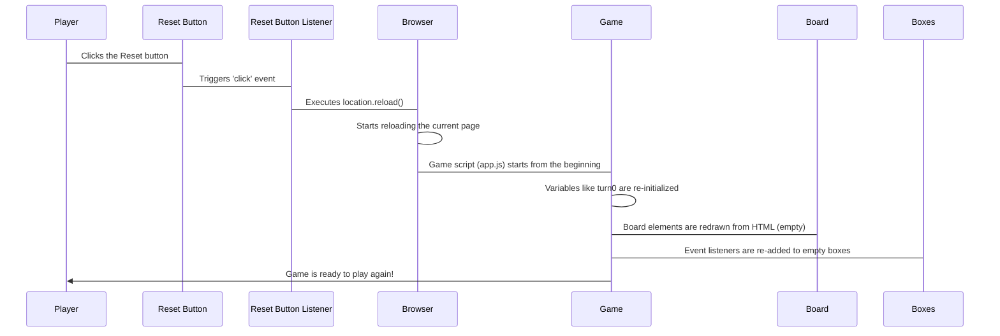

# Chapter 6: Game Reset Functionality

Welcome to the final chapter of our Tic Tac Toe tutorial! In our previous chapters, we've covered the core mechanics: setting up the board ([Chapter 1: Game Squares (Boxes)](01_game_squares__boxes__.md)), defining winning patterns ([Chapter 2: Winning Rules (Patterns)](02_winning_rules__patterns__.md)), managing player turns ([Chapter 3: Player Turn Management](03_player_turn_management_.md)), placing marks ([Chapter 4: Move Placement Handler](04_move_placement_handler_.md)), and checking if a player has won ([Chapter 5: Winner Checker](05_winner_checker_.md)).

Now, imagine a game ends – someone wins (as we saw in [Chapter 5: Winner Checker](05_winner_checker_.md)), or perhaps it ends in a draw (a tie). What do you do next? In a real game, you'd clear the board and start fresh! In our web game, we need a way to do the same thing. This is where the **Game Reset Functionality** comes in.

## What is Game Reset Functionality?

It's exactly what it sounds like: a feature that allows you to reset the game back to its starting state at any point.

Think about playing Tic Tac Toe on a physical board or a piece of paper. When a game is over, you wipe the board clean or grab a new sheet of paper. All the 'X's and 'O's disappear, and you're ready for another round, with 'O' usually starting again.

In our web game, resetting means:

*   Clearing all the 'X's and 'O's from the squares.
*   Making all the squares clickable again (they were disabled after being filled, remember [Chapter 1: Game Squares (Boxes)](01_game_squares__boxes__.md) and [Chapter 4: Move Placement Handler](04_move_placement_handler_.md)?).
*   Setting the turn back to the starting player (usually 'O').
*   Hiding any messages about winners.

This ensures the game is completely fresh and ready for a new match.

## How Do We Make it Happen?

Our game needs a way for the player to *tell* it to reset. The simplest way is to have a button dedicated to this task. You'll see a button in the HTML with the ID `#reset-btn`.

Just like we made the game squares respond to clicks ([Chapter 1: Game Squares (Boxes)](01_game_squares__boxes__.md)), we need to make this reset button respond when someone clicks it.

Here's the basic idea:

1.  Find the reset button on the web page.
2.  Tell the button, "Hey, listen for a 'click'!"
3.  When the button is clicked, run some code that resets the game state.

## Finding the Reset Button

We already know how to find elements on the page using `document.querySelector`. We used `.box` to find all squares; now we'll use `#reset-btn` to find our specific button.

```javascript
let resetBtn = document.querySelector("#reset-btn");
```

*   `let resetBtn`: This creates a variable named `resetBtn` to hold a reference to the button.
*   `document.querySelector("#reset-btn")`: This searches the entire page (`document`) for the element that has the ID `reset-btn` and gives it to our `resetBtn` variable.

Now our code knows where the reset button is!

## Listening for Clicks on the Button

Next, we add an event listener to this `resetBtn`, just like we did for the individual `boxes`.

```javascript
resetBtn.addEventListener("click", () => {
  // Code inside here runs when the reset button is clicked!
});
```

*   `resetBtn.addEventListener("click", ...)`: This tells the `resetBtn` to pay attention and run the code inside the curly braces `{}` whenever a `click` event happens on it.
*   `() => { ... }`: This is the function (the block of code) that will run when the button is clicked.

## The Reset Logic: Reloading the Page

What code do we put inside that function to actually reset the game? There are several ways to reset a JavaScript game, but for a simple game like Tic Tac Toe, the *easiest* way is often just to refresh the entire web page. When the page reloads, the browser starts the `app.js` script from the very beginning, resetting all variables (`turn0` goes back to `true`), clearing the board display (because the HTML loads fresh), and re-adding all the event listeners.

Our provided code uses this simple approach:

```javascript
resetBtn.addEventListener("click", () => {
  location.reload();
});
```

*   `location.reload()`: This is a built-in browser command. It tells the browser to reload the current page from the server (or cache). It's like hitting the "refresh" button in your browser.

And that's it for the reset! When the button is clicked, this single line of code runs, and the page refreshes, bringing the game back to its initial state.

## How the Reset Button Works (Step-by-Step)

Let's trace what happens when you click the Reset button:



This diagram shows that clicking the button activates its event listener, which simply tells the browser to reload the page. The page reload then clears everything and restarts the game script as if you just opened the page for the first time.

## Where in the Code?

The code for the reset functionality is placed directly in your `app.js` file, usually near the top after you've selected all the elements you need to interact with (`boxes`, `resetBtn`, etc.).

```javascript
// ... (code to select boxes, define winPatterns, initialize turn0) ...

let resetBtn = document.querySelector("#reset-btn"); // Find the button

// ... (code for box event listeners and checkWinner function) ...

// Add the event listener to the reset button
resetBtn.addEventListener("click", () => {
  location.reload(); // Reload the page to reset the game
});

// ... (rest of the code) ...
```

This simple setup provides an easy way for players to start a new game whenever they wish, whether after a game ends or if they want a do-over.

## Conclusion

Game Reset Functionality is about providing a way to quickly and easily start a new game. In our simple Tic Tac Toe project, we achieve this by adding a dedicated Reset button and using a single line of JavaScript code (`location.reload()`) in its click event listener. This effectively restarts the entire game by refreshing the web page, clearing the board, resetting the turn, and preparing for another round.

This concludes our tutorial on building a basic Tic Tac Toe game piece by piece. We've covered the board, rules, turns, moves, winning, and resetting! You now have a foundational understanding of how these core concepts come together in a simple web application.

Congratulations on building your Tic Tac Toe game!

---

Generated by AI Codebase Knowledge Builder