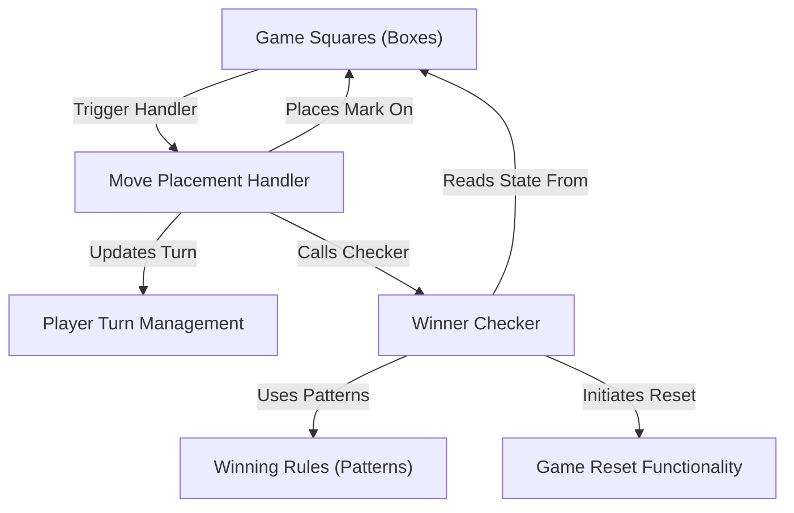
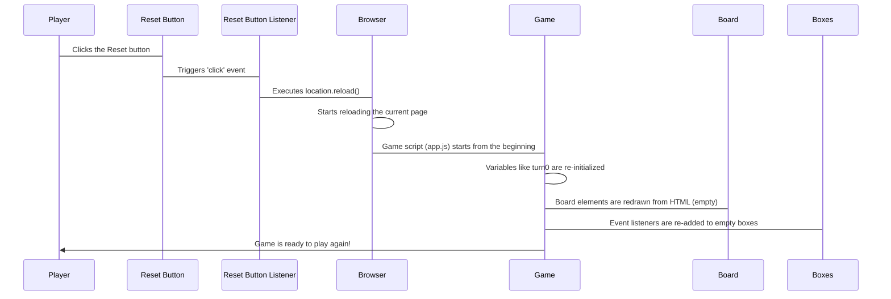

# Tutorial: TicTacToe

This project is a simple, web-based *Tic Tac Toe game*. Players **take turns** placing their 'X' or 'O' marks on a **grid of squares**. The game **checks** after each move to see if any player has achieved a **winning line** (three marks in a row, column, or diagonally), and it can be **reset** to start a new game.


**Source Repository:** [None](None)



## Chapters

1. [Game Squares (Boxes)
](01_game_squares__boxes__.md)
2. [Winning Rules (Patterns)
](02_winning_rules__patterns__.md)
3. [Player Turn Management
](03_player_turn_management_.md)
4. [Move Placement Handler
](04_move_placement_handler_.md)
5. [Winner Checker
](05_winner_checker_.md)
6. [Game Reset Functionality
](06_game_reset_functionality_.md)


---

Generated by AI Codebase Knowledge Builder

---

# Chapter 1: Game Squares (Boxes)

Welcome to the first chapter of our Tic Tac Toe tutorial! We're going to build a simple game step-by-step, and we'll start with the very foundation: the game board itself.

Imagine you're playing Tic Tac Toe on paper. You draw a grid, right? That grid has 9 separate spots where you can place your 'X' or 'O'. In our web-based game, we need to do the same thing – we need to represent these 9 spots and make them interactive so a player can click on them.

These interactive spots are what we'll call "Game Squares" or simply "Boxes". They are the clickable areas on our game board.

## What are Game Squares?

Think of the game board as having 9 individual sections. Each section is a "box".

*   **They are clickable:** A player interacts with the game by clicking on one of these boxes.
*   **They hold a mark:** Once clicked, a box will display either an 'X' or an 'O'.
*   **They are unique:** Even though they look similar, each box is a distinct part of the board, and the game needs to know *which specific* box was clicked.

So, how do we work with these boxes in our code?

## Finding and Reacting to Our Boxes

Our web page has the visual representation of the board, including these 9 boxes. In our `app.js` file, the first thing we need to do is find these boxes so our code can interact with them.

We use some special JavaScript code to do this. Look at this line from `app.js`:

```javascript
let boxes = document.querySelectorAll(".box");
```

What this line does is go through the entire web page (`document`) and find all the elements that have a special label (a "class") called `.box`. It then collects all of these found elements into a list called `boxes`. Now, the `boxes` variable holds references to all 9 of our game squares!

Next, we want something to happen *when* a player clicks on any of these boxes. We need to tell each box, "Hey, listen for a click!" We do this by looping through the `boxes` list and adding an "event listener" to each one.

Here's the part of the code that does that:

```javascript
boxes.forEach((box) => {
  box.addEventListener("click", (e) => {
    // ... code to handle the click ...
  });
});
```

*   `boxes.forEach((box) => { ... });`: This is like saying, "For *each* individual `box` in our list of `boxes`, do the following..."
*   `box.addEventListener("click", (e) => { ... });`: For the current `box` we're looking at, this line says, "When this `box` is clicked, run the code inside the curly braces `{}`." The `e` is short for "event" and gives us information about the click, like *which* box was clicked.

So, this setup makes sure that when *any* of the 9 boxes is clicked, our special click-handling code runs.

## Placing a Mark and Disabling the Box

When a box is clicked, two important things need to happen regarding that specific box:

1.  We need to place the current player's mark ('X' or 'O') inside it.
2.  We need to make sure it can't be clicked again (you can't change a move!).

Inside the click-handling code we just saw (`box.addEventListener(...)`), after we know which box was clicked, we do this:

```javascript
// ... inside the click event handler ...
    box.innerText = "O"; // Or "X", depending on whose turn it is
    box.disabled = true; // Make the box unclickable
// ... rest of the code ...
```

*   `box.innerText = "O";`: This changes the text *inside* the clicked `box` to 'O' (or 'X'). This is how the mark appears on the board!
*   `box.disabled = true;`: This tells the browser to disable this specific `box`. Disabled elements can't be clicked, so the player can't mess with a square that already has a mark.

## Putting it Together (Simplified)

Let's trace what happens when a player clicks on one of the empty squares on the board, keeping it simple for now:

1.  The player clicks on a square.
2.  Because we added an event listener to that square, the code inside the `addEventListener` function runs.
3.  The code identifies *which* square was clicked (`e.target` or `box` in our loop).
4.  It places the current player's mark ('X' or 'O') inside that square by changing its `innerText`.
5.  It disables that square so it cannot be clicked again.
6.  *(As we'll see in later chapters, other things happen too, like checking for a winner!)*

Here's a very simplified look at the core interaction with a single box:

```javascript
// Imagine 'clickedBox' is the specific box that was clicked
clickedBox.innerText = "O"; // Put 'O' inside it
clickedBox.disabled = true; // Stop it from being clicked again

// Other checks like win-checking happen after this
// checkWinner();
```

This simple process is repeated every time a player clicks on an empty square, managing the placement of marks on our game squares.

## What's Next?

Now that we understand how we represent the game squares, how we find them, react when they are clicked, and place marks in them, we can move on to the next piece of the puzzle. Clicking on boxes and placing marks is great, but how do we know if someone has won the game?

In the next chapter, we'll explore the concept of [Winning Rules (Patterns)](02_winning_rules__patterns__.md) – the different combinations of three squares that result in a win.

---

Generated by AI Codebase Knowledge Builder

---

# Chapter 2: Winning Rules (Patterns)

Welcome back! In [Chapter 1: Game Squares (Boxes)](01_game_squares__boxes__.md), we learned about the individual spots on our Tic Tac Toe board and how we can click on them to place 'X' or 'O'. We now know how to get marks onto the board.

But simply placing marks isn't enough to play the game! How does the game know when someone has actually *won*?

Think about playing Tic Tac Toe on paper. You win by getting three of your marks in a row, column, or diagonally. The game needs a way to know exactly *which* combinations of squares count as a win. This is where the concept of "Winning Rules" or "Patterns" comes in.

## What are Winning Rules (Patterns)?

A "Winning Pattern" is simply a list of three specific squares on the board that, if all contain the same player's mark ('X' or 'O'), mean that player has won.

In Tic Tac Toe, there are always the same ways to win:
*   The top row
*   The middle row
*   The bottom row
*   The left column
*   The middle column
*   The right column
*   The top-left to bottom-right diagonal
*   The top-right to bottom-left diagonal

That's a total of 8 different ways to win!

The game needs to know all of these 8 combinations so it can check after every move whether a player has completed one of them.

## Representing Winning Patterns in Our Code

Remember in [Chapter 1: Game Squares (Boxes)](01_game_squares__boxes__.md) we talked about the 9 boxes? We can think of them as being numbered from 0 to 8:

```
  0 | 1 | 2
 ---|---|---
  3 | 4 | 5
 ---|---|---
  6 | 7 | 8
```

Using these numbers, we can describe each winning line:

*   The top row is squares 0, 1, and 2.
*   The middle column is squares 1, 4, and 7.
*   One of the diagonals is squares 0, 4, and 8.

In our code, we store all these winning combinations in a list. We use an array of arrays (a list of lists) where each inner list contains the numbers of the three squares that form a winning line.

Look at this part of our `app.js` file:

```javascript
const winPatterns = [
  [0, 1, 2], // Top Row
  [0, 4, 8], // Diagonal (top-left to bottom-right)
  [0, 3, 6], // Left Column
  [1, 4, 7], // Middle Column
  [2, 5, 8], // Right Column
  [2, 4, 6], // Diagonal (top-right to bottom-left)
  [3, 4, 5], // Middle Row
  [6, 7, 8], // Bottom Row
];
```

This `winPatterns` list is our "rulebook" for winning. Each small list inside it (like `[0, 1, 2]`) is one specific way to win the game.

*   `[0, 1, 2]` means if squares number 0, 1, and 2 all have the same mark ('X' or 'O') and are not empty, someone wins.
*   `[0, 4, 8]` means if squares number 0, 4, and 8 all have the same mark and are not empty, someone wins.
*   And so on for all 8 combinations.

This list is like giving the computer a map of all the possible winning lines on the board, using the numbers 0 through 8 to point to the specific squares.

## How Are These Patterns Used?

Okay, so we have this list of winning rules (`winPatterns`). What does the game do with it?

The main job of this list is for checking if someone has won *after* a move is made.

Here's the high-level idea:

1.  A player clicks on a square and places their mark ('X' or 'O'). (We learned about this in [Chapter 1: Game Squares (Boxes)](01_game_squares__boxes__.md)).
2.  The game then needs to ask, "Did that last move create a winning line?"
3.  To answer this, the game looks at our `winPatterns` list.
4.  It goes through *each* pattern in the list (like checking the top row, then the middle row, etc.).
5.  For the current pattern it's checking (e.g., `[0, 1, 2]`), it looks at the actual squares on the board that correspond to those numbers (square 0, square 1, and square 2).
6.  It checks if those three squares are all filled (not empty) AND if they all have the *same* mark ('X' or 'O').
7.  If it finds *any* pattern where the squares meet these conditions, it knows there's a winner! If it checks all 8 patterns and none meet the condition, the game continues.

We'll dive into the code that actually performs this check in a later chapter ([Chapter 5: Winner Checker](05_winner_checker_.md)). For now, just understand that `winPatterns` is the *data* the game uses to know *what* constitutes a winning line.

## Where Does This List Live in the Code?

As we saw, the `winPatterns` list is defined right at the beginning of our `app.js` file:

```javascript
// ... other code ...

const winPatterns = [
  [0, 1, 2], // Top Row
  [0, 4, 8], // Diagonal (top-left to bottom-right)
  // ... other patterns ...
];

// ... rest of the code ...
```

It's declared using `const`, which means this list of winning patterns will not change throughout the game. It's a fixed rulebook!

This list needs to be available whenever the game needs to check for a winner, which is why it's placed globally at the top of the script.

## Putting it Together (Conceptually)

Imagine the computer playing Tic Tac Toe:

```
Computer: Okay, Player X just put their mark in square 4.
Computer: Now I need to check if X won.
Computer: I'll look at my "Winning Rules" list (`winPatterns`).
Computer: Rule 1 is [0, 1, 2] (top row). Are squares 0, 1, and 2 all 'X'? Let me check... No.
Computer: Rule 2 is [0, 4, 8] (diagonal). Are squares 0, 4, and 8 all 'X'? Let me check... Hmm, square 4 is X, but what about 0 and 8? Not all X yet.
Computer: ... (checks Rule 3, Rule 4, etc.) ...
Computer: Rule 7 is [3, 4, 5] (middle row). Are squares 3, 4, and 5 all 'X'? Let me check... Square 3 is X, square 4 is X, and Player X just put their mark in square 5 and it's also X! Yes!
Computer: Player X wins!
```

This is the basic process. The `winPatterns` list provides the computer with the specific square combinations it needs to look at.

## What's Next?

We now understand the foundation of the board ([Chapter 1: Game Squares (Boxes)](01_game_squares__boxes__.md)) and what constitutes a win (this chapter). But we're missing a crucial piece: How does the game know *whose turn* it is to place an 'X' or an 'O'?

In the next chapter, we'll explore [Chapter 3: Player Turn Management](03_player_turn_management_.md) – how we keep track of whose turn it is and switch between players.

[Chapter 3: Player Turn Management](03_player_turn_management_.md)

---

Generated by AI Codebase Knowledge Builder

---

# Chapter 3: Player Turn Management

Welcome back! In our last chapter, [Chapter 2: Winning Rules (Patterns)](02_winning_rules__patterns__.md), we learned how our game knows *what* combinations of squares make a player win. We have our game squares ([Chapter 1: Game Squares (Boxes)](01_game_squares__boxes__.md)) and we know the winning patterns.

But there's a crucial part missing from our game: How does it know *whose turn* it is? In Tic Tac Toe, Player 'O' usually goes first, then Player 'X', then 'O' again, and so on. We need a system to manage this order.

## What is Player Turn Management?

Imagine you're playing a board game with a friend. You take your turn, and then you announce, "Okay, your turn!" and your friend takes their turn. You take turns back and forth until the game ends.

Player Turn Management in our code is the same idea. It's the system that ensures:

1.  Only one player can make a move at a time.
2.  The players take turns in the correct order ('O', 'X', 'O', 'X', ...).

## Keeping Track of the Current Turn

To manage whose turn it is, our game needs a way to remember this information. We use a special variable for this purpose. In our `app.js` code, you'll see this line:

```javascript
let turn0 = true;
```

*   `let turn0 = true;`: This line declares a variable named `turn0` and sets its starting value to `true`.
    *   We'll use `true` to mean it's Player 'O''s turn. ('O' often goes first in Tic Tac Toe, and `turn0` sounds a bit like "turn O").
    *   We'll use `false` to mean it's Player 'X''s turn.

So, right when the game starts, `turn0` is `true`, indicating that 'O' is the first player to move.

## How the Turn Switches

The turn needs to switch *after* a player successfully makes a move. This happens inside the code that runs when a box is clicked. Remember from [Chapter 1: Game Squares (Boxes)](01_game_squares__boxes__.md) that we have code that listens for clicks on the boxes?

Inside that click listener code, after we figure out which mark to place, we also update the `turn0` variable to switch turns.

Look at this simplified snippet from the click handler in `app.js`:

```javascript
boxes.forEach((box) => {
  box.addEventListener("click", (e) => {
    if (turn0) {
      // If turn0 is true, it's O's turn
      box.innerText = "O"; // Place 'O'
      turn0 = false; // Switch turn to X (set turn0 to false)
    } else {
      // If turn0 is false, it's X's turn
      box.innerText = "X"; // Place 'X'
      turn0 = true; // Switch turn to O (set turn0 to true)
    }
    box.disabled = true; // Disable the box (from Chapter 1)
    // checkWinner(); // Check for winner (from later chapter)
  });
});
```

Let's break down the `if/else` part related to turn management:

1.  `if (turn0)`: The code checks the value of the `turn0` variable.
2.  `if (turn0)` is `true`: This block of code runs.
    *   `box.innerText = "O";`: The game places an 'O' in the clicked box.
    *   `turn0 = false;`: **This is the key!** The value of `turn0` is changed from `true` to `false`. For the *next* click, the `if (turn0)` check will be false, and the `else` block will run.
3.  `else` (if `turn0` is `false`): This block of code runs.
    *   `box.innerText = "X";`: The game places an 'X' in the clicked box.
    *   `turn0 = true;`: **This is the key!** The value of `turn0` is changed from `false` back to `true`. For the *next* click, the `if (turn0)` check will be true again, and the `if` block will run.

This simple `if/else` structure, combined with changing the `turn0` variable, makes sure that 'O' and 'X' marks are placed alternately every time a box is clicked.

## Step-by-Step Turn Switching

Let's trace what happens when the first two moves are made:

1.  **Game Starts:** `turn0` is `true`. It's O's turn.
2.  **Player Clicks Box:** The click event handler runs.
3.  **Check Turn:** The code sees `if (turn0)` is `true`.
4.  **Place Mark:** It sets the box's text to 'O'.
5.  **Switch Turn:** It sets `turn0` to `false`.
6.  **Disable Box:** The box is disabled.
7.  **First Turn Ends:** `turn0` is now `false`. It's X's turn.
8.  **Another Player Clicks Box:** The click event handler runs again for a *different* box.
9.  **Check Turn:** The code sees `if (turn0)` is `false`.
10. **Place Mark:** It goes into the `else` block and sets the box's text to 'X'.
11. **Switch Turn:** It sets `turn0` back to `true`.
12. **Disable Box:** The box is disabled.
13. **Second Turn Ends:** `turn0` is now `true`. It's O's turn again.

And so the game continues, switching between `turn0 = true` and `turn0 = false` after each valid move.

## Where in the Code?

As shown above, the turn management logic is primarily handled inside the `addEventListener` function attached to each `box`.

```javascript
// ... inside the event listener for each box ...

    // Check whose turn it is based on 'turn0'
    if (turn0) {
      box.innerText = "O"; // Place O's mark
      box.style.color = "green"; // (Specific styling, not core turn logic)
      turn0 = false; // *** Switch turn to X ***
    } else {
      box.innerText = "X"; // Place X's mark
      box.style.color = "red"; // (Specific styling)
      turn0 = true; // *** Switch turn to O ***
    }

    box.disabled = true; // Disable the box
    // checkWinner(); // Check for winner (covered later)

// ... rest of the code ...
```

The `let turn0 = true;` declaration is done once at the beginning of the script so the variable is available to the click handler.

## Conclusion

Player Turn Management in our Tic Tac Toe game is simply about keeping track of whose turn it is using a variable (`turn0`) and switching the value of that variable (`true` to `false`, or `false` to `true`) after each valid move is made. This ensures the game flows correctly with players taking turns.

Now that we know how we manage turns, we can look closer at the process of actually placing the mark in the clicked square, which depends directly on whose turn it is.

Next, we'll dive into [Chapter 4: Move Placement Handler](04_move_placement_handler_.md) to see how the game uses the turn information to place the correct 'X' or 'O' in the clicked square.

[Chapter 4: Move Placement Handler](04_move_placement_handler_.md)

---

Generated by AI Codebase Knowledge Builder

---

# Chapter 4: Move Placement Handler

Welcome back! In our previous chapter, [Chapter 3: Player Turn Management](03_player_turn_management_.md), we figured out how our game keeps track of whose turn it is, using a variable called `turn0`. This is super important because it tells us whether we should place an 'O' or an 'X' on the board when a player clicks.

Now, let's focus on the exciting part: what actually happens *when* a player clicks on a square? This is where the "Move Placement Handler" comes in.

## What is the Move Placement Handler?

Think of it like this: A player taps an empty square on the screen. Something needs to react to that tap! The Move Placement Handler is the piece of code that:

1.  Notices which square was clicked.
2.  Checks whose turn it is ([Chapter 3: Player Turn Management](03_player_turn_management_.md)).
3.  Puts the correct mark ('O' or 'X') onto that specific square ([Chapter 1: Game Squares (Boxes)](01_game_squares__boxes__.md)).
4.  Makes sure you can't click that square again.

It's the core action that happens every time a player makes a move.

## Reacting to the Click (A Quick Recap)

Remember from [Chapter 1: Game Squares (Boxes)](01_game_squares__boxes__.md) that we added something called an "event listener" to each game square?

```javascript
boxes.forEach((box) => {
  box.addEventListener("click", (e) => {
    // Code inside here runs when a box is clicked!
    // This is our Move Placement Handler area.
  });
});
```

This `addEventListener` part is what kicks off the whole process. When a click happens on a `box`, the code inside the curly braces `{}` starts running. This code is essentially our Move Placement Handler for that specific clicked box.

## Inside the Handler: Making the Move

Okay, so a box has been clicked, and our code is running. What does it do step-by-step to place the mark?

It follows these main steps:

1.  **Check the Turn:** It looks at our `turn0` variable to see if it's 'O's turn (`true`) or 'X's turn (`false`).
2.  **Place the Mark:** Based on the turn, it puts the correct letter ('O' or 'X') inside the clicked square.
3.  **Style the Mark:** It might also change the color of the mark (like green for 'O', red for 'X') just to make it look nice.
4.  **Disable the Square:** It makes the clicked square unclickable so no one can change the mark.
5.  **Switch the Turn:** It updates the `turn0` variable to switch the turn for the *next* move ([Chapter 3: Player Turn Management](03_player_turn_management_.md)).
6.  **Check for Winner:** (This is the next step after a move, which we'll cover in [Chapter 5: Winner Checker](05_winner_checker_.md)).

Let's look at the actual code inside the `addEventListener` for a `box` that performs these steps:

```javascript
// ... inside the box.addEventListener("click", ...) function ...

    // Step 1 & 2: Check turn and place mark
    if (turn0) {
      box.innerText = "O"; // Place 'O'
    } else {
      box.innerText = "X"; // Place 'X'
    }

    // Step 3: Style the mark (optional but nice!)
    if (turn0) { // (We check turn again, or save the mark in a variable)
      box.style.color = "green";
    } else {
      box.style.color = "red";
    }

    // Step 4: Disable the square
    box.disabled = true;

    // Step 5: Switch the turn
    turn0 = !turn0; // This flips true to false, or false to true

    // Step 6: Check for winner (covered in the next chapter!)
    // checkWinner();

// ... rest of the click handler ...
```

This block of code is the heart of our Move Placement Handler. Let's break down those lines:

```javascript
if (turn0) {
  box.innerText = "O";
} else {
  box.innerText = "X";
}
```

This is where we use the `turn0` variable from [Chapter 3: Player Turn Management](03_player_turn_management_.md). If `turn0` is `true` (O's turn), we put "O" in the `box`. If `turn0` is `false` (X's turn), we put "X". Remember, `box.innerText` changes what's shown *inside* the square on the web page.

```javascript
if (turn0) { // Note: turn0 *just* changed, this check is slightly simplified
  box.style.color = "green";
} else {
  box.style.color = "red";
}
```

After placing the mark, we also set its color. This `box.style.color` line changes the text color of the mark inside the `box`. The code in `app.js` actually sets the color *before* flipping `turn0`, which makes more sense:

```javascript
if (turn0) {
  box.innerText = "O";
  box.style.color = "green"; // Set O's color
  turn0 = false; // THEN switch turn
} else {
  box.innerText = "X";
  box.style.color = "red";   // Set X's color
  turn0 = true;  // THEN switch turn
}
```
This revised order ensures the color matches the mark being placed *in this turn*.

```javascript
box.disabled = true;
```

This is a simple but critical line. Setting `disabled = true` on a button or similar element prevents it from being clicked again. Once a square has a mark, it should be off-limits!

```javascript
turn0 = !turn0; // Simplified view
```

This line is from the original code snippet and is a neat trick! The `!` symbol means "not". So `!turn0` means "not true" (which is false) or "not false" (which is true). This line is a compact way to flip the value of `turn0` from `true` to `false` or `false` to `true`, effectively switching the turn. In the actual `app.js` code, the `turn0 = false;` and `turn0 = true;` lines are explicitly inside the `if/else` blocks right after setting the color, which is also perfectly fine and perhaps clearer for beginners. Both methods achieve the same result of switching turns after a move.

## The Flow of a Move

Let's visualize the steps the game takes when a player clicks on an empty square, focusing on the Move Placement Handler part:

```mermaid
sequenceDiagram
    participant Player
    participant Game as Game (Click Handler)
    participant Box as Clicked Box
    participant TurnMgr as Turn Management (turn0)

    Player->Box: Clicks on an empty square
    Box->Game: Triggers 'click' event for this Box
    Game->TurnMgr: Checks value of turn0?
    TurnMgr-->Game: Responds (e.g., "true", it's O's turn)
    Game->Box: Sets innerText to 'O'
    Game->Box: Sets color to green
    Game->Box: Sets disabled = true
    Game->TurnMgr: Tells TurnMgr to switch turn
    TurnMgr->TurnMgr: Updates turn0 to false (now X's turn)
    Game->Game: (Continues to check for winner, etc.)
```

This diagram shows how clicking the `Box` triggers the code in the `Game`'s click handler. The handler talks to the `Turn Management` system to know whose turn it is, updates the `Box` itself (placing the mark, styling, disabling), and then tells the `Turn Management` system to switch to the next player.

## Where in the Code?

All the code snippets we've looked at in this chapter for placing the mark, setting the color, and disabling the box are located *inside* the `addEventListener` function for each `box` in your `app.js` file.

```javascript
boxes.forEach((box) => {
  box.addEventListener("click", (e) => {
    // *** This is the Move Placement Handler code block ***

    if (turn0) {
      box.innerText = "O";
      box.style.color = "green";
      turn0 = false; // Switch turn AFTER placing O
    } else {
      box.innerText = "X";
      box.style.color = "red";
      turn0 = true; // Switch turn AFTER placing X
    }

    box.disabled = true; // Make this box unclickable

    checkWinner(); // <-- Next step! Check if this move won.

    // ***************************************************
  });
});
```

This single block of code runs every time a player clicks one of the 9 squares and is responsible for making that specific move happen on the board.

## Conclusion

The Move Placement Handler is the essential part of our Tic Tac Toe game that takes the action of a player clicking a square and translates it into placing a mark on the board. It uses the turn information ([Chapter 3: Player Turn Management](03_player_turn_management_.md)) to decide which mark to place ('O' or 'X'), updates the square visually, and prevents it from being clicked again ([Chapter 1: Game Squares (Boxes)](01_game_squares__boxes__.md)). It's the active part of the game loop where a turn is completed.

Once a move is placed, the very next critical step is to see if that move resulted in a win. In the next chapter, we'll explore [Chapter 5: Winner Checker](05_winner_checker_.md) – the code that uses our [Winning Rules (Patterns)](02_winning_rules__patterns__.md) to determine if the game is over.

[Chapter 5: Winner Checker](05_winner_checker_.md)

---

Generated by AI Codebase Knowledge Builder

---

# Chapter 5: Winner Checker

Welcome back! In our journey so far, we've built the foundation of our Tic Tac Toe game. We have our game squares ([Chapter 1: Game Squares (Boxes)](01_game_squares__boxes__.md)), we know the winning combinations ([Chapter 2: Winning Rules (Patterns)](02_winning_rules__patterns__.md)), we can manage whose turn it is ([Chapter 3: Player Turn Management](03_player_turn_management_.md)), and we know how to place the correct mark in a clicked square and disable it ([Chapter 4: Move Placement Handler](04_move_placement_handler_.md)).

But there's one huge missing piece: How does the game know when someone has won? After a player places their mark, we need to immediately check if that move finished a winning line. This is the job of the "Winner Checker".

## What is the Winner Checker?

Imagine a referee in a sports game. After a critical play, the referee might pause and review the action to see if a rule was broken or if a point was scored.

Our Winner Checker function acts like this referee for our Tic Tac Toe game. After *every single move* is successfully placed on the board, the game needs to quickly check the board to see if the player who just moved has created one of the winning patterns we defined in [Chapter 2: Winning Rules (Patterns)](02_winning_rules__patterns__.md).

Its main goal is simple: **Determine if the game is over because a player has won.**

## When Does the Check Happen?

The Winner Checker must run *immediately* after a player places their mark and before the next player's turn begins. Why? Because the move just made is the *only* move that could have possibly created a new winning line. If that move didn't create a win, then no win occurred on this turn.

Looking back at our [Chapter 4: Move Placement Handler](04_move_placement_handler_.md), you'll see the spot where we need to add this check. It's right after we place the mark and disable the box:

```javascript
boxes.forEach((box) => {
  box.addEventListener("click", (e) => {
    // ... code to place the mark and switch turn ...
    // ... disable the box ...

    // *** This is where we check for a winner ***
    checkWinner(); // <-- We need a function like this!

  });
});
```

Every time a square is clicked and a mark is placed, this `checkWinner()` function will be called to do its job.

## How Does it Work? (High Level)

The `checkWinner` function needs access to two main things:

1.  **The current state of the board:** What marks are currently in each of the 9 squares?
2.  **The list of winning patterns:** The `winPatterns` array we discussed in [Chapter 2: Winning Rules (Patterns)](02_winning_rules__patterns__.md).

Here's the basic process the `checkWinner` function follows:

*   Go through *each* winning pattern defined in `winPatterns`.
*   For the current pattern being checked (e.g., `[0, 1, 2]` for the top row):
    *   Look at the marks in the squares corresponding to the numbers in the pattern (Square 0, Square 1, Square 2).
    *   Check if all three of these squares are **not empty**. (An empty square can't be part of a win).
    *   Check if the marks in these three squares are **exactly the same** ('X', 'X', 'X' or 'O', 'O', 'O').
*   If it finds *any* pattern that meets these two conditions (not empty AND same mark), it means a winner is found!
*   If it checks *all* 8 patterns and doesn't find a match, nobody has won with this move, and the game continues.

## The `checkWinner` Function in Code

Let's look at the actual `checkWinner` function in our `app.js` file.

```javascript
const checkWinner = () => {
  // This function loops through all winning patterns
  // and checks the board to see if any pattern is filled
  // with the same non-empty mark.
};
```

This is where our winning rules (`winPatterns`) come into play. We need to loop through that list:

```javascript
const checkWinner = () => {
  // winPatterns is the list of all winning combinations (like [0, 1, 2])
  for (let pattern of winPatterns) {
    // 'pattern' will be one winning combination at a time, e.g., [0, 1, 2]

    // We need to get the marks from the squares listed in this pattern
    // Remember 'boxes' is our list of all 9 squares from Chapter 1
    let pos1Val = boxes[pattern[0]].innerText; // Mark in the 1st square of pattern
    let pos2Val = boxes[pattern[1]].innerText; // Mark in the 2nd square of pattern
    let pos3Val = boxes[pattern[2]].innerText; // Mark in the 3rd square of pattern

    // Now, check if these three squares form a winning line...
    // (Checks explained next)
  }
};
```

*   `for (let pattern of winPatterns)`: This loop goes through each item in the `winPatterns` array. In the first loop, `pattern` will be `[0, 1, 2]`. In the second, `[0, 4, 8]`, and so on.
*   `boxes[pattern[0]]`: `pattern[0]` gets the *first* number from the current pattern (e.g., `0`). `boxes[0]` gets the actual first game square element (from our `boxes` list, see [Chapter 1: Game Squares (Boxes)](01_game_squares__boxes__.md)).
*   `.innerText`: This gets the mark ('O', 'X', or empty `""`) currently displayed inside that game square. We store these marks in `pos1Val`, `pos2Val`, and `pos3Val`.

Next, we add the conditions to check if these three squares form a win:

```javascript
const checkWinner = () => {
  for (let pattern of winPatterns) {
    let pos1Val = boxes[pattern[0]].innerText;
    let pos2Val = boxes[pattern[1]].innerText;
    let pos3Val = boxes[pattern[2]].innerText;

    // Condition 1: Are all three squares in this pattern NOT empty?
    if (pos1Val != "" && pos2Val != "" && pos3Val != "") {

      // Condition 2: Do all three non-empty squares have the SAME mark?
      if (pos1Val === pos2Val && pos2Val === pos3Val) {

        // *** Winner Found! ***
        console.log("Winner!", pattern); // Just for checking behind the scenes

        // Do something to show the winner and end the game
        // (Covered in detail next)

      }
    }
  }
};
```

Let's break down the `if` conditions:

*   `if (pos1Val != "" && pos2Val != "" && pos3Val != "")`: This checks if none of the three squares in the current pattern are empty. `!= ""` means "is not an empty string". The `&&` means "and", so all three parts must be true. If any square is empty, this pattern can't be a winning one *yet*, so the code inside this `if` block is skipped, and the loop moves to the next pattern.
*   `if (pos1Val === pos2Val && pos2Val === pos3Val)`: This checks if the mark in the first square (`pos1Val`) is the same as the mark in the second (`pos2Val`), AND if the mark in the second square is the same as the mark in the third (`pos3Val`). If both are true, it means all three squares have the same mark (either 'X' or 'O' because of the first check).

If both conditions are met for a specific pattern, it means we have found a winner!

## What Happens When a Winner is Found?

Once the `checkWinner` function detects a winning pattern, the game needs to react. In our simple code, it does two things:

1.  It shows a message saying who won.
2.  It resets the game (by reloading the page).

This happens inside the innermost `if` block where we found the winner:

```javascript
// ... inside the checkWinner function, inside the winning if blocks ...

      if (pos1Val === pos2Val && pos2Val === pos3Val) {
        // Winner Found!

        // 1. Show Winner Message
        // pos1Val will be the winning mark ('X' or 'O')
        setTimeout(() => {
          alert("Winner : " + pos1Val); // Show a pop-up message
        }, 100); // Add a small delay (optional, but sometimes nice)


        // 2. Reset the Game
        // For simplicity, we'll just reload the page
        location.reload();

      }
// ... rest of the checkWinner function ...
```

*   `alert("Winner : " + pos1Val)`: The `alert()` function pops up a simple message box in the browser. We combine the text "Winner : " with the winning mark (`pos1Val`, which is either 'X' or 'O'). The `setTimeout` is used here to give a brief moment before the alert appears, though 100ms is very fast. The 5000 value in the original code looks like it might have been intended as a delay in milliseconds, but it's placed incorrectly in the `setTimeout` arguments in the snippet provided in the context. The simpler form `alert("Winner : " + pos1Val);` works fine without `setTimeout` for basic functionality.
*   `location.reload()`: This is a browser command that simply reloads the current web page. It's a quick way to reset the game back to its starting state for a new round. We'll discuss game resetting more in the next chapter ([Chapter 6: Game Reset Functionality](06_game_reset_functionality_.md)).

## The Winner Checking Process in Flow

Let's trace the flow when a move is made and `checkWinner` is called:

```mermaid
sequenceDiagram
    participant Player
    participant Box as Clicked Box
    participant Handler as Move Handler (Click Listener)
    participant Checker as Winner Checker (checkWinner fn)
    participant Board as Game Board (boxes)
    participant Patterns as Winning Patterns (winPatterns)

    Player->Box: Clicks empty square
    Box->Handler: Triggers 'click' event
    Handler->Board: Places 'X' or 'O', disables Box
    Handler->Checker: Calls checkWinner()
    Checker->Patterns: Gets the list of win patterns
    loop For each pattern in winPatterns
        Checker->Board: Checks innerText of 3 squares for this pattern
        alt If all 3 squares are NOT empty AND have the same mark
            Checker->Checker: Winner found!
            Checker-->>Player: Shows "Winner: X" or "Winner: O" message
            Checker->Game: Resets the game (e.g., reloads page)
            break Loop ends (game over)
        end
    end
    opt If no winner found after checking all patterns
        Checker-->Handler: Returns (or finishes)
        Handler->>Player: Game continues (next turn)
    end
```

This diagram shows that the `checkWinner` function is triggered by the `Move Handler` (the click listener). It then loops through the `winPatterns` and checks the `Board` state for each pattern. If a winner is found during this loop, it stops and signals the end of the game. Otherwise, the function finishes, and the game continues.

## Where in the Code?

The `checkWinner` function is defined once in your `app.js` file:

```javascript
// ... other code ...

const checkWinner = () => {
  for (let pattern of winPatterns) {
    let pos1Val = boxes[pattern[0]].innerText;
    let pos2Val = boxes[pattern[1]].innerText;
    let pos3Val = boxes[pattern[2]].innerText;

    if (pos1Val != "" && pos2Val != "" && pos3Val != "") {
      if (pos1Val === pos2Val && pos2Val === pos3Val) {
        // Found a winner!
        setTimeout(() => {
          alert("Winner : " + pos1Val); // Show who won
        }, 100); // Small delay

        location.reload(); // Reset the game

      }
    }
  }
};

// ... rest of the code ...
```

And it is called inside the click event listener for each box, as shown earlier and in [Chapter 4: Move Placement Handler](04_move_placement_handler_.md):

```javascript
boxes.forEach((box) => {
  box.addEventListener("click", (e) => {
    // ... code to place mark and switch turn ...

    box.disabled = true; // Disable the box

    checkWinner(); // <<< Called here after each move!

    // ... rest of the handler ...
  });
});
```

This setup ensures that after every player makes a move by clicking a box, the game instantly checks if that move resulted in a win by comparing the board state against all possible winning patterns.

## What about a Draw?

Our current `checkWinner` only handles the case where a player wins. What if all 9 squares are filled, but nobody has won? That's a draw (or a tie)! Our current `checkWinner` function doesn't explicitly check for this, but a full Tic Tac Toe game needs to.

A simple way to check for a draw is to count how many boxes have been filled. If all 9 boxes are filled (`box.innerText` is not empty for all of them), and `checkWinner` did *not* find a winner, then it's a draw. This check would also happen after each move. We could add this logic into or after the `checkWinner` function. For this tutorial, we'll stick to the win condition check as the core concept of this chapter.

## Conclusion

The Winner Checker (`checkWinner`) is a vital part of our Tic Tac Toe game. It's the routine that runs after every move, acting as the game's referee to see if the player who just moved has completed any of the predefined winning patterns ([Chapter 2: Winning Rules (Patterns)](02_winning_rules__patterns__.md)). It does this by examining the marks on the game squares ([Chapter 1: Game Squares (Boxes)](01_game_squares__boxes__.md)) at the specific positions listed in each winning pattern. If a win is found, the game announces the winner and prepares for a new game.

Speaking of new games, what happens after a winner is found, or if the game ends in a draw, or if the player just wants to start over? We need a way to reset the game board and its state.

In our final chapter, we'll explore [Chapter 6: Game Reset Functionality](06_game_reset_functionality_.md) – how we can bring the game back to its initial state for a new round.

[Chapter 6: Game Reset Functionality](06_game_reset_functionality_.md)

---

Generated by AI Codebase Knowledge Builder

---

# Chapter 6: Game Reset Functionality

Welcome to the final chapter of our Tic Tac Toe tutorial! In our previous chapters, we've covered the core mechanics: setting up the board ([Chapter 1: Game Squares (Boxes)](01_game_squares__boxes__.md)), defining winning patterns ([Chapter 2: Winning Rules (Patterns)](02_winning_rules__patterns__.md)), managing player turns ([Chapter 3: Player Turn Management](03_player_turn_management_.md)), placing marks ([Chapter 4: Move Placement Handler](04_move_placement_handler_.md)), and checking if a player has won ([Chapter 5: Winner Checker](05_winner_checker_.md)).

Now, imagine a game ends – someone wins (as we saw in [Chapter 5: Winner Checker](05_winner_checker_.md)), or perhaps it ends in a draw (a tie). What do you do next? In a real game, you'd clear the board and start fresh! In our web game, we need a way to do the same thing. This is where the **Game Reset Functionality** comes in.

## What is Game Reset Functionality?

It's exactly what it sounds like: a feature that allows you to reset the game back to its starting state at any point.

Think about playing Tic Tac Toe on a physical board or a piece of paper. When a game is over, you wipe the board clean or grab a new sheet of paper. All the 'X's and 'O's disappear, and you're ready for another round, with 'O' usually starting again.

In our web game, resetting means:

*   Clearing all the 'X's and 'O's from the squares.
*   Making all the squares clickable again (they were disabled after being filled, remember [Chapter 1: Game Squares (Boxes)](01_game_squares__boxes__.md) and [Chapter 4: Move Placement Handler](04_move_placement_handler_.md)?).
*   Setting the turn back to the starting player (usually 'O').
*   Hiding any messages about winners.

This ensures the game is completely fresh and ready for a new match.

## How Do We Make it Happen?

Our game needs a way for the player to *tell* it to reset. The simplest way is to have a button dedicated to this task. You'll see a button in the HTML with the ID `#reset-btn`.

Just like we made the game squares respond to clicks ([Chapter 1: Game Squares (Boxes)](01_game_squares__boxes__.md)), we need to make this reset button respond when someone clicks it.

Here's the basic idea:

1.  Find the reset button on the web page.
2.  Tell the button, "Hey, listen for a 'click'!"
3.  When the button is clicked, run some code that resets the game state.

## Finding the Reset Button

We already know how to find elements on the page using `document.querySelector`. We used `.box` to find all squares; now we'll use `#reset-btn` to find our specific button.

```javascript
let resetBtn = document.querySelector("#reset-btn");
```

*   `let resetBtn`: This creates a variable named `resetBtn` to hold a reference to the button.
*   `document.querySelector("#reset-btn")`: This searches the entire page (`document`) for the element that has the ID `reset-btn` and gives it to our `resetBtn` variable.

Now our code knows where the reset button is!

## Listening for Clicks on the Button

Next, we add an event listener to this `resetBtn`, just like we did for the individual `boxes`.

```javascript
resetBtn.addEventListener("click", () => {
  // Code inside here runs when the reset button is clicked!
});
```

*   `resetBtn.addEventListener("click", ...)`: This tells the `resetBtn` to pay attention and run the code inside the curly braces `{}` whenever a `click` event happens on it.
*   `() => { ... }`: This is the function (the block of code) that will run when the button is clicked.

## The Reset Logic: Reloading the Page

What code do we put inside that function to actually reset the game? There are several ways to reset a JavaScript game, but for a simple game like Tic Tac Toe, the *easiest* way is often just to refresh the entire web page. When the page reloads, the browser starts the `app.js` script from the very beginning, resetting all variables (`turn0` goes back to `true`), clearing the board display (because the HTML loads fresh), and re-adding all the event listeners.

Our provided code uses this simple approach:

```javascript
resetBtn.addEventListener("click", () => {
  location.reload();
});
```

*   `location.reload()`: This is a built-in browser command. It tells the browser to reload the current page from the server (or cache). It's like hitting the "refresh" button in your browser.

And that's it for the reset! When the button is clicked, this single line of code runs, and the page refreshes, bringing the game back to its initial state.

## How the Reset Button Works (Step-by-Step)

Let's trace what happens when you click the Reset button:



This diagram shows that clicking the button activates its event listener, which simply tells the browser to reload the page. The page reload then clears everything and restarts the game script as if you just opened the page for the first time.

## Where in the Code?

The code for the reset functionality is placed directly in your `app.js` file, usually near the top after you've selected all the elements you need to interact with (`boxes`, `resetBtn`, etc.).

```javascript
// ... (code to select boxes, define winPatterns, initialize turn0) ...

let resetBtn = document.querySelector("#reset-btn"); // Find the button

// ... (code for box event listeners and checkWinner function) ...

// Add the event listener to the reset button
resetBtn.addEventListener("click", () => {
  location.reload(); // Reload the page to reset the game
});

// ... (rest of the code) ...
```

This simple setup provides an easy way for players to start a new game whenever they wish, whether after a game ends or if they want a do-over.

## Conclusion

Game Reset Functionality is about providing a way to quickly and easily start a new game. In our simple Tic Tac Toe project, we achieve this by adding a dedicated Reset button and using a single line of JavaScript code (`location.reload()`) in its click event listener. This effectively restarts the entire game by refreshing the web page, clearing the board, resetting the turn, and preparing for another round.

This concludes our tutorial on building a basic Tic Tac Toe game piece by piece. We've covered the board, rules, turns, moves, winning, and resetting! You now have a foundational understanding of how these core concepts come together in a simple web application.

Congratulations on building your Tic Tac Toe game!

---

Generated by AI Codebase Knowledge Builder

---

