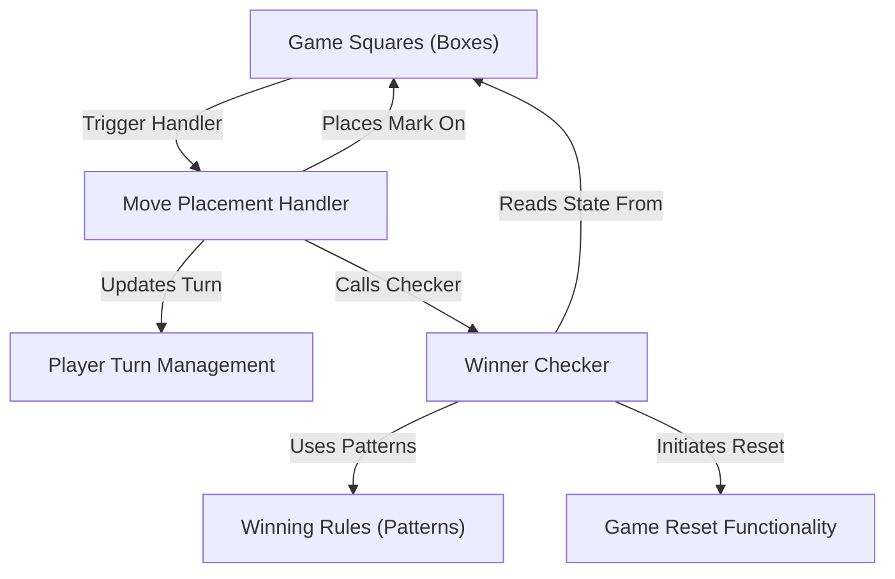

# Tutorial: TicTacToe

This project is a simple, web-based *Tic Tac Toe game*. Players **take turns** placing their 'X' or 'O' marks on a **grid of squares**. The game **checks** after each move to see if any player has achieved a **winning line** (three marks in a row, column, or diagonally), and it can be **reset** to start a new game.

**Source Repository:** [None](None)

## Chapters

1. [Game Squares (Boxes)
](01_game_squares__boxes__.md)
2. [Winning Rules (Patterns)
](02_winning_rules__patterns__.md)
3. [Player Turn Management
](03_player_turn_management_.md)
4. [Move Placement Handler
](04_move_placement_handler_.md)
5. [Winner Checker
](05_winner_checker_.md)
6. [Game Reset Functionality
](06_game_reset_functionality_.md)

---

Generated by AI Codebase Knowledge Builder