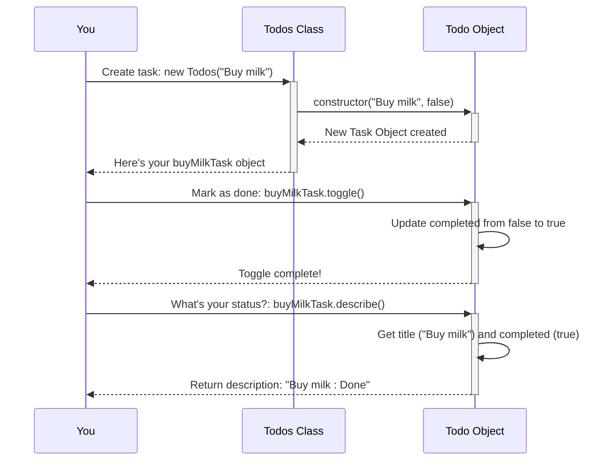

# Chapter 1: Todo Item Blueprint

Welcome to the `Todo_es6` project tutorial! Let's start building our To-Do application from the ground up.

Imagine you want to keep track of things you need to do, like "Buy milk" or "Walk the dog". A To-Do list is made up of these individual tasks. But how do we represent a single task in our code? We need a consistent way to define what a task *is* and what it can *do*.

This is where the **Todo Item Blueprint** comes in! Think of it like a recipe or a template. Every time we want to create a new task, we use this blueprint to ensure it has all the necessary ingredients and instructions.

## What is a Todo Item Blueprint?

In our project, the blueprint is technically called a `class` named `Todos`. Don't worry too much about the word `class` for now; just think of it as our defined structure for *any* single To-Do item.

Our blueprint says that every To-Do item must have two key pieces of information:

1.  **Title:** What is the task? (e.g., "Buy milk")
2.  **Completion Status:** Is the task done or not? (It usually starts as "not done").

Analogy: Imagine a cookie cutter for star-shaped cookies. The cutter is our `Todos` blueprint. Every cookie we make using that cutter will be a star (an individual To-Do task). Each cookie might have different decorations (like a different `title` or `completion status`), but they all come from the same basic star shape (our blueprint).

## Creating Your First Task

Let's use our blueprint (`Todos` class) to create a task. In our code (`app.js`), we'd typically do something like this, but let's look at the core creation part from `todo.js`:

```javascript
// This line creates a new task object using our blueprint
const buyMilkTask = new Todos("Buy milk");
```

*   **What's happening?** We use the `new` keyword with our blueprint name (`Todos`) followed by parentheses `()`.
*   **Input:** Inside the parentheses, we give it the `title` for our task: `"Buy milk"`.
*   **Output:** This creates a specific *instance* or *object* representing our "Buy milk" task. By default, its completion status is set to `false` (not done).

What if you want to create a task that's already completed? Our blueprint allows this too!

```javascript
// Create a task and mark it as completed immediately
const runTask = new Todos("Run in morning", true);
```

*   **Input:** We provide the `title` ("Run in morning") and a second value, `true`, to set the initial `completed` status.
*   **Output:** A new task object for "Run in morning" which is already marked as done.

## What Can a Task Do?

Our blueprint doesn't just define *what* a task is (title, completed status), but also *what it can do*.

1.  **Mark as Complete/Incomplete (Toggle):** We need a way to change a task's status. If it's not done, we mark it done, and vice-versa. This is called "toggling".

    ```javascript
    // Imagine we have our 'buyMilkTask' from before
    // Let's say we just bought the milk! Let's toggle its status.
    buyMilkTask.toggle();
    ```

    *   **Action:** Calling `.toggle()` on our task object flips its `completed` status. If it was `false`, it becomes `true`. If it was `true`, it becomes `false`.
    *   Analogy: Like flipping a light switch on or off.

2.  **Describe Itself:** We need a way for the task to tell us its current state (its title and whether it's done).

    ```javascript
    // Ask the task to describe itself
    const description = buyMilkTask.describe();
    console.log(description); // Output: Buy milk : Done
    ```

    *   **Action:** Calling `.describe()` on the task object asks it for a summary.
    *   **Output:** It gives back a string like `"Buy milk : Done"` or `"Walk the dog : Not Done"`.

## Under the Hood: How the Blueprint Works

Our blueprint is defined in the `todo.js` file using an ES6 `class`. Let's peek inside.

**1. The Constructor (Setting up a new task):**

When we use `new Todos(...)`, a special function inside the class called `constructor` runs automatically. Its job is to set up the initial properties (`title` and `completed`) for the new task object.

```javascript
// Inside todo.js
export class Todos {
  constructor(title, completed = false) { // <-- The constructor
    this.title = title;          // Sets the title property
    this.completed = completed;  // Sets the completed property
  }
  // ... other methods below ...
}
```

*   `constructor(title, completed = false)`: Defines the function. It takes `title` as input. It *also* takes `completed`, but if we don't provide it (like in `new Todos("Buy milk")`), it defaults to `false`.
*   `this.title = title;`: Stores the provided `title` into the new object's `title` property. `this` refers to the specific task object being created.
*   `this.completed = completed;`: Stores the provided (or default) `completed` status into the object's `completed` property.

**2. The `toggle` Method (Flipping the switch):**

This is the function that changes the completion status.

```javascript
// Inside todo.js (within the Todos class)
  toggle = () => {
    // Set completed to the opposite of its current value
    this.completed = !this.completed;
  };
```

*   `toggle = () => { ... }`: Defines the `toggle` function (using arrow function syntax).
*   `this.completed = !this.completed;`: This is the core logic. The `!` symbol means "not". So, it takes the current value of `this.completed` (e.g., `false`), finds the opposite (`!false` which is `true`), and updates `this.completed` with that new value.

**3. The `describe` Method (Giving a status update):**

This function creates the text summary of the task.

```javascript
// Inside todo.js (within the Todos class)
  describe = () => {
    const { title, completed } = this; // Get current title & status
    // Build the description string
    return `${title} : ${completed ? "Done" : "Not Done"}`;
  };
```

*   `describe = () => { ... }`: Defines the `describe` function.
*   `const { title, completed } = this;`: A shortcut to get the `title` and `completed` values from the current object (`this`).
*   `${title} : ${completed ? "Done" : "Not Done"}`: This builds the string.
    *   It includes the `title`.
    *   The `${completed ? "Done" : "Not Done"}` part is a quick way to say: If `completed` is `true`, use the word "Done", otherwise use "Not Done".

**Visualizing the Process:**

Here's a simple diagram showing how creating and interacting with a task might look:



## Conclusion

Great job! You've learned about the fundamental building block of our application: the **Todo Item Blueprint** (the `Todos` class).

*   We know it defines the **structure** (title, completed status) and **behavior** (toggle, describe) of a single task.
*   We saw how to **create** new tasks using `new Todos(...)`.
*   We learned how to **interact** with tasks using methods like `.toggle()` and `.describe()`.
*   We peeked **under the hood** to see how the `constructor`, `toggle`, and `describe` functions work within the `class`.

Now that we can create individual To-Do items, how do we manage a whole *list* of them? That's exactly what we'll cover in the next chapter!

Next up: [Todo List Management](02_todo_list_management_.md)

---

Generated by AI Codebase Knowledge Builder