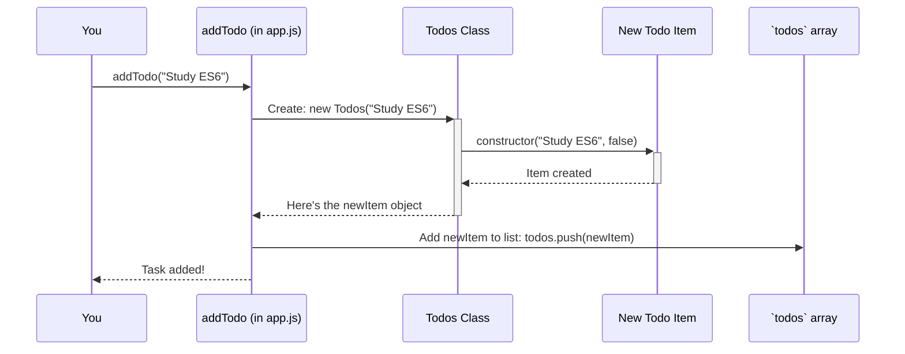

# Chapter 2: Todo List Management

Welcome back! In [Chapter 1: Todo Item Blueprint](01_todo_item_blueprint_.md), we learned how to create a blueprint for a single To-Do item. We saw how each item has a title, a completion status, and can describe itself or toggle its status. That's great for one task, but what about a whole list of them? How do we keep track of "Buy milk," "Walk the dog," *and* "Read a chapter"?

That's where **Todo List Management** comes in. Think of it as your personal assistant for tasks. This assistant doesn't just know about one task; it manages your *entire* list. It can add new tasks, show you everything you need to do, and help you update tasks, like marking them as complete.

## Your Task List's Personal Assistant

Imagine you have a dedicated helper for your To-Do list.
*   You tell your assistant, "Add 'Pay bills' to my list."
*   You ask, "What's on my list today?" and your assistant reads it out.
*   You say, "I've finished 'Buy groceries.' Can you mark it as done?"

In our `Todo_es6` project, we have a set of functions that act like this personal assistant. They work together to manage a collection of our To-Do items. The collection itself is actually a simple list, or what programmers often call an **array**.

Let's meet the key skills of our "task assistant":

1.  **Adding a New Task (`addTodo`)**: Telling the assistant to put a new task on the list.
2.  **Showing All Tasks (`showTodo`)**: Asking the assistant to display all current tasks.
3.  **Updating a Task's Status (`toggleTodo`)**: Instructing the assistant to find a specific task and change its completion status (e.g., from "Not Done" to "Done").

## Managing Your Tasks: The Basic Operations

In our `app.js` file, you'll find these "assistant" functions. Let's see how they work with simple examples.

### 1. Adding a New Task: `addTodo`

When you have a new task, like "Learn JavaScript," you need to add it to your list. The `addTodo` function does exactly this.

```javascript
// In app.js - how you'd use it (conceptually)
addTodo("Learn JavaScript"); // Tell our assistant to add this task
```

*   **What's happening?** We call `addTodo` and give it the title of our new task.
*   **What does it do?**
    1.  It uses the [Todo Item Blueprint](01_todo_item_blueprint_.md) (our `Todos` class) to create a new task item for "Learn JavaScript".
    2.  It then adds this new item to our main list of tasks.

After this, "Learn JavaScript" is now part of your To-Do list, initially marked as "Not Done".

### 2. Showing All Tasks: `showTodo`

Once you have a few tasks, you'll want to see what's on your list. The `showTodo` function displays all of them.

```javascript
// In app.js - how you'd use it (conceptually)
showTodo();
```

*   **What's happening?** We call `showTodo` without any inputs.
*   **What does it do?** It goes through your entire list of tasks and prints each one to the console, showing its title and whether it's done or not.

If you had "Buy milk : Not Done" and "Learn JavaScript : Not Done" on your list, the output might look like:

```
Your Todos -->
1 : Buy milk : Not Done
2 : Learn JavaScript : Not Done
```

### 3. Updating a Task's Status: `toggleTodo`

Let's say you've finished buying milk. You need to update its status. The `toggleTodo` function helps you do this. It needs to know *which* task to update. We tell it by its position in the list (e.g., the first task, the second task, etc.). Computers usually start counting from 0, so the first task is at position 0, the second at position 1, and so on.

```javascript
// In app.js - how you'd use it (conceptually)
// Let's say "Buy milk" was the first item (position 0)
toggleTodo(0); // Tell assistant to toggle the status of the task at position 0
```

*   **What's happening?** We call `toggleTodo` and give it the *index* (position) of the task we want to change.
*   **What does it do?**
    1.  It finds the task at that specific position in your list.
    2.  It then tells that task to "toggle" its own status (just like we saw in [Chapter 1: Todo Item Blueprint](01_todo_item_blueprint_.md) with `task.toggle()`). If it was "Not Done," it becomes "Done," and vice-versa.

If "Buy milk" (at position 0) was "Not Done", after `toggleTodo(0)`, it would become "Done".

## Under the Hood: How Your Assistant Works

So, how do these functions actually manage the list? It all revolves around a central list (an array) that holds all your To-Do items. In our `app.js` file, this list is called `todos`:

```javascript
// Inside app.js
const todos = []; // This is our main list, initially empty!
```
This `todos` array is like the assistant's notepad where all tasks are written down.

Let's look at how each function uses this `todos` array.

### How `addTodo` Works

When you call `addTodo("New Task Title")`:

1.  A new To-Do item object is created using the `Todos` class (our blueprint).
2.  This new To-Do item object is added to the end of the `todos` array.

Here's a simplified diagram:



And the code for `addTodo` in `app.js`:

```javascript
// Inside app.js
import { Todos } from "./todo.js"; // We need the blueprint!

// const todos = []; // Our list, defined elsewhere in app.js

const addTodo = (title = "Untitled") => {
  // 1. Create a new todo item using the blueprint
  const todo = new Todos(title);
  // 2. Add it to our main list
  todos.push(todo);
};
```
*   `const todo = new Todos(title);`: Creates a new task object using the `Todos` blueprint we learned about in [Chapter 1: Todo Item Blueprint](01_todo_item_blueprint_.md).
*   `todos.push(todo);`: The `.push()` method is a standard way to add something to the end of an array in JavaScript. So, our new `todo` object is added to our `todos` list.

### How `showTodo` Works

When you call `showTodo()`:

1.  It looks at the `todos` array.
2.  It goes through each item in the array, one by one.
3.  For each item, it asks the item to describe itself (using the `describe()` method from our `Todos` blueprint).
4.  It then prints this description.

The code for `showTodo` in `app.js`:

```javascript
// Inside app.js
// const todos = []; // Our list

const showTodo = () => {
  console.log("Your Todos --> ");
  // Loop through each item 't' at index 'i' in the 'todos' array
  todos.forEach((t, i) => {
    // t.describe() is the method from our Todo Item Blueprint!
    console.log(`${i + 1} : ${t.describe()}`);
  });
};
```
*   `todos.forEach((t, i) => { ... });`: This is a way to perform an action for every item in the `todos` array.
    *   `t` represents the current To-Do item object in the loop.
    *   `i` represents its index (position: 0, 1, 2...).
*   `${i + 1} : ${t.describe()}`: This creates the line to print. We use `i + 1` for a human-friendly number (1, 2, 3...). `t.describe()` calls the method on the individual To-Do item to get its text description (e.g., "Buy milk : Done").

### How `toggleTodo` Works

When you call `toggleTodo(index)` (e.g., `toggleTodo(1)` to toggle the second item):

1.  It uses the `index` to find the specific To-Do item in the `todos` array.
2.  Once it has that item, it calls the item's own `toggle()` method.

The code for `toggleTodo` in `app.js`:

```javascript
// Inside app.js
// const todos = []; // Our list

const toggleTodo = (index) => {
  // 1. Get the specific todo item from the list using its index
  const todo = todos[index];
  // 2. If the todo item exists, call its toggle method
  // (The '?' checks if 'todo' is not null/undefined before calling toggle)
  todo?.toggle();
};
```
*   `const todo = todos[index];`: This retrieves the To-Do item object from the `todos` array at the specified `index`. For example, if `index` is `1`, it gets the second item.
*   `todo?.toggle();`: This is the magic!
    *   `todo` is the To-Do item we just fetched.
    *   `.toggle()` is the method on that specific item (from the `Todos` blueprint in [Chapter 1: Todo Item Blueprint](01_todo_item_blueprint_.md)) that flips its `completed` status.
    *   The `?.` (optional chaining operator) is a safety check: it only tries to call `.toggle()` if `todo` actually exists (i.e., if the `index` was valid). If `todo` doesn't exist (e.g., we ask for item 100 but only have 3 items), it prevents an error.

## The Big Picture

So, our "Todo List Management" system is essentially:
*   An **array** (named `todos`) that holds all our individual To-Do item objects.
*   A set of **functions** (`addTodo`, `showTodo`, `toggleTodo`) that operate on this array to add items, display them, or modify them.

These functions act as a clean interface, like our personal assistant, so we don't always have to directly mess with the `todos` array ourselves. We just tell the assistant what to do!

You might notice in `app.js` there's also a `saveTodos` function. This is for saving your list more permanently, which involves [Asynchronous Data Storage](04_asynchronous_data_storage_.md) – a topic for a later chapter! For now, our list exists as long as the program is running.

## Conclusion

Fantastic! You've now seen how we manage a whole collection of To-Do items.
*   We have a central list (an array called `todos`) that stores all our task objects.
*   We use functions like `addTodo` to add new tasks, `showTodo` to see them all, and `toggleTodo` to update their status.
*   These functions provide a way to interact with our list, much like a helpful assistant.
*   This management layer builds on top of the [Todo Item Blueprint](01_todo_item_blueprint_.md), using the capabilities of individual tasks to manage the whole group.

We have the blueprint for a task, and we have a way to manage a list of these tasks. But how does our application actually *run*? How do these pieces come together when we execute the program? That's what we'll explore next!

Next up: [Application Execution Flow](03_application_execution_flow_.md)

---

Generated by AI Codebase Knowledge Builder