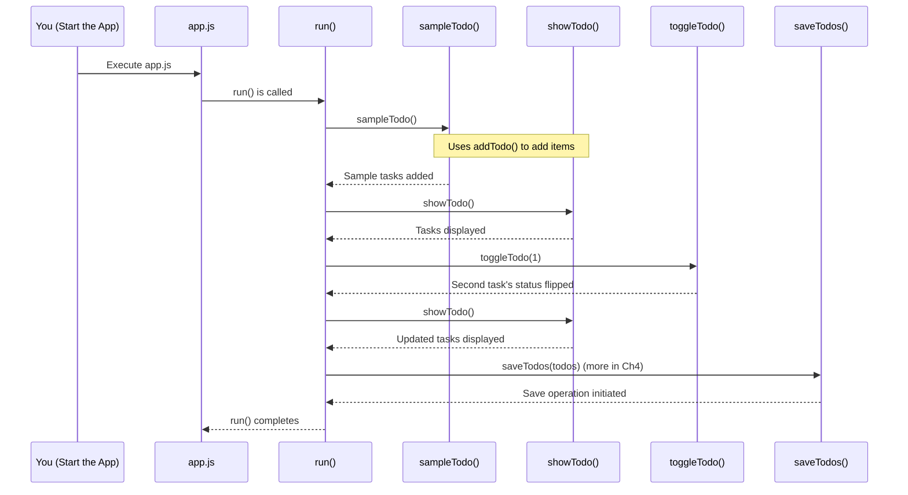

# Chapter 3: Application Execution Flow

Welcome back! In [Chapter 2: Todo List Management](02_todo_list_management_.md), we learned how to manage a whole list of tasks using functions like `addTodo`, `showTodo`, and `toggleTodo`. We have our [Todo Item Blueprint](01_todo_item_blueprint_.md) for individual tasks, and now we have a way to manage a collection of them.

But how does our application actually *start*? How do all these pieces—creating tasks, adding them to a list, displaying them—know *when* to act and in what *order*? This is where the **Application Execution Flow** comes in.

## The Conductor of Our To-Do Symphony

Imagine our To-Do application is like an orchestra.
*   The [Todo Item Blueprint](01_todo_item_blueprint_.md) (our `Todos` class) is like an instrument maker, creating individual instruments (our tasks).
*   The functions from [Todo List Management](02_todo_list_management_.md) (like `addTodo`, `showTodo`) are like different sections of the orchestra – the strings, the brass, etc. – each knowing how to perform a specific part.

But who tells them when to play and what to play? We need a **conductor**!

In our `Todo_es6` project, the "conductor" is mainly a special function called `run` located in our main script file, `app.js`. This `run` function orchestrates the entire sequence of operations for our application. It dictates the order in which things happen, ensuring our app runs smoothly from start to finish, just like a conductor guides an orchestra through a piece of music.

The main script, `app.js`, isn't just a place where we define functions; it's where we *execute* them in a planned sequence to make our application come alive.

## Meet the Conductor: The `run` function

The heart of our application's execution flow is the `run` function in `app.js`. When our application starts, this `run` function is called, and it begins to direct the show.

Let's see what kind of instructions our conductor (`run` function) gives:

1.  **Set up some initial tasks**: To get us started, it first adds a couple of sample To-Do items to our list.
2.  **Show the current list**: It then displays these tasks so we can see what's on our list.
3.  **Make a change**: It might perform an operation, like marking one of the tasks as complete.
4.  **Show the updated list**: After the change, it displays the list again so we can see the effect.
5.  **Save the list**: Finally, it attempts to save our list of tasks (we'll learn more about how this saving part works in the next chapter on [Asynchronous Data Storage](04_asynchronous_data_storage_.md)).

All these actions happen in a specific, predefined order, thanks to our `run` function.

## A Peek at the Conductor's Score (The `run` function)

Let's look at a simplified version of what the `run` function in `app.js` might be doing.

```javascript
// Inside app.js

// (Other functions like addTodo, showTodo, toggleTodo are defined above)

// This is our conductor!
const run = async () => {
  // Step 1: Add some sample todos
  sampleTodo();
  console.log("Following are the sample To Do ");

  // Step 2: Show the initial list
  showTodo();

  // Step 3: Toggle the status of the second todo item
  // (Remember, list positions start from 0, so 1 is the second item)
  toggleTodo(1);
  console.log("Todos after toggling 2nd element");

  // Step 4: Show the list again to see the change
  showTodo();

  // Step 5: Save the todos (more on 'await' in the next chapter!)
  // const result = await saveTodos(todos);
  // console.log(`${result.length} todos saved.`);
  console.log("Attempting to save todos...");
};

// And this is the command to start the music!
run();
```

*   **`const run = async () => { ... }`**: This defines our main "conductor" function. The `async` keyword here is a hint that this function might handle operations that take some time, like saving data. We'll explore `async` more in [Chapter 4: Asynchronous Data Storage](04_asynchronous_data_storage_.md).
*   **`sampleTodo();`**: This is a helper function (also in `app.js`) that adds a few predefined tasks to our list using `addTodo`.
    ```javascript
    // Inside app.js - a helper function used by run()
    const sampleTodo = () => {
      const sample = ["Buy milk", "Run in the morning"];
      // It uses addTodo from Chapter 2 for each sample item!
      sample.forEach(addTodo);
    };
    ```
*   **`showTodo();`**: Calls the function we learned about in [Chapter 2: Todo List Management](02_todo_list_management_.md) to display all tasks.
*   **`toggleTodo(1);`**: Calls another function from Chapter 2 to change the completion status of the task at index 1 (the second task).
*   **`run();`**: This is crucial! After defining the `run` function, this line actually *calls* it, starting the entire sequence of operations. Without this line, our conductor would have a score but would never start the performance!

**What happens when you run `app.js`?**

1.  The JavaScript engine reads `app.js`.
2.  It sees all the function definitions (`Todos` class from `todo.js` (imported), `addTodo`, `showTodo`, `toggleTodo`, `sampleTodo`, `run`).
3.  Finally, it reaches the line `run();` and executes the `run` function.
4.  The `run` function then executes its commands one by one, from top to bottom.

## Under the Hood: How `run` Orchestrates the Show

Let's visualize the sequence of events when `run()` is called:



This diagram shows how the `run` function acts as a central point, calling other functions in the correct order to achieve the application's goals.

Let's look at the `run` function from `app.js` again, focusing on its role as the orchestrator:

```javascript
// In app.js

// ... (import statements and other function definitions like addTodo, showTodo, toggleTodo) ...

const todos = []; // Our main list, managed by functions in Chapter 2

const sampleTodo = () => {
  const sample = ["Buy milk", "Run in the morning"];
  sample.forEach(addTodo); // Adds "Buy milk" and "Run in the morning" to 'todos'
};

// The conductor function
const run = async () => {
  // Action 1: Populate the list with initial data
  sampleTodo();
  console.log("Following are the sample To Do ");
  // Expected output: (console logs, then showTodo output)
  // Following are the sample To Do
  // Your Todos -->
  // 1 : Buy milk : Not Done
  // 2 : Run in the morning : Not Done

  // Action 2: Display the initial list
  showTodo();

  // Action 3: Modify data - toggle the second item (index 1)
  toggleTodo(1); // "Run in the morning" becomes "Done"
  console.log("Todos after toggling 2nd element");

  // Action 4: Display the modified list
  showTodo();
  // Expected output: (console logs, then showTodo output)
  // Todos after toggling 2nd element
  // Your Todos -->
  // 1 : Buy milk : Not Done
  // 2 : Run in the morning : Done

  // ... (code for adding more todos, as in the original app.js) ...

  // Action 5: Prepare for saving (details in next chapter)
  // const result = await saveTodos(todos);
  // console.log(`${result.length} todos saved.`);
  console.log("\nFinal list prepared for saving (details in next chapter).");
};

// The crucial call that starts everything!
run();
```

Each step within `run` is a clear instruction: "do this, then do that."
1.  `sampleTodo()` is called. Internally, it uses `addTodo` (from [Todo List Management](02_todo_list_management_.md)) to populate our `todos` array.
2.  `showTodo()` is called to display the contents of the `todos` array.
3.  `toggleTodo(1)` finds the second item in the `todos` array and calls its `.toggle()` method (from the [Todo Item Blueprint](01_todo_item_blueprint_.md)).
4.  `showTodo()` is called again to display the changes.
5.  The `saveTodos(todos)` line (though its `await` magic is for [Chapter 4: Asynchronous Data Storage](04_asynchronous_data_storage_.md)) signals an attempt to save the current state of the `todos` array.

Without the `run` function to call these other functions in sequence, our `addTodo`, `showTodo`, etc., would just be defined but never actually *do* anything. And without the final `run();` line, even our conductor `run` function itself wouldn't start!

## Conclusion

You've now seen how our To-Do application is set in motion!
*   The **Application Execution Flow** is like the script or score that our application follows.
*   The `run` function in `app.js` acts as the **conductor**, orchestrating the sequence of operations.
*   It calls various helper functions (many of which we learned about in [Chapter 1: Todo Item Blueprint](01_todo_item_blueprint_.md) and [Chapter 2: Todo List Management](02_todo_list_management_.md)) in a specific order.
*   The very act of calling `run();` at the end of `app.js` is what kicks everything off.

We've seen our application load sample data, display it, modify it, and display it again. The `run` function also included a step for saving our To-Do list. But how does saving work, especially if it might take some time (like writing to a file or a database)? That involves "asynchronous" operations, which is exactly what we'll explore next!

Next up: [Asynchronous Data Storage](04_asynchronous_data_storage_.md)

---

Generated by AI Codebase Knowledge Builder