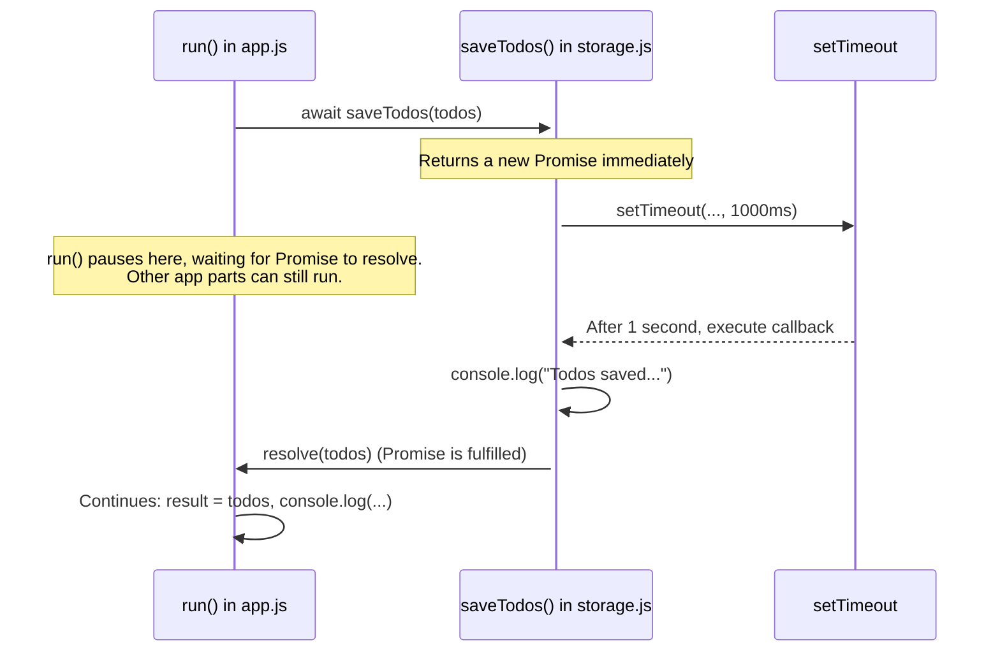

# Chapter 4: Asynchronous Data Storage

Welcome back! In [Chapter 3: Application Execution Flow](03_application_execution_flow_.md), we saw how the `run` function orchestrates our To-Do application, making it add, show, and even toggle tasks. But what happens when the application closes? Right now, our To-Do list would vanish! To make our list persistent—meaning it stays around even after we close the app—we need to save it. This chapter explores how our `Todo_es6` project simulates saving data, and introduces the important concept of "asynchronous" operations.

## Why Do We Need to Save Data Asynchronously?

Imagine you've just finished organizing your To-Do list:
1.  "Buy milk"
2.  "Walk the dog" (Done)
3.  "Read ES6 book"

You want the application to remember this list for the next time you open it. This "remembering" is what we call **data storage**. In real applications, this could mean writing to a file on your computer or sending data to a database over the internet.

Now, what if saving this data takes a few seconds? If the application just froze completely while saving, you wouldn't be able to click anything or see any updates. It would feel broken! This is where **asynchronous** operations come to the rescue.

**Asynchronous means "not at the same time."** Think of it like ordering food online:
1.  You place your order (this is like telling the app to save your data).
2.  You don't just stare at the "Order Placed" screen, unable to do anything else until your food arrives. You can continue browsing other websites, check your email, or do other things on your computer.
3.  Your food order is being processed in the background. Eventually, you get a notification (or the food arrives) confirming it's done.

Asynchronous data storage works similarly: the app initiates the save operation, and while that's happening in the background, the app can still respond to you. It doesn't halt everything.

## Meet `async` and `await`: Managing the Wait

If saving happens in the background, how does our main application code know when it's finished? And what if we want to do something immediately *after* saving is complete, like displaying a "Your list is saved!" message?

JavaScript gives us special keywords, `async` and `await`, to handle these situations gracefully.

*   **`async`**: You put this keyword before a function definition (like `async function myFunction() {...}`). It signals that this function might perform some asynchronous operations and will implicitly return a `Promise` (we'll touch on Promises soon!).
*   **`await`**: You can only use `await` *inside* a function that is marked `async`. When you put `await` before a call to an asynchronous function (like `await saveData()`), it tells JavaScript:
    *   "Start this asynchronous operation (`saveData()`)."
    *   "Now, pause the execution *of this `async` function only* right here."
    *   "Wait until `saveData()` finishes and gives back its result."
    *   "Once it's done, resume this `async` function from where it left off, using the result from `saveData()`."

The crucial part is that `await` only pauses the `async` function it's in. The rest of your application (like the user interface) can remain responsive.

## How `Todo_es6` Simulates Saving

In our project, we're not connecting to a real database. Instead, we have a function that *simulates* the act of saving, including a slight delay, to demonstrate asynchronous behavior. This happens in the `storage.js` file with the `saveTodos` function, which is then used by our main `app.js` script.

Let's look at how the `run` function in `app.js` (from [Chapter 3: Application Execution Flow](03_application_execution_flow_.md)) uses this:

```javascript
// Inside app.js, within the run function
// ... (code for adding and showing todos) ...

// The 'todos' array now holds our list
const result = await saveTodos(todos); // <-- Saving happens here!
console.log(`${result.length} todos saved.`);
```

*   **`saveTodos(todos)`**: This function (from `storage.js`) is called with our current list of `todos`. Its job is to "save" them.
*   **`await`**: Because `saveTodos` is asynchronous (it pretends to take time), we use `await`. This means the `run` function will pause at this line. It won't immediately jump to `console.log(...)`. It will wait until `saveTodos` signals that it has finished its job.
*   **`const result = ...`**: When `saveTodos` finishes, whatever value it "returns" (or "resolves" with) will be stored in the `result` variable.

For `await` to be used, the `run` function itself must be declared as `async`:

```javascript
// Inside app.js
// Note the 'async' keyword here!
const run = async () => {
  // ...
  sampleTodo();
  showTodo();
  // ...
  const result = await saveTodos(todos); // await is allowed here
  console.log(`${result.length} todos saved.`);
};
```

## Under the Hood: `saveTodos` and the Magic of `Promise`

Let's peek into `storage.js` to see how `saveTodos` works its magic.

```javascript
// Inside storage.js
// This function simulates saving data.
export const saveTodos = (todos = []) => {
  // 1. Return a new Promise
  return new Promise((resolve) => {
    // 2. Simulate a delay (like talking to a database)
    setTimeout(() => {
      console.log("\n Todos saved to fake database ");
      // 3. "Resolve" the promise with the data
      resolve(todos);
    }, 1000); // 1000 milliseconds = 1 second delay
  });
};
```

This might look a bit new, so let's break it down:

1.  **`return new Promise((resolve) => { ... });`**
    *   The `saveTodos` function immediately returns something called a **`Promise`**.
    *   **Analogy:** Think of a `Promise` like getting a receipt when you drop off dry cleaning. You don't have your clean clothes yet (the final result), but you have a "promise" (the receipt) that you'll get them later.
    *   The `Promise` takes a function with an argument, commonly named `resolve`. `resolve` is a function you call when your asynchronous task is successfully completed.

2.  **`setTimeout(() => { ... }, 1000);`**
    *   `setTimeout` is a built-in JavaScript function that waits for a specified amount of time (in milliseconds) and then executes the code you give it.
    *   Here, we're telling it to wait for `1000` milliseconds (which is 1 second).
    *   This `setTimeout` *simulates* the delay that might occur if we were actually saving data to a real database or a file.

3.  **Inside `setTimeout`:**
    *   `console.log("\n Todos saved to fake database ");`: This message prints to the console after the 1-second delay, indicating our "fake save" has happened.
    *   **`resolve(todos);`**: This is the crucial step! Calling `resolve(todos)` means the `Promise` is now "fulfilled" or "resolved." It's like the dry cleaner calling you to say, "Your clothes are ready!" The value passed to `resolve` (in this case, our `todos` array) becomes the result that `await` (back in `app.js`) was waiting for.

**Visualizing the Flow:**

Here’s how `app.js` and `storage.js` interact when saving:



So, even though `saveTodos` uses `setTimeout` to create a delay, the `async`/`await` syntax in `app.js` makes it appear as if the code is just pausing and then continuing, all without freezing the entire application. This is much cleaner than older ways of handling asynchronous code (which often involved complex nested "callback functions").

## Why is this "Mock" Saving Useful?

Even though `storage.js` doesn't *really* save the data anywhere permanent in this project, it's extremely valuable because:
1.  **It teaches `async/await`**: It provides a perfect, simple example of how to use `async` and `await` to handle operations that take time.
2.  **It simulates reality**: Real-world applications almost always involve asynchronous operations (fetching data, saving data, user input). This prepares you for that.
3.  **It allows for future expansion**: If we wanted to make this a "real" app, we could replace the `setTimeout` logic in `storage.js` with actual code to save to a file or database, and the `app.js` code using `await saveTodos(todos)` wouldn't need to change much!

## Conclusion

Great job! You've now learned about a very important concept in modern JavaScript: **Asynchronous Data Storage**.

*   We understood that "asynchronous" means operations can happen in the background without freezing the main application, like placing an online order.
*   We saw how our `Todo_es6` project *simulates* saving data with a delay using `setTimeout` inside the `saveTodos` function in `storage.js`.
*   We learned that `saveTodos` returns a `Promise`, which is like an IOU for a future result.
*   We discovered how `async` and `await` in `app.js` allow us to work with these `Promise`s in a clean, readable way, pausing a function's execution until the asynchronous operation completes.
*   This approach keeps our application responsive even when dealing with potentially time-consuming tasks.

We've covered how to define a task, manage a list of tasks, control the application's flow, and even how to "save" our data asynchronously. Our code is starting to do quite a bit! But as projects grow, keeping everything in just one or two files can become messy. How do we organize our code better? That's where modules come in!

Next up: [Code Modularity (ES6 Modules)](05_code_modularity__es6_modules_.md)

---

Generated by AI Codebase Knowledge Builder