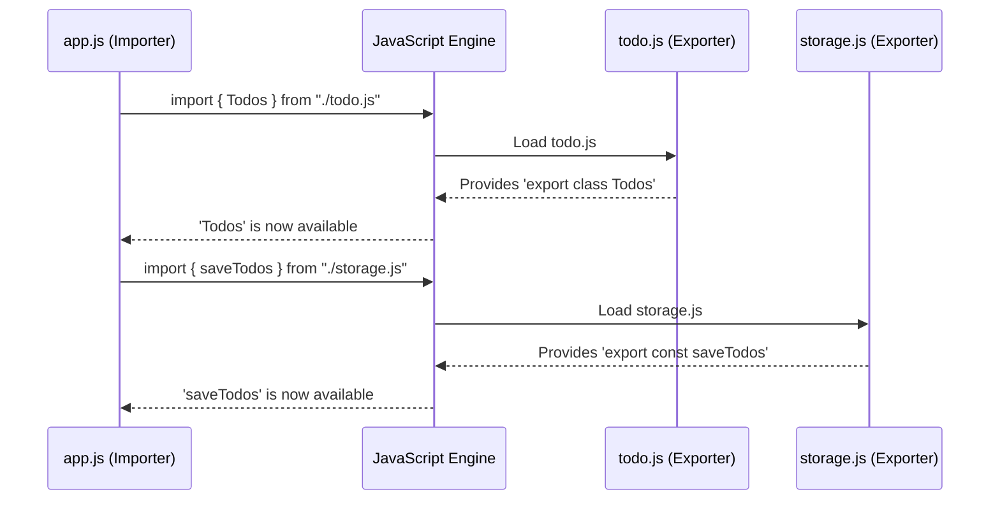

# Chapter 5: Code Modularity (ES6 Modules)

Welcome to the final chapter of our `Todo_es6` tutorial! In [Chapter 4: Asynchronous Data Storage](04_asynchronous_data_storage_.md), we explored how our application can "save" data without freezing up, using `async` and `await`. We've built quite a few pieces now: a blueprint for tasks, ways to manage a list, a flow for running the app, and even simulated saving.

As projects grow, putting all your code into one or two giant files becomes like trying to find a specific tool in a very messy toolbox – it's difficult and time-consuming! This chapter is all about how `Todo_es6` keeps things tidy using **Code Modularity** with ES6 Modules.

## Your Workshop: Keeping Code Organized

Imagine your project is a workshop. If all your tools and all your specialized stations were just jumbled together in one big room, it would be chaos! A well-organized workshop, however, has specialized stations:
*   One station for designing and cutting wood (like our `todo.js` file, which defines what a "Todo" item is).
*   Another station for assembling parts (like `app.js`, which uses To-Do items and manages the list).
*   Perhaps a separate station for packaging finished products (like `storage.js`, which handles "saving" our list).

**Code Modularity** is exactly this: organizing your code into separate, independent files, often called **modules**. Each module has a specific job, making the whole project cleaner, easier to understand, and easier to manage.

In JavaScript, ES6 Modules provide a standard way to create these separate files and allow them to share code with each other using special keywords: `export` and `import`.

*   **`export`**: This is like a specialized station in your workshop announcing, "Hey, I've finished making this tool (or part), and it's available for others to use!"
*   **`import`**: This is like the main assembly station saying, "I need that tool from the cutting station and that part from the packaging station to do my job."

Let's see how `Todo_es6` uses this "workshop" approach.

## How `Todo_es6` Uses Modules

Our project has three main JavaScript files:

1.  `todo.js`: Defines the blueprint for a single To-Do item (the `Todos` class from [Chapter 1: Todo Item Blueprint](01_todo_item_blueprint_.md)). This is like our "To-Do Item Design Station."
2.  `storage.js`: Handles the logic for "saving" our list of To-Do items (the `saveTodos` function from [Chapter 4: Asynchronous Data Storage](04_asynchronous_data_storage_.md)). This is our "Data Storage Station."
3.  `app.js`: The main file that orchestrates the application. It creates To-Do items, manages the list, and uses the storage functionality. This is our "Main Assembly Station."

How do these "stations" share their work? With `export` and `import`!

### Making Tools Available: `export`

A module needs to explicitly say what parts of its code can be used by other modules. This is done with the `export` keyword.

**1. Exporting the `Todos` Blueprint (`todo.js`):**

Our `todo.js` file defines the `Todos` class. To make this class usable by other files (like `app.js`), we put `export` in front of it:

```javascript
// Inside todo.js
export class Todos { // <-- 'export' makes this class available
  constructor(title, completed = false) {
    this.title = title;
    this.completed = completed;
  }
  // ... other methods like toggle() and describe() ...
}
```
*   **`export class Todos { ... }`**: This line says, "The `Todos` class defined here is available for other modules to import and use."

**2. Exporting the Saving Function (`storage.js`):**

Similarly, `storage.js` defines the `saveTodos` function. It uses `export` to make it available:

```javascript
// Inside storage.js
// 'export' makes this function available
export const saveTodos = (todos = []) => {
  return new Promise((resolve) => {
    setTimeout(() => {
      // console.log("\n Todos saved to fake database ");
      resolve(todos); // Simplified for brevity
    }, 1000);
  });
};
```
*   **`export const saveTodos = ...`**: This says, "The `saveTodos` function is now available for other modules to use."

### Using Shared Tools: `import`

Now that `todo.js` and `storage.js` have "exported" their tools, our main assembly station, `app.js`, can "import" and use them.

**Importing into `app.js`:**

At the very top of `app.js`, you'll see these lines:

```javascript
// Inside app.js (at the top)
import { Todos } from "./todo.js";
import { saveTodos } from "./storage.js";

// Now, app.js can use Todos and saveTodos!
// For example:
// const newTask = new Todos("Learn Modules!");
// await saveTodos(someListOfTasks);
```
Let's break this down:
*   **`import { Todos } from "./todo.js";`**
    *   `import`: The keyword to bring in code from another module.
    *   `{ Todos }`: This specifies *what* we want to import from `todo.js`. The curly braces `{}` are used for "named exports" (because `Todos` was exported by its name).
    *   `from "./todo.js"`: This tells JavaScript *where* to find the module.
        *   `./` means "look in the current directory" (the same folder as `app.js`).
        *   `todo.js` is the name of the file.

*   **`import { saveTodos } from "./storage.js";`**
    *   This works the same way: it imports the `saveTodos` function from the `storage.js` file located in the current directory.

Once imported, `app.js` can use `Todos` to create new task objects (as seen in [Chapter 1: Todo Item Blueprint](01_todo_item_blueprint_.md)) and `saveTodos` to save the list (as seen in [Chapter 4: Asynchronous Data Storage](04_asynchronous_data_storage_.md)), just as if those pieces of code were written directly in `app.js`.

## Under the Hood: How Modules Connect

When your browser or Node.js (the environment that can run JavaScript outside a browser) encounters an `import` statement, it's like a request being sent:

1.  **`app.js` says:** "I need `Todos` from `./todo.js` and `saveTodos` from `./storage.js`."
2.  **JavaScript Engine (the "Loader"):**
    *   Finds the `todo.js` file.
    *   Looks inside `todo.js` for things marked with `export`. It finds `export class Todos`.
    *   Makes the `Todos` class available to `app.js`.
    *   Then, it finds the `storage.js` file.
    *   Looks inside `storage.js` for `export`s. It finds `export const saveTodos`.
    *   Makes the `saveTodos` function available to `app.js`.
3.  **`app.js` continues:** Now it can use `Todos` and `saveTodos` as needed.

Here's a simple diagram illustrating this:



This system of `import` and `export` ensures that modules only share what they intend to share, and that dependencies between files are clear.

## Why Bother With Modules? The Benefits!

Using modules, even in a small project like `Todo_es6`, brings several advantages that become even more critical in larger applications:

1.  **Organization:** Your code is neatly arranged into logical units. It's like having a tidy workshop where every tool has its place. You know `todo.js` is all about the structure of a single To-Do item.
2.  **Readability:** It's easier to understand a smaller, focused file than a giant one. When you open `storage.js`, you know you're looking at code related to saving data.
3.  **Reusability:** Code defined in one module (like our `Todos` class) can be easily reused in other parts of the application, or even in different projects.
4.  **Maintainability:** If you need to change how a To-Do item is defined, you know to go to `todo.js`. Changes in one module are less likely to accidentally break unrelated parts of your application, as long as the "exported" parts don't change their basic function.
5.  **Collaboration (for bigger projects):** Different developers can work on different modules simultaneously with less risk of stepping on each other's toes.

Think back to our workshop. If the wood-cutting station improves its saw, it doesn't necessarily disrupt the assembly station, as long as it still produces the same kind of cut pieces.

## Conclusion

Congratulations! You've reached the end of the `Todo_es6` tutorial and learned about **Code Modularity using ES6 Modules**.

*   We saw that modules are like specialized stations in a workshop, each file (`todo.js`, `storage.js`, `app.js`) having its own distinct role.
*   The `export` keyword is used within a module to make its functions, classes, or variables available to others.
*   The `import` keyword is used by a module to bring in and use the exported tools from other modules.
*   This system helps keep our code **organized**, **readable**, **reusable**, and **easier to maintain**.

Throughout this tutorial series, we've journeyed from defining a [Todo Item Blueprint](01_todo_item_blueprint_.md), to [Todo List Management](02_todo_list_management_.md), understanding the [Application Execution Flow](03_application_execution_flow_.md), handling [Asynchronous Data Storage](04_asynchronous_data_storage_.md), and finally, organizing our code with **ES6 Modules**.

You now have a solid foundation in some of the key concepts used in modern JavaScript development, all demonstrated through the `Todo_es6` project. We hope this has been a helpful and enjoyable learning experience. Keep exploring, keep coding, and keep building!

---

Generated by AI Codebase Knowledge Builder