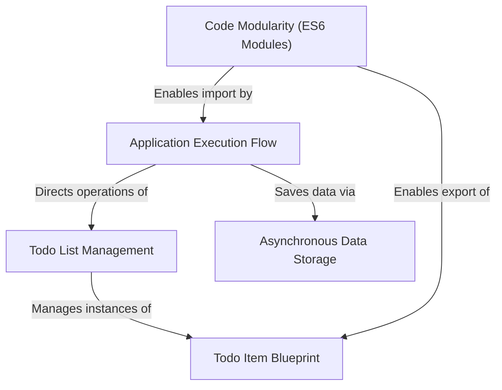

# Tutorial: Todo_es6

This project is a *simple command-line To-Do list application*.
It allows you to **create tasks** (like "Buy milk"), view your list of tasks, and *mark tasks as complete or incomplete*.
Finally, it demonstrates how the list of to-do items can be **saved** (simulating saving to a database).
The project is built using modern **JavaScript (ES6)**, organizing its code into different files (modules) and using classes to define the structure of a to-do item.

**Source Repository:** [None](None)

## Chapters

1. [Todo Item Blueprint
](01_todo_item_blueprint_.md)
2. [Todo List Management
](02_todo_list_management_.md)
3. [Application Execution Flow
](03_application_execution_flow_.md)
4. [Asynchronous Data Storage
](04_asynchronous_data_storage_.md)
5. [Code Modularity (ES6 Modules)
](05_code_modularity__es6_modules__.md)

---

Generated by AI Codebase Knowledge Builder