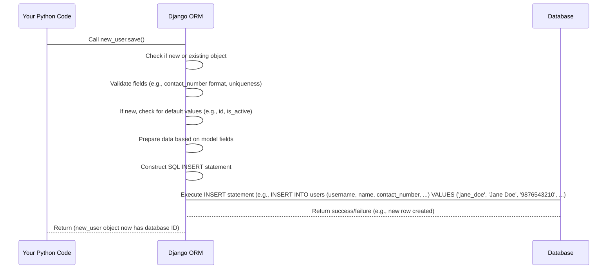
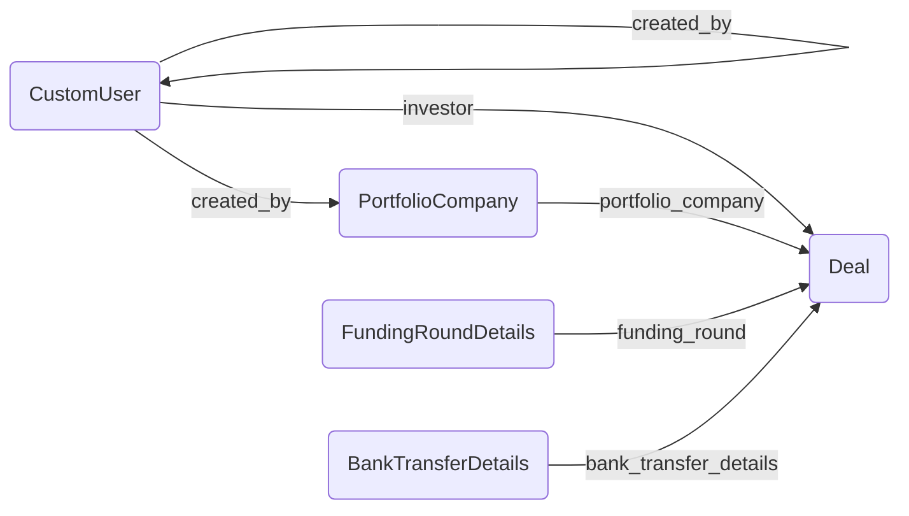

# Chapter 1: Django Models (ORM)

Welcome to the first chapter of our tutorial on the `sisforce-pig_backend` project! We're starting with the very foundation of how our application handles data: **Django Models** and its **Object-Relational Mapper (ORM)**.

Imagine you're building a system to manage information about investment deals, the companies involved, and the investors. You need a structured way to store things like:

*   Who is the investor? What's their name, contact, type?
*   What portfolio company is the deal for? What's its business type, current valuation?
*   What are the details of the deal itself? The amount invested, the date, the status?

This is where databases come in. Traditionally, you'd use a database like PostgreSQL and write SQL queries (like `CREATE TABLE users (id UUID PRIMARY KEY, name VARCHAR(100), ...);`, `INSERT INTO users (...) VALUES (...);`, `SELECT * FROM deals WHERE investor_id = '...';`) to define your data structure and interact with it. While powerful, SQL can become complex, especially for beginners, and it requires switching between your Python code and database-specific commands.

Django Models and the ORM solve this!

## What are Django Models (ORM)?

Think of Django Models as **blueprints or templates** for the different types of information you need to store in your application. Each model is essentially a Python class that defines the structure of data for a specific entity, like a `User`, a `PortfolioCompany`, or a `Deal`.

The **ORM (Object-Relational Mapper)** is the clever tool that acts as a translator. It lets you interact with your database using familiar Python code (working with these model objects) instead of writing complex SQL queries directly. You can create, read, update, and delete data using Python methods, and the ORM handles the translation to the necessary database commands behind the scenes.

*   **Object:** Your Python class instance (e.g., a specific `CustomUser` object).
*   **Relational:** Your database (which stores data in related tables).
*   **Mapper:** The ORM maps the Python objects to database rows and columns.

Using models makes managing and querying data much more intuitive and "Pythonic". It defines not just the structure but also the relationships between different pieces of data.

Let's look at the `pig_project/pig/models.py` file to see how this is defined in our project.

## Key Concepts in Django Models

Let's break down the essential parts you'll see in our `models.py` file.

### 1. Model Classes

Each distinct type of data gets its own Python class, which *inherits* from `django.db.models.Model`.

```python
# Inside pig_project/pig/models.py

from django.db import models
import uuid

class CustomUser(models.Model): # This is a model class
    # ... fields defined below ...
    pass

class PortfolioCompany(models.Model): # Another model class
    # ... fields defined below ...
    pass

class Deal(models.Model): # And another!
    # ... fields defined below ...
    pass

# ... other models ...
```

Each of these classes (`CustomUser`, `PortfolioCompany`, `Deal`, etc.) corresponds to a table in our database.

### 2. Fields

Inside each model class, you define **fields**. These are class attributes that specify the type of data each column in the database table will hold, and how it should behave.

```python
# Inside CustomUser model (simplified)

class CustomUser(models.Model):
    id = models.UUIDField(primary_key=True, default=uuid.uuid4, editable=False) # A unique identifier field
    name = models.CharField(max_length=100) # Text field for names
    contact_number = models.CharField(max_length=10, unique=True) # Text field for numbers, must be unique
    is_active = models.BooleanField(default=True) # True/False value, defaults to True
    created_at = models.DateTimeField(auto_now_add=True) # Date and time, automatically set when created

    # ... other fields ...
```

Here are some common field types used in our project:

*   `models.CharField`: For small amounts of text (like names, codes). Requires `max_length`.
*   `models.TextField`: For larger amounts of text (like descriptions).
*   `models.IntegerField`: For whole numbers.
*   `models.DecimalField`: For numbers with decimal points (like currency amounts). Requires `max_digits` and `decimal_places`.
*   `models.BooleanField`: For true/false values.
*   `models.DateField`: For dates.
*   `models.DateTimeField`: For dates and times.
*   `models.UUIDField`: For storing universally unique identifiers (UUIDs). Often used for `primary_key`.
*   `models.URLField`: For storing web addresses.
*   `models.EmailField`: For storing email addresses.

Fields often have attributes like:

*   `primary_key=True`: Makes this field the unique identifier for each row.
*   `default=...`: Provides a default value if none is specified when creating a new object.
*   `null=True`: Allows the database column to store `NULL` (empty) values.
*   `blank=True`: Allows forms (like in the Django Admin) to have this field empty. `null` is for the database, `blank` is for validation.
*   `unique=True`: Ensures that each value in this column must be unique across all rows.
*   `choices=...`: Provides a list of predefined options for this field.
*   `validators=...`: Allows adding custom validation rules (like the `RegexValidator` for `contact_number`).

### 3. Relationships

Real-world data is connected. Models reflect this using special field types:

*   **`ForeignKey`**: Represents a "many-to-one" relationship. Many objects of one model are related to a single object of another model.
    *   Example: Many `Deal` objects can be linked to *one* `PortfolioCompany`. A `Deal` object has a `portfolio_company` field that links to a `PortfolioCompany` object.
    *   Code Example:
        ```python
        # Inside Deal model
        portfolio_company = models.ForeignKey(
            'PortfolioCompany', # Links to the PortfolioCompany model
            on_delete=models.CASCADE, # What happens if the linked company is deleted? CASCADE means delete the deal too.
            related_name='deals' # Allows accessing related deals from a PortfolioCompany object (company.deals.all())
        )
        ```
    *   Another Example: Many `CustomUser` objects might be *created by* a single other `CustomUser`.
        ```python
        # Inside CustomUser model
        created_by = models.ForeignKey(
            'self', # Links to the same model (CustomUser)
            on_delete=models.SET_NULL, # What happens if the creator is deleted? Set this field to NULL.
            null=True, blank=True, # Allow this field to be optional
            related_name='created_users' # Access users created by this user (user.created_users.all())
        )
        ```

*   **`ManyToManyField`**: Represents a "many-to-many" relationship. Many objects of one model can be related to many objects of another model.
    *   Example: A `Deal` might involve multiple `BankTransferDetails` (for different payment stages), and a single `BankTransferDetail` might be used for multiple `Deal`s.
    *   Code Example:
        ```python
        # Inside Deal model
        bank_transfer_details = models.ManyToManyField(
            'BankTransferDetails', # Links to the BankTransferDetails model
            related_name='deals', # Allows accessing related deals from a BankTransferDetails object (bank_detail.deals.all())
            blank=True # Allow a deal to have no bank details linked initially
        )
        ```

Django's ORM automatically handles the database structure (often creating intermediate tables for `ManyToManyField`) to manage these relationships.

### 4. Metadata (`class Meta`)

You can add a special inner class named `Meta` inside your model to define database-specific options or other settings.

```python
# Inside CustomUser model
class CustomUser(AbstractUser):
    class Meta: # This is the Meta class
        db_table = "users" # Tells Django to use "users" as the table name instead of the default "pig_customuser"

    # ... fields ...
```

The `db_table` option is used here to give the database table a specific name ("users") which might be different from the default name Django would generate (which would typically be `appname_modelname`, like `pig_customuser`).

### 5. Model Methods

Model classes can also have methods, just like any other Python class. These methods can add custom behavior related to the data represented by the model.

```python
# Inside CustomUser model

# ... fields ...

def __str__(self):
    """String representation of the object."""
    return str(self.username) # When you print a user object, it shows their username

def set_ssn(self, ssn):
    """Encrypts and stores the SSN"""
    if ssn:
        encrypted_data = cipher.encrypt(ssn.encode())
        self.encrypted_ssn = encrypted_data
    else:
        self.encrypted_ssn = None

def get_ssn(self):
    """Decrypts and returns the SSN"""
    # ... decryption logic ...
    pass

def save(self, *args, **kwargs):
    """Ensure SSN is encrypted before saving"""
    if self.encrypted_ssn and isinstance(self.encrypted_ssn, str):
        self.set_ssn(self.encrypted_ssn) # Call set_ssn before saving if SSN is a string (e.g., coming from user input)
    super().save(*args, **kwargs) # Call the original save method to store in the database
```

*   The `__str__` method is very common. It defines what should be displayed when you print or represent an object of this model (very useful in the Django Admin or for debugging).
*   Methods like `set_ssn` and `get_ssn` encapsulate specific logic related to the model's data, in this case, handling encryption/decryption of sensitive information.
*   Overriding the `save` method allows you to perform actions *before* or *after* an object is saved to the database. In the `Deal` model, the `save` method is used to automatically generate a unique `deal_code` before saving a new deal object.

```python
# Inside Deal model

# ... fields ...

def save(self, *args, **kwargs):
    """Generate deal code before saving"""
    if not self.deal_code: # Check if deal_code is not already set
        # Logic to generate a unique code based on month/year and sequence number
        # ... (Code omitted for brevity, but it calculates a string like "PIG/DC/MMYYYY/######")
        self.deal_code = generated_code_here # Set the generated code
    super().save(*args, **kwargs) # Call the original save method to store in the database

# ... other methods ...
```

This shows how methods can add business logic directly to your data models.

## Using Models: A Simple Example (Creating a User)

Let's see how we would use the `CustomUser` model to create a new user in the database using Python and the ORM. You would typically do this in a Django shell, a script, or a view function ([Chapter 6: API Views and URL Routing](06_api_views_and_url_routing_.md)).

First, you need to import the model:

```python
# In your Python code (e.g., manage.py shell)

from pig.models import CustomUser
```

Now, create an *instance* of the model class. This is like creating a row in the "users" table, but it only exists in Python memory so far:

```python
# Create a new user object in memory
new_user = CustomUser(
    username='jane_doe',
    name='Jane Doe',
    contact_number='9876543210',
    role='investor', # Using one of the ROLE_CHOICES
    # You'd typically set a password separately and securely!
)

print(f"New user object created in memory: {new_user}")
```

This creates a Python object. It hasn't touched the database yet.

To save this user to the database, you call the `.save()` method on the object:

```python
# Save the user object to the database
new_user.save()

print(f"User '{new_user.username}' saved to database with ID: {new_user.id}")
```

**What happens when you call `.save()`?** This is where the ORM magic happens!

## Behind the Scenes: The ORM at Work

When you call `new_user.save()`, the Django ORM takes over. It knows:

1.  You're trying to save an object of the `CustomUser` model.
2.  The `CustomUser` model maps to the "users" table in the database.
3.  The fields (`username`, `name`, `contact_number`, etc.) correspond to columns in that table.
4.  The `new_user` object has specific values for these fields.

The ORM then constructs the appropriate SQL command, typically an `INSERT` statement if it's a new object, or an `UPDATE` statement if it's an existing object being modified.

Here's a simplified look at the process using a sequence diagram:



The ORM handles all the communication with the database using your project's database settings (defined in `pig_project/settings.py`, though we won't cover settings in detail here).

## Retrieving Data

The ORM also makes it easy to fetch data from the database using Python. Each model class automatically gets a special attribute called `objects`. This is the gateway to performing database queries.

To get the user we just created:

```python
# Get the user by username
try:
    fetched_user = CustomUser.objects.get(username='jane_doe')
    print(f"Fetched user: {fetched_user.name}, Contact: {fetched_user.contact_number}")
except CustomUser.DoesNotExist:
    print("User not found!")
```

This `CustomUser.objects.get(username='jane_doe')` call is translated by the ORM into an SQL query like `SELECT id, username, name, ... FROM users WHERE username = 'jane_doe';`. The ORM then takes the resulting row from the database and turns it back into a `CustomUser` Python object for you to use.

You can also fetch multiple objects (which returns a `QuerySet`, similar to a list) and filter them:

```python
# Get all users with the role 'investor'
investors = CustomUser.objects.filter(role='investor')

print(f"Found {investors.count()} investor(s):")
for investor in investors:
    print(f"- {investor.name}")

# Get all active portfolio companies
active_companies = PortfolioCompany.objects.filter(status='publish')
# (Here 'publish' would come from the STATUS_CHOICES defined in pig.utils)

print(f"Found {active_companies.count()} active companies.")

```

These simple Python method calls (`.get()`, `.filter()`, `.count()`) are powerful ORM features that abstract away complex SQL.

## Examples from `models.py`

Let's look at a few more snippets from the provided `pig_project/pig/models.py` file to see these concepts in action in our project.

### `PortfolioCompany` Model

```python
# Inside pig_project/pig/models.py
class PortfolioCompany(models.Model):
    id = models.UUIDField(primary_key=True, default=uuid.uuid4, editable=False)
    name = models.CharField(max_length=100)
    detail_url = models.URLField(max_length=500)
    business_type = models.CharField(max_length=50, choices=BUSINESS_TYPE_CHOICES)
    status = models.CharField(max_length=10, choices=STATUS_CHOICES, default='unpublish')
    created_by = models.ForeignKey(
        'CustomUser', # Links to the CustomUser model
        on_delete=models.SET_NULL,
        null=True, blank=True,
        related_name='portfolio_companies' # Access companies created by a user
    )
    created_at = models.DateTimeField(auto_now_add=True)

    class Meta:
        db_table = "portfolio_company" # Custom table name

    def __str__(self):
        return f"{self.name}"
```

This model defines the structure for storing information about a company. It has fields for its name, a URL, type, status, who created it (`ForeignKey` to `CustomUser`), and timestamps. The `Meta` class specifies the table name.

### `Deal` Model

```python
# Inside pig_project/pig/models.py
class Deal(models.Model):
    id = models.UUIDField(primary_key=True, default=uuid.uuid4, editable=False)
    investor = models.ForeignKey('CustomUser', on_delete=models.CASCADE, related_name='deals') # Link to the investor (a CustomUser)
    portfolio_company = models.ForeignKey('PortfolioCompany', on_delete=models.CASCADE, related_name='deals') # Link to the company
    funding_round = models.ForeignKey('FundingRoundDetails', on_delete=models.CASCADE, related_name='deals') # Link to a specific funding round detail
    invested_amount = models.DecimalField(max_digits=15, decimal_places=2, validators=[MinValueValidator(0)])
    bank_transfer_details = models.ManyToManyField('BankTransferDetails', related_name='deals', blank=True) # Link to potentially multiple bank details
    deal_execution_date = models.DateField()
    status = models.CharField(max_length=10, choices=DEAL_STATUS_CHOICES, default='active')
    deal_code = models.CharField(max_length=20, unique=True, editable=False) # Unique auto-generated code
    created_by = models.ForeignKey('CustomUser', on_delete=models.SET_NULL, null=True, related_name='created_deals')

    class Meta:
        db_table = "deals" # Custom table name

    def save(self, *args, **kwargs):
        """Generate deal code before saving"""
        # ... (logic to generate deal_code) ...
        super().save(*args, **kwargs)

    def __str__(self):
        return f"Deal {self.deal_code} - {self.investor.name}"
```

The `Deal` model brings together information from other models (`CustomUser`, `PortfolioCompany`, `FundingRoundDetails`, `BankTransferDetails`) using `ForeignKey` and `ManyToManyField` relationships. It also has its own specific fields like `invested_amount`, dates, status, and a unique `deal_code` which is automatically generated in the overridden `save` method.

### Relationships Visualized

Here's a simple diagram showing some of the key relationships between models using `ForeignKey` and `ManyToManyField`:


*Note: The arrows show the direction from the model where the `ForeignKey` or `ManyToManyField` is defined.*

## Why Use Models and ORM?

*   **Abstraction:** You don't need to write or even know SQL to perform most database operations.
*   **Maintainability:** Your data structure is defined in one place (your models.py file) using Python, which is easier to read and manage.
*   **Portability:** Django's ORM works with different database systems (PostgreSQL, MySQL, SQLite, Oracle) with minimal changes to your model code. The ORM translates your Python calls to the specific database's SQL dialect.
*   **Productivity:** Common tasks like creating, querying, and relating data are handled efficiently with simple method calls.
*   **Security:** The ORM helps prevent common security issues like SQL injection because it handles parameterization of queries.

Models are the backbone of any Django application that needs to store data. They define the "what" and the "how" of your data structure.

## Conclusion

In this first chapter, we learned that Django Models are Python classes that define the structure of our application's data, mapping directly to database tables. The Django ORM is the powerful layer that lets us interact with the database using standard Python code instead of writing SQL. We looked at how fields define columns, how `ForeignKey` and `ManyToManyField` define relationships between models, and how model methods add behavior.

Understanding models is crucial because they are the foundation upon which we will build the rest of our application's data management features.

In the next chapter, we will dive deeper into the `CustomUser` model and explore how it's used for [User Management & Authentication](02_user_management___authentication_.md), which is built directly on top of this foundational model structure.

[Next Chapter: User Management & Authentication](02_user_management___authentication_.md)

