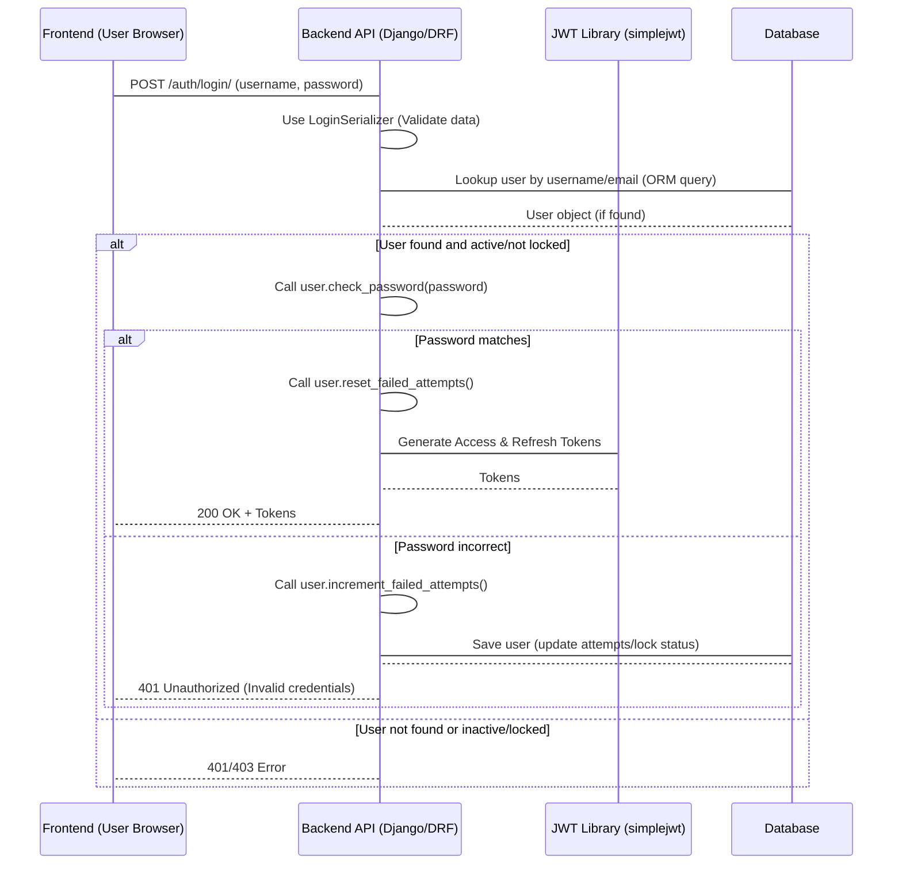
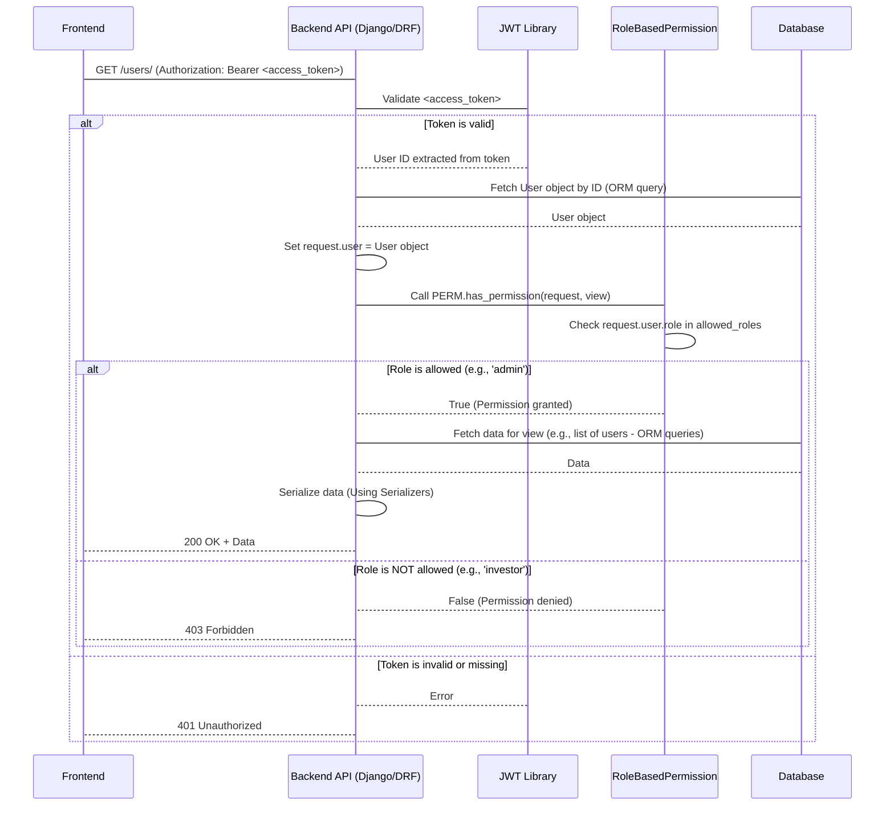

# Chapter 2: User Management & Authentication

Welcome back! In [Chapter 1: Django Models (ORM)](01_django_models__orm__.md), we learned how Django Models provide a structured way to represent and store our application's data, acting as blueprints for database tables. We saw how our `CustomUser` model defines the structure for user information.

Now, let's build on that foundation and explore how our application handles everything related to users: allowing them to prove who they are (Authentication) and determining what they are allowed to do (Authorization), based on their roles.

## Why is User Management & Authentication Important?

Imagine our investment platform. We have different types of users:

*   **Admins/Operations:** Who manage the platform, create other users, see all data, etc.
*   **Investors:** Who log in to view their deals, profile, documents, etc.

These different users need different levels of access. An investor shouldn't be able to create new admin accounts or see sensitive data about other investors' deals. An admin needs full access to manage the system.

This is where User Management & Authentication come in. It's the system's **security guard** and **HR department**:

1.  **Authentication:** Verifying a user's identity (Are you who you say you are?). This usually involves a username and password.
2.  **Authorization:** Determining what an *authenticated* user is allowed to access or do (Okay, you're Jane Doe; are you allowed to view this specific deal?). This is often based on roles or permissions.

Our project handles this using Django's built-in authentication system, extended with custom logic and modern API practices like token-based authentication.

## Core Concepts in Our Project

Let's break down the key pieces that make up our User Management & Authentication system:

### 1. The `CustomUser` Model (Our Foundation)

As we saw in [Chapter 1](01_django_models__orm__.md), the `CustomUser` model in `pig_project/pig/models.py` is the central place where user information is stored.

```python
# Inside pig_project/pig/models.py (Simplified)
from django.contrib.auth.models import AbstractUser
# ... other imports ...

class CustomUser(AbstractUser): # Inherits from Django's base user model
    class Meta:
        db_table = "users" # Uses 'users' as table name

    ROLE_CHOICES = (
        ('super_admin', 'Super Admin'),
        ('admin', 'Admin'),
        ('operations', 'Operations'),
        ('investor', 'Investor'),
    )
    role = models.CharField( # The key field for Authorization
        max_length=15,
        choices=ROLE_CHOICES
    )
    id = models.UUIDField(primary_key=True, default=uuid.uuid4, editable=False)
    name = models.CharField(max_length=100)
    contact_number = models.CharField(max_length=10, unique=True)
    is_active = models.BooleanField(default=True)
    failed_login_attempts = models.IntegerField(default=0) # Track failed logins
    lock_until = models.DateTimeField(null=True, blank=True) # Lockout timestamp

    # ... other fields for investor details, timestamps, etc. ...

    def __str__(self):
        return str(self.username) # Display username

    def is_locked(self):
        """Check if the user is currently locked."""
        # Check if lock_until is set AND is in the future
        return self.lock_until and self.lock_until > timezone.now()

    def reset_failed_attempts(self):
        """Reset failed login attempts and lock status."""
        self.failed_login_attempts = 0
        self.lock_until = None
        self.save()

    def increment_failed_attempts(self):
        """Increment failed login attempts and lock if needed."""
        self.failed_login_attempts += 1
        if self.failed_login_attempts >= 3: # Lock after 3 attempts
            self.lock_until = timezone.now() + timedelta(minutes=30) # Lock for 30 mins
        self.save()

    # ... set_ssn, get_ssn, and overridden save method ...
```

*   We inherit from `AbstractUser` to get all standard Django user features (like `username`, `password`, `email`, `is_staff`, `is_superuser`, `last_login`).
*   The `role` field is crucial for our authorization logic.
*   We add custom fields like `failed_login_attempts` and `lock_until` to implement a simple lockout mechanism for security.
*   Methods like `is_locked()`, `reset_failed_attempts()`, and `increment_failed_attempts()` are defined directly on the model to handle the logic related to login attempts.

This model is the central source of truth for user identity and basic properties.

### 2. Authentication: Logging In (Using Tokens)

Instead of traditional session-based logins (where the server keeps track of who is logged in), our API uses **Token-Based Authentication**, specifically **JSON Web Tokens (JWT)**.

Think of it like a club membership card:

1.  **Login:** You show your ID (username/password) at the door (the login endpoint).
2.  **Verification:** The bouncer (the backend) checks your ID.
3.  **Issue Token:** If your ID is valid, the bouncer gives you a special membership card (a JWT). This card proves you've been authenticated without needing to show your full ID every time.
4.  **Accessing Services:** For the rest of the night, whenever you want to access a service inside the club (like getting a drink at the bar - an API endpoint), you just show your membership card (the JWT). The bartender (the API endpoint) quickly checks if the card is valid.

This is great for APIs because the server doesn't need to remember anything about you after giving you the token (it's *stateless*), and the token itself contains enough information (like your user ID) for the server to identify you on subsequent requests.

Our project uses the `djangorestframework-simplejwt` library for this.

### 3. Authorization: Role-Based Permissions

Once a user is authenticated (they have a valid token), we need to decide what they can *do*. This is **Authorization**.

Our project uses a **Role-Based Permission** system. Each user has a `role` ('admin', 'investor', etc.). Specific API endpoints (views) are protected by a custom permission class that checks if the logged-in user's role is in the list of roles allowed to access that endpoint.

Think of this as different rooms in the club requiring different colored membership cards based on your membership type (role).

```python
# Inside pig_project/pig/permissions.py
from rest_framework.permissions import BasePermission
from pig.utils import log

class RoleBasedPermission(BasePermission):
    """
    Custom permission to check if the user has the required role.
    Super admin users always have permission.
    """

    allowed_roles = [] # This list is set on the view class

    def has_permission(self, request, view):
        # 1. Check if the user is authenticated (logged in).
        # This is usually handled by other authentication classes first,
        # but good practice to consider. request.user will be
        # an AnonymousUser if not authenticated.
        if not request.user or not request.user.is_authenticated:
             return False # Not authenticated? No permission.

        # 2. Super admin bypasses all role checks
        if request.user.role == 'super_admin':
            log(f'Super Admin {request.user.username} granted access', 'info')
            return True

        # 3. Check if the user's role is in the allowed list for THIS view
        if request.user.role not in self.allowed_roles:
            log(
                (
                    f"Unauthorized attempt by user {request.user.username} "
                    f"with role {request.user.role} on {view.__class__.__name__}"
                ),
                "warning",
            )
            return False # Role not allowed? No permission.

        # 4. If authenticated, not super_admin, and role IS allowed
        log(f'User {request.user.username} with role {request.user.role} granted access', 'info')
        return True # Permission granted!

```

This `RoleBasedPermission` class is attached to API views ([Chapter 6: API Views and URL Routing](06_api_views_and_url_routing_.md)). When a request comes in, Django REST Framework (DRF) checks this permission class *before* running the view logic.

### 4. Password Reset & Account Security

Handling forgotten passwords and securing against brute-force attacks are also part of user management.

*   **Forgot Password:** The system provides a way for users to request a password reset email with a special, time-sensitive link.
*   **Create Password:** This link allows the user to set a new password without knowing the old one.
*   **Account Lockout:** As seen in the `CustomUser` model, the system tracks failed login attempts and temporarily locks an account after too many incorrect password tries.

## Use Case Walkthrough: Logging In and Accessing Data

Let's follow a user trying to log in and then fetch a list of other users (an action only admins/operations should perform).

**Scenario 1: Successful Login**

1.  **User Action:** An 'admin' user enters their username (email) and password into the login form and clicks submit. The frontend sends this data to the backend's login endpoint (`/auth/login/`).
2.  **Backend Receives Request:** The `LoginView` ([Chapter 6: API Views and URL Routing](06_api_views_and_url_routing_.md)) receives the POST request.
3.  **Data Validation:** A `LoginSerializer` ([Chapter 5: Data Serializers](05_data_serializers_.md)) checks if the data format is correct (e.g., username looks like an email, password is present).
    ```python
    # Inside pig_project/pig/auth/serializers.py (Simplified)
    from rest_framework import serializers

    class LoginSerializer(serializers.Serializer):
        username = serializers.EmailField()
        password = serializers.CharField(write_only=True)

    # The serializer.is_valid() call in the view triggers this
    ```
4.  **User Lookup:** The view uses the `username` to find the `CustomUser` object in the database using the ORM (`User.objects.get(...)`).
    ```python
    # Inside pig_project/pig/auth/views.py (Simplified)
    from django.contrib.auth import get_user_model
    from rest_framework.views import APIView
    from rest_framework.response import Response
    from rest_framework import status
    # ... other imports ...

    User = get_user_model()

    class LoginView(APIView):
        def post(self, request):
            serializer = LoginSerializer(data=request.data)
            if serializer.is_valid():
                username = serializer.validated_data['username']
                password = serializer.validated_data['password']
                try:
                    # Find the user by email (username)
                    user = User.objects.get(email=username)
                except User.DoesNotExist:
                    # Handle user not found
                    return Response({'error': 'Invalid credentials'}, status=status.HTTP_401_UNAUTHORIZED)

                # Check if user is active or locked
                if not user.is_active: # Check CustomUser field
                     return Response({'error': 'You do not have permission to log in.'}, status=status.HTTP_403_FORBIDDEN)
                if user.is_locked(): # Call CustomUser method
                    return Response({'error': 'Account locked...'}, status=status.HTTP_403_FORBIDDEN)

                # Check the password
                if user.check_password(password): # Method provided by AbstractUser
                    # Password is correct!
                    user.reset_failed_attempts() # Reset attempts using CustomUser method
                    # ... issue tokens ...
                    log(f'User {user.username} logged in successfully', 'info')
                    return Response({'message': 'Login successful', 'access': '...', 'refresh': '...'}, status=status.HTTP_200_OK)

                else: # Password incorrect
                    user.increment_failed_attempts() # Increment attempts using CustomUser method
                    # Handle incorrect password
                    return Response({'error': 'Invalid credentials'}, status=status.HTTP_401_UNAUTHORIZED)
            # Handle invalid serializer data
            return Response(serializer.errors, status=status.HTTP_400_BAD_REQUEST)
    ```
5.  **Password Verification:** Django's built-in `check_password` method (from `AbstractUser`) securely compares the provided password with the hashed password stored in the database.
6.  **Account Status Check:** The view checks if the user is active and if their account is locked using the methods on the `CustomUser` model.
7.  **Token Issuance:** If everything is correct, `djangorestframework-simplejwt` is used to generate an **Access Token** and a **Refresh Token**.
    ```python
    # Inside LoginView's post method (Simplified)
    from rest_framework_simplejwt.tokens import RefreshToken
    # ... inside the 'if user.check_password(password):' block ...

    refresh = RefreshToken.for_user(user) # Generate tokens for this user
    # return tokens in the response...
    ```
8.  **Response:** The backend sends a successful response back to the frontend, including the Access and Refresh tokens.

**Scenario 2: Accessing a Protected View (e.g., Get List of Users)**

1.  **User Action:** The 'admin' user's frontend application wants to display a list of all users. It sends a GET request to the `/users/` endpoint, including the **Access Token** in the `Authorization` header (usually as `Bearer <token>`).
2.  **Backend Receives Request:** The request arrives at the `GetUsersView` ([Chapter 6: API Views and URL Routing](06_api_views_and_url_routing_.md)).
3.  **Authentication Middleware:** Django REST Framework's authentication system extracts the token from the request header, validates it using `djangorestframework-simplejwt`. If the token is valid, it identifies the user associated with the token and attaches the `CustomUser` object to the `request.user` property. If the token is invalid or missing, `request.user` might be an `AnonymousUser`.
4.  **Permission Check:** Before the view's `get` method is executed, DRF checks the `permission_classes` defined on the view. Our `GetUsersView` has `RoleBasedPermission`.
    ```python
    # Inside pig_project/pig/user/views.py (Simplified)
    from rest_framework.views import APIView
    from rest_framework.permissions import IsAuthenticated # Also usually included
    from pig.permissions import RoleBasedPermission
    # ... other imports ...

    class GetUsersView(APIView):
        # Permission check happens BEFORE the get() method runs
        permission_classes = [IsAuthenticated, RoleBasedPermission]
        RoleBasedPermission.allowed_roles = ['admin', 'operations'] # Only these roles allowed

        def get(self, request):
            # If we reach here, the user is authenticated and has an allowed role
            # ... logic to fetch and return list of users ...
            # Example: Fetch all users with role 'admin' or 'operations'
            users = User.objects.filter(role__in=['admin', 'operations']).order_by('-created_at')
            # ... serialize and return users ...
            return Response({'items': [...], 'pagination': {...}}, status=status.HTTP_200_OK)

    ```
5.  **`RoleBasedPermission.has_permission` Execution:**
    *   `request.user` is checked (`is_authenticated`). Since the JWT was valid, this is True.
    *   The user's role (`request.user.role`) is checked against `self.allowed_roles` which is `['admin', 'operations']`.
    *   If the user's role is 'admin' (or 'operations'), `has_permission` returns `True`.
    *   If the user's role was 'investor', `has_permission` would return `False`.
6.  **View Execution (if permitted):** Since the role was 'admin', the permission check passes, and the `get` method of `GetUsersView` is executed. This method fetches the relevant user data from the database using the ORM ([Chapter 1: Django Models (ORM)](01_django_models__orm__.md)).
7.  **Response:** The view returns the list of users.

**Scenario 3: Access Denied**

*   If an 'investor' user (authenticated) tried to access `/users/`, the `RoleBasedPermission` would return `False`, and Django REST Framework would automatically return an "Permission Denied" error response (usually HTTP 403 Forbidden) without even running the `get` method in `GetUsersView`.
*   If an *unauthenticated* user (no valid token) tried to access `/users/`, the `IsAuthenticated` permission (or the first check in `RoleBasedPermission`) would return `False`, resulting in an "Authentication credentials were not provided" error (HTTP 401 Unauthorized).

## Under the Hood: The Flow

Let's visualize the login flow with a simple sequence diagram:



And the flow for accessing a protected endpoint after login:



These diagrams illustrate how different parts of the system (Frontend, API views, JWT library, Custom Permission class, and Database) work together to handle secure access.

## Creating and Managing Users

Users are typically created by existing 'admin' or 'operations' users. The `RegisterView` in `pig_project/pig/user/views.py` handles this:

```python
# Inside pig_project/pig/user/views.py (Simplified)
from rest_framework.views import APIView
from rest_framework.permissions import IsAuthenticated
from pig.permissions import RoleBasedPermission
from pig.user.serializers import RegisterSerializer # Handles data for creating/updating users
# ... other imports ...

class RegisterView(APIView):
    # Only authenticated users with 'admin' or 'operations' roles can access this
    permission_classes = [IsAuthenticated, RoleBasedPermission]
    RoleBasedPermission.allowed_roles = ['admin', 'operations']

    def post(self, request):
        # Use RegisterSerializer to validate input data for a new user
        serializer = RegisterSerializer(
            data=request.data,
            context={'request': request} # Pass request to serializer for validation checks
        )
        if serializer.is_valid():
            # The serializer's create method (see user/serializers.py)
            # handles creating the user object and sending the welcome email
            user = serializer.save()
            log('User registered successfully', 'info')
            return Response(
                {'message': 'User registered successfully', 'user_id': user.id},
                status=status.HTTP_201_CREATED # 201 Created status
            )
        log(f'Registration failed: {serializer.errors}', 'error')
        return Response(serializer.errors, status=status.HTTP_400_BAD_REQUEST)

```

When a user is registered, their password is *not* set directly. Instead, the `RegisterSerializer` ([Chapter 5: Data Serializers](05_data_serializers_.md)) automatically generates a unique, time-limited token using `TimestampSigner` and sends a welcome email containing a link to a "Create Password" page.

```python
# Inside pig_project/pig/user/serializers.py (Simplified)
from rest_framework import serializers
from django.core.signing import TimestampSigner # Used for creating timed tokens
from django.conf import settings
from pig.utils import send_email_with_template, generate_reset_password_link # Utility functions

signer = TimestampSigner() # Initialize the signer

class RegisterSerializer(serializers.ModelSerializer):
    # ... field definitions ...
    social_security_number = serializers.CharField(write_only=True, required=False) # Write-only for encryption

    class Meta:
        model = User
        # ... fields list ...

    def create(self, validated_data):
        request = self.context.get('request')
        ssn = validated_data.pop('social_security_number', None) # Extract SSN before creating user
        profile_picture = validated_data.pop('profile_picture', None)

        # Create the user object (password is NOT set here)
        user = User.objects.create(
            username=validated_data['username'],
            email=validated_data['username'],
            role=validated_data['role'],
            name=validated_data['name'],
            contact_number=validated_data['contact_number'],
            is_active=True,
            created_by_id=request.user.id, # Link to the user who created this user
            # ... other field assignments ...
        )

        if profile_picture:
             user.profile_picture = profile_picture
             user.save()

        if ssn:
            user.set_ssn(ssn) # Call the model method to encrypt and store SSN
            user.save()

        # Generate password reset link and send email
        reset_password_link = generate_reset_password_link(user.username)
        template_id = settings.SENDGRID_WELCOME_TEMPLATE_ID
        dynamic_data = {"name": user.name, "link": reset_password_link}
        send_email_with_template(user.email, template_id, dynamic_data)

        return user
```

The `generate_reset_password_link` function (found in `pig_project/pig/utils.py`) uses the `TimestampSigner` to create a signed token containing the user's username. This token is then included in the link.

When the user clicks the link, they are taken to a page where they can set their password using the `CreatePasswordView` and `CreatePasswordSerializer` in `pig_project/pig/auth/views.py` and `pig_project/pig/auth/serializers.py`. This serializer first validates the token using the same `TimestampSigner` (checking the signature and expiration) via the `TokenValidationSerializer`, and then uses `user.set_password()` to securely hash and store the new password.

This flow ensures that initial passwords are not handled insecurely and forgotten passwords can be reset safely.

Other views in `pig_project/pig/user/views.py` (like `UpdateUserView`, `GetUserByIdView`, `GetUsersView`, `GetInvestorsView`) provide functionality to manage user data, always protected by the `RoleBasedPermission` to ensure only authorized roles can access them. For instance, `GetUsersView` and `GetInvestorsView` use ORM queries ([Chapter 1: Django Models (ORM)](01_django_models__orm__.md)) to fetch lists of users filtered by role and include related data like the creator (`select_related('created_by')`) or total investment amount (`annotate(total_investment=Sum('deals__invested_amount'))`).

## Conclusion

In this chapter, we explored the User Management & Authentication system. We saw how the `CustomUser` model is the core data structure, extended from Django's built-in users to include roles and security features. We learned about token-based authentication (JWT) as the method for users to prove their identity to the API after logging in. Crucially, we understood how the `RoleBasedPermission` class enforces authorization, ensuring only users with specific roles ('admin', 'operations', 'investor') can access relevant parts of the application. Finally, we touched upon account security features like login attempt tracking and the password reset flow.

Understanding how users are managed, authenticated, and authorized is fundamental to building a secure application. In the next chapter, we'll look at how the system handles data related to the companies that the platform invests in: [Portfolio Company Management](03_portfolio_company_management_.md).

[Next Chapter: Portfolio Company Management](03_portfolio_company_management_.md)

---

Generated by AI Codebase Knowledge Builder