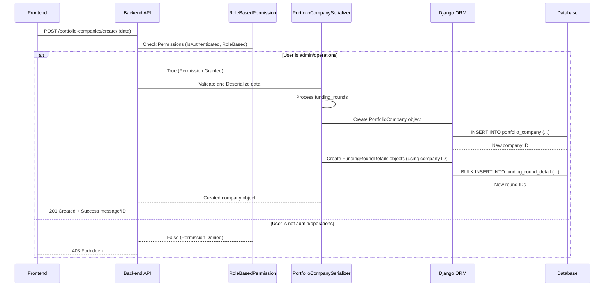

# Chapter 3: Portfolio Company Management

Welcome back! In [Chapter 1: Django Models (ORM)](01_django_models__orm__.md), we learned how models structure our data, and in [Chapter 2: User Management & Authentication](02_user_management___authentication_.md), we explored how users log in and what permissions they have based on their roles. Now that we know who our users are and how they are authenticated, let's dive into managing one of the core types of data in our investment platform: the **Portfolio Companies**.

## What is Portfolio Company Management?

Imagine you're running an investment fund. You invest money in various startup or growth-stage companies. You need a system to keep track of:

*   Which companies you've invested in?
*   Basic details about each company (name, type, website).
*   How much the company is currently valued at.
*   Details about the specific investment rounds you've participated in for that company (when was it, how much was the company worth then, how much did your fund invest in that specific round).

**Portfolio Company Management** is the part of our application that handles all this information. It's like maintaining a detailed, digital directory for every company you have a stake in. It allows users (specifically admins and operations staff) to add new companies, record funding rounds, update valuations, and view all this crucial data.

This abstraction focuses on two main data types, represented by Django Models we briefly touched upon in [Chapter 1](01_django_models__orm__.md):

1.  **`PortfolioCompany`**: This model stores the main details about a company in your portfolio.
2.  **`FundingRoundDetails`**: This model tracks specific investment rounds within a `PortfolioCompany`.

Let's look at these models in a bit more detail.

## Core Models for Portfolio Companies

These models are defined in the `pig_project/pig/models.py` file.

### The `PortfolioCompany` Model

This is the main blueprint for a company record.

```python
# Inside pig_project/pig/models.py (Simplified)

class PortfolioCompany(models.Model):
    id = models.UUIDField(primary_key=True, default=uuid.uuid4, editable=False)
    name = models.CharField(max_length=100) # Company's name
    detail_url = models.URLField(max_length=500) # Website or detailed info URL
    business_type = models.CharField( # Type of business (e.g., Tech, Healthcare)
        max_length=50, choices=BUSINESS_TYPE_CHOICES
    )
    status = models.CharField( # Internal status (e.g., 'publish', 'unpublish')
        max_length=10, choices=STATUS_CHOICES, default='unpublish'
    )
    current_valuation = models.DecimalField( # Most recent company valuation
        max_digits=10, decimal_places=2, null=True, blank=True
    )
    date_of_valuation = models.DateField(null=True, blank=True) # Date of that valuation
    created_by = models.ForeignKey( # Who added this company? (Link to CustomUser)
        'CustomUser', on_delete=models.SET_NULL, null=True, blank=True, related_name='portfolio_companies'
    )
    created_at = models.DateTimeField(auto_now_add=True)

    class Meta:
        db_table = "portfolio_company" # Database table name

    def __str__(self):
        return f"{self.name}" # How the object looks when printed
```

As you can see, it uses various field types ([Chapter 1: Django Models (ORM)](01_django_models__orm__.md)) like `CharField`, `URLField`, `DecimalField`, `DateField`, and a `ForeignKey` to `CustomUser` to link the company record to the user who created it.

### The `FundingRoundDetails` Model

A company can have multiple investment rounds over time (Seed, Series A, Series B, etc.). This model tracks the details for *each* specific round.

```python
# Inside pig_project/pig/models.py (Simplified)

class FundingRoundDetails(models.Model):
    id = models.UUIDField(primary_key=True, default=uuid.uuid4, editable=False)
    portfolio_company = models.ForeignKey( # Which company does this round belong to?
        'PortfolioCompany', on_delete=models.CASCADE, related_name='funding_rounds'
    )
    funding_round_stage = models.CharField(max_length=20) # e.g., 'Series A', 'Seed'
    valuation_amount = models.DecimalField( # Company valuation AT THIS ROUND
        max_digits=10, decimal_places=2, null=True, blank=True)
    valuation_date = models.DateField() # Date of THIS round's valuation
    pig_funds = models.DecimalField(max_digits=10, decimal_places=2) # Amount PIG invested in THIS round
    created_by = models.ForeignKey( # Who added this round detail? (Link to CustomUser)
        'CustomUser', on_delete=models.SET_NULL, null=True, blank=True, related_name='funding_rounds'
    )
    created_at = models.DateTimeField(auto_now_add=True)

    class Meta:
        db_table = "funding_round_detail" # Database table name

    def __str__(self):
        return f"{self.portfolio_company.name} - {self.funding_round_stage}"
```

Notice the `ForeignKey` pointing back to `PortfolioCompany`. This creates the link: one `PortfolioCompany` can have many `FundingRoundDetails`. The `related_name='funding_rounds'` allows us to easily access all funding rounds for a company using `company_object.funding_rounds.all()`.

## Use Case: Adding a New Company and Its First Funding Round

Let's walk through a common task: adding a brand new company to the portfolio along with the details of the initial investment round the fund participated in.

To do this, an 'admin' or 'operations' user would typically use an interface (like a web form) which sends data to the backend API.

The relevant API endpoint for creating a portfolio company is `/portfolio-companies/create/` and it accepts `POST` requests.

The data sent would look something like this (using JSON format):

```json
{
    "name": "Innovative Gadgets Inc.",
    "detail_url": "https://www.innovativegadgets.com",
    "business_type": "technology",
    "status": "publish",
    // current_valuation and date_of_valuation can be omitted if sending funding rounds
    "funding_rounds": [
        {
            "funding_round_stage": "Seed",
            "valuation_amount": 5000000.00,
            "valuation_date": "2023-07-15",
            "pig_funds": 500000.00
        }
    ]
}
```

This single request includes data for both the `PortfolioCompany` (name, URL, type, status) and its first `FundingRoundDetails` (stage, valuation at that time, date, funds invested).

## How it Works: Creating a Portfolio Company

When the backend receives the `POST` request with the company and funding round data, here's a simplified look at the process:



Let's break down the key components involved:

### 1. The API View (`CreatePortfolioCompanyView`)

This view (`pig_project/pig/portfolio_company/views.py`) is the entry point for the API request.

```python
# Inside pig_project/pig/portfolio_company/views.py (Simplified)

from rest_framework import status
from rest_framework.response import Response
from rest_framework.views import APIView
from rest_framework.permissions import IsAuthenticated
from pig.portfolio_company.serializers import PortfolioCompanySerializer # We'll use this next
from pig.permissions import RoleBasedPermission # Used in Chapter 2

class CreatePortfolioCompanyView(APIView):
    # Permissions: Must be authenticated AND have 'admin' or 'operations' role
    permission_classes = [IsAuthenticated, RoleBasedPermission]
    RoleBasedPermission.allowed_roles = ['admin', 'operations']

    def post(self, request):
        # Pass the received data to the serializer for validation and creation
        serializer = PortfolioCompanySerializer(
            data=request.data, # The data from the frontend
            context={'request': request} # Pass the request context (needed for created_by)
        )
        # Check if the data is valid according to the serializer rules
        if serializer.is_valid():
            # If valid, save the data (this calls the serializer's create method)
            portfolio_company = serializer.save()
            # Return a success response
            return Response({
                "message": "Portfolio company created successfully",
                "id": portfolio_company.id,
            }, status=status.HTTP_201_CREATED) # Use 201 for creation success
        # If data is NOT valid, return error details
        return Response(serializer.errors, status=status.HTTP_400_BAD_REQUEST)
```

*   The `permission_classes` ensure that only authorized users can even attempt to create a company ([Chapter 2: User Management & Authentication](02_user_management___authentication_.md)).
*   The `post` method receives the request data.
*   It hands the data over to the `PortfolioCompanySerializer` ([Chapter 5: Data Serializers](05_data_serializers_.md)) for validation and processing.
*   If the serializer says the data is good (`is_valid()`), it calls `serializer.save()`, which triggers the actual database creation.
*   Finally, it returns a success or error response.

### 2. The Serializer (`PortfolioCompanySerializer`)

This serializer (`pig_project/pig/portfolio_company/serializers.py`) is responsible for converting the incoming JSON data into Python objects that match our models, validating the data, and then telling the ORM to save it.

```python
# Inside pig_project/pig/portfolio_company/serializers.py (Simplified)

from rest_framework import serializers
from pig.models import PortfolioCompany, FundingRoundDetails

# Serializer for the nested Funding Round data
class FundingRoundDetailsSerializer(serializers.ModelSerializer):
    class Meta:
        model = FundingRoundDetails
        fields = [ # Define which fields are expected in the input/output
            'funding_round_stage', 'valuation_amount', 'valuation_date', 'pig_funds',
        ]

# Main serializer for the Portfolio Company, includes nested funding rounds
class PortfolioCompanySerializer(serializers.ModelSerializer):
    # Define 'funding_rounds' field using the nested serializer
    # many=True indicates it's a list of funding rounds
    funding_rounds = FundingRoundDetailsSerializer(many=True)

    class Meta:
        model = PortfolioCompany
        fields = [ # Define which fields are expected for the company itself
            'name', 'detail_url', 'business_type', 'status',
            'current_valuation', 'date_of_valuation',
            'funding_rounds', # Include the nested field
        ]

    # This method is automatically called by serializer.save() when creating
    def create(self, validated_data):
        # 1. Separate funding round data from company data
        #    .pop() removes funding_rounds from validated_data but gives us the list
        funding_rounds_data = validated_data.pop('funding_rounds', [])
        request_user = self.context['request'].user # Get the logged-in user

        # 2. Create the PortfolioCompany object using ORM
        #    **validated_data unpacks the dictionary into arguments
        portfolio_company = PortfolioCompany.objects.create(
            **validated_data,
            created_by=request_user # Set the creator based on the logged-in user
        )

        # 3. Prepare FundingRoundDetails objects
        funding_rounds_to_create = [
            FundingRoundDetails(
                portfolio_company=portfolio_company, # Link to the company we just created
                created_by=request_user, # Set the creator
                **funding_round_data # Unpack funding round specific data
            )
            for funding_round_data in funding_rounds_data
        ]

        # 4. Create FundingRoundDetails objects in bulk using ORM
        #    bulk_create is efficient for adding multiple objects at once
        if funding_rounds_to_create:
             FundingRoundDetails.objects.bulk_create(funding_rounds_to_create)

        # 5. Handle setting initial current_valuation if not provided
        #    (Logic omitted for brevity, but it finds the latest round's valuation)
        # ... (logic to find latest valuation in funding_rounds_to_create) ...
        # if latest_valuation_found:
        #     portfolio_company.current_valuation = latest_valuation
        #     portfolio_company.date_of_valuation = latest_date
        #     portfolio_company.save() # Save the company again with the valuation

        return portfolio_company # Return the created company object
```

*   This serializer defines how the `PortfolioCompany` data, *including* the nested `funding_rounds` list, should look.
*   The `create` method is crucial. It's where the ORM calls happen.
*   It first creates the main `PortfolioCompany` object using `PortfolioCompany.objects.create()`.
*   Then, it iterates through the list of funding round dictionaries, creates `FundingRoundDetails` objects in memory, and uses `FundingRoundDetails.objects.bulk_create()` to efficiently save them all to the database, linked back to the newly created company.
*   It also includes logic to automatically set the company's `current_valuation` and `date_of_valuation` based on the funding rounds provided in the request if the user didn't explicitly set `current_valuation` in the main company data.

This flow demonstrates how Serializers and ORM work together to handle complex data structures like a company with multiple related funding rounds.

## Viewing Portfolio Companies

Admins and operations staff also need to view the list of portfolio companies and their details.

*   **Get List:** The `/portfolio-companies/` endpoint (GET request to `GetPortfolioCompaniesView` in `pig_project/pig/portfolio_company/views.py`) is used to fetch a paginated list of companies.

    ```python
    # Inside pig_project/pig/portfolio_company/views.py (Simplified)

    from rest_framework.views import APIView
    from rest_framework.response import Response
    from django.db.models import Sum # Used for calculations
    from pig.permissions import RoleBasedPermission
    from pig.models import PortfolioCompany

    class GetPortfolioCompaniesView(APIView):
        permission_classes = [RoleBasedPermission] # Only roles listed in allowed_roles
        RoleBasedPermission.allowed_roles = ['admin', 'operations'] # Allowed roles

        def get(self, request):
            # Get pagination parameters from request query (e.g., ?limit=10&offset=0)
            limit = int(request.query_params.get('limit', 10))
            offset = int(request.query_params.get('offset', 0))

            # Use ORM to query companies:
            # .annotate(invested_value=Sum('funding_rounds__pig_funds')) calculates total PIG investment per company
            # .select_related('created_by') efficiently fetches creator details
            # .order_by('-created_at') sorts by creation date
            # [offset:offset + limit] applies pagination (slicing)
            portfolio_companies = (
                PortfolioCompany.objects
                .annotate(invested_value=Sum('funding_rounds__pig_funds', default=0))
                .select_related('created_by')
                .order_by('-created_at')[offset:offset + limit]
            )

            # Prepare data for the response (converting ORM objects to dictionary list)
            items = [
                {
                    "id": company.id,
                    "portfolio_company": company.name,
                    "invested_value": company.invested_value or 0,
                    "created_date": company.created_at.strftime('%m/%d/%Y'),
                    "created_by": (company.created_by.name if company.created_by else None),
                    "status": company.status,
                }
                for company in portfolio_companies
            ]

            # Get total count for pagination info
            total_count = PortfolioCompany.objects.count()

            response_data = {
                "items": items,
                "pagination": {
                    "total_count": total_count,
                    "offset": offset,
                    "limit": limit,
                    "has_more": offset + limit < total_count
                }
            }
            return Response(response_data, status=status.HTTP_200_OK)
    ```

    This view uses powerful ORM features like `annotate` (to perform calculations like summing investment across related funding rounds and deals) and `select_related` (to fetch related user data efficiently) ([Chapter 1: Django Models (ORM)](01_django_models__orm__.md)).

*   **Get Single:** The `/portfolio-companies/{company_id}/` endpoint (GET request to `GetPortfolioCompanyByIdView`) fetches details for a specific company, including all its associated funding rounds.

    ```python
    # Inside pig_project/pig/portfolio_company/views.py (Simplified)

    from rest_framework.views import APIView
    from rest_framework.response import Response
    from rest_framework import status
    from pig.permissions import RoleBasedPermission
    from pig.models import PortfolioCompany, FundingRoundDetails # Need both models

    class GetPortfolioCompanyByIdView(APIView):
        permission_classes = [RoleBasedPermission]
        RoleBasedPermission.allowed_roles = ['admin', 'operations']

        def get(self, request, company_id): # company_id comes from the URL
            try:
                # Fetch the company using ORM, also select related creator
                portfolio_company = PortfolioCompany.objects.select_related(
                    'created_by'
                ).get(id=company_id) # .get() raises DoesNotExist if not found

                # Fetch all funding rounds related to this company
                funding_rounds = list(
                    FundingRoundDetails.objects.filter(
                        portfolio_company=portfolio_company
                    ).values(
                        "id", "funding_round_stage", "valuation_amount",
                        "valuation_date", "pig_funds",
                    )
                )
                # Format date fields for the response
                for round_data in funding_rounds:
                    if round_data["valuation_date"]:
                        round_data["valuation_date"] = round_data["valuation_date"].strftime('%m/%d/%Y')

                # Build the response dictionary
                response_data = {
                    "id": portfolio_company.id,
                    "name": portfolio_company.name,
                    "detail_url": portfolio_company.detail_url,
                    "business_type": portfolio_company.business_type,
                    "status": portfolio_company.status,
                    "current_valuation": portfolio_company.current_valuation,
                    "date_of_valuation": (
                        portfolio_company.date_of_valuation.strftime('%m/%d/%Y')
                        if portfolio_company.date_of_valuation else None
                    ),
                    "funding_rounds": funding_rounds, # Include the list of rounds
                }
                return Response(response_data, status=status.HTTP_200_OK)

            except PortfolioCompany.DoesNotExist:
                # If .get() didn't find the company, return 404
                return Response({"error": "Portfolio company not found"},
                                status=status.HTTP_404_NOT_FOUND)
    ```

    This view demonstrates fetching related objects (`FundingRoundDetails`) for a single main object (`PortfolioCompany`). It uses `.get()` to find the specific company and `.filter()` to get its related funding rounds ([Chapter 1: Django Models (ORM)](01_django_models__orm__.md)).

## Updating Portfolio Companies and Notifications

Keeping company information up-to-date is important. The `/portfolio-companies/{company_id}/` endpoint also handles `PUT` requests via the `UpdatePortfolioCompanyView`. This view allows updating basic company fields and also adding/updating individual funding rounds.

One important feature here is the **valuation change notification**. If the `current_valuation` field of a `PortfolioCompany` is updated, the system automatically sends an email notification to all investors who have a `Deal` associated with that company.

How does this work?

1.  The `UpdatePortfolioCompanyView` (`pig_project/pig/portfolio_company/views.py`) handles the `PUT` request.
2.  Before saving the updated data, it retrieves the existing `PortfolioCompany` object from the database using its `id`.
3.  It then applies the updates from the request data to the fetched object's fields.
4.  It saves the updated `PortfolioCompany` object.
5.  Crucially, *after* saving, it compares the `current_valuation` value *before* the update with the `current_valuation` value *after* the update.
6.  If the values are different, it calls a separate function, `send_valuation_change_email`, passing the company object, the old valuation, and the new valuation.

Here's a simplified look at the update logic and notification trigger:

```python
# Inside pig_project/pig/portfolio_company/views.py (Simplified PUT method)

class UpdatePortfolioCompanyView(APIView):
    permission_classes = [RoleBasedPermission]
    RoleBasedPermission.allowed_roles = ['admin', 'operations']

    def put(self, request, company_id):
        try:
            # 1. Get the existing company object
            portfolio_company = PortfolioCompany.objects.get(id=company_id)
            # Store the old valuation before updating
            old_valuation = portfolio_company.current_valuation

            # 2. Update company fields (excluding nested funding rounds)
            #    (Logic omitted for brevity, but it loops through request.data and sets attributes)
            # Example: portfolio_company.name = request.data.get('name', portfolio_company.name)
            # portfolio_company.save()

            # 3. Handle nested funding rounds (add new, potentially update existing)
            #    (This involves complex logic using FundingRoundDetailsSerializer)
            #    (Logic omitted, but it processes request.data['funding_rounds'])

            # 4. After all updates and saves, get the NEW valuation
            portfolio_company.refresh_from_db() # Get the latest values from the DB
            new_valuation = portfolio_company.current_valuation

            # 5. Compare old and new valuation and trigger email if changed
            if old_valuation != new_valuation:
                # Call the notification function
                send_valuation_change_email(
                    portfolio_company, old_valuation, new_valuation
                )

            # 6. Return success response
            return Response(
                {"message": "Portfolio company updated successfully"},
                status=status.HTTP_200_OK
            )

        except PortfolioCompany.DoesNotExist:
            return Response({"error": "Portfolio company not found"}, status=status.HTTP_404_NOT_FOUND)
        except Exception as e:
             # Handle other potential errors during update
             return Response({"error": str(e)}, status=status.HTTP_500_INTERNAL_SERVER_ERROR)
```

### The Notification Function (`send_valuation_change_email`)

This function (`pig_project/pig/portfolio_company/portfolio_updates.py`) is responsible for finding the relevant investors and sending the email.

```python
# Inside pig_project/pig/portfolio_company/portfolio_updates.py (Simplified)

from django.conf import settings
from pig.utils import log, send_email_with_template # Utility functions from Chapter 7
from pig.models import Deal # Need the Deal model to find investors

def send_valuation_change_email(
        portfolio_company, old_valuation, new_valuation):
    """
    Sends an email notification to all investors when the current valuation changes.
    """
    try:
        # 1. Find all Deals related to this portfolio_company
        #    .select_related('investor') efficiently fetches investor details for each deal
        deals = Deal.objects.filter(
            portfolio_company=portfolio_company).select_related('investor')

        # 2. Collect unique investors and their total invested amount in this company
        investor_data = {}
        for deal in deals:
            investor_email = deal.investor.email
            if investor_email not in investor_data:
                investor_data[investor_email] = {
                    "name": deal.investor.name,
                    "invested_value": 0
                }
            # Sum up the invested amount from all deals for this investor in this company
            investor_data[investor_email]["invested_value"] += deal.invested_amount

        # 3. Send an email to each unique investor
        template_id = settings.SENDGRID_PORTFOLIO_UPDATE_TEMPLATE_ID # Email template ID
        for investor_email, data in investor_data.items():
            # Prepare dynamic data for the email template
            dynamic_data = {
                "name": data["name"],
                "invested_value": f"${data['invested_value']:,.2f}", # Format currency
                "current_value": f"${new_valuation:,.2f}" if new_valuation is not None else "N/A",
                "updated_companies": [portfolio_company.name],
                "link": f"{settings.REACT_ORIGIN_URL}/dashboard" # Link to their dashboard
            }
            # Use the utility function to send the email
            send_email_with_template(investor_email, template_id, dynamic_data)
            log(f"Valuation change email sent to {data['name']} for '{portfolio_company.name}'")

    except Exception as e:
        # Log any errors that occur during the process
        log(f"Error sending valuation change email for '{portfolio_company.name}': {str(e)}", "error")

```

This function uses the `Deal` model and ORM queries to find which `CustomUser` objects (investors) are linked to the updated `PortfolioCompany` through deals. It then aggregates the data and uses utility functions ([Chapter 7: Utility Services & Helpers](07_utility_services___helpers_.md)) to send personalized emails based on a template.

## Conclusion

In this chapter, we focused on the Portfolio Company Management abstraction. We learned about the key models, `PortfolioCompany` and `FundingRoundDetails`, and how they are related using a `ForeignKey`. We explored how API views and serializers work together to allow authorized users to create, retrieve, and update company information, including managing nested funding rounds. Finally, we saw how updates to a company's valuation can trigger automatic email notifications to relevant investors, leveraging ORM relationships to find the right recipients and utility functions to handle the email sending.

Understanding how companies and their funding history are managed provides a crucial piece of the platform's data structure. In the next chapter, we will look at how the system tracks individual investments made by investors in these companies: [Deal Lifecycle Management](04_deal_lifecycle_management_.md).

[Next Chapter: Deal Lifecycle Management](04_deal_lifecycle_management_.md)

---

Generated by AI Codebase Knowledge Builder