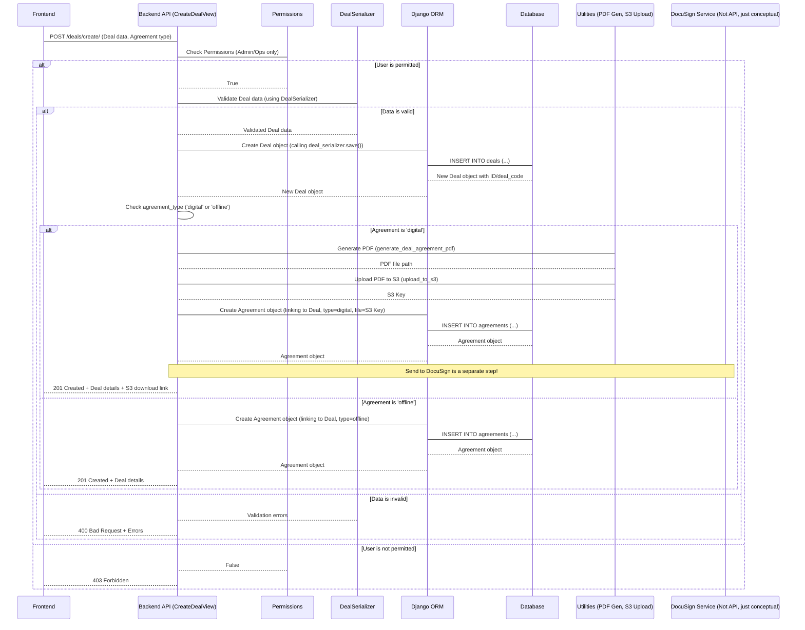
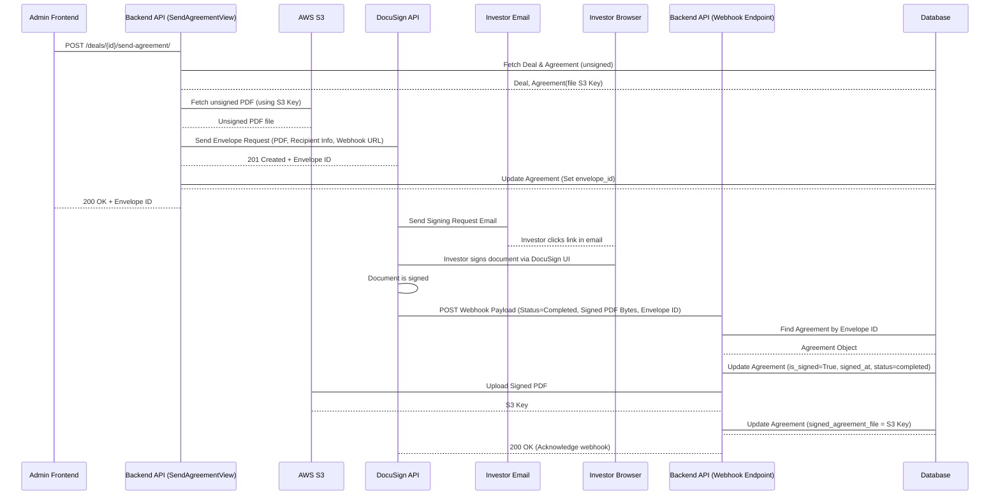

# Chapter 4: Deal Lifecycle Management

Welcome back! In the previous chapters, we've built up fundamental parts of our investment platform. In [Chapter 1: Django Models (ORM)](01_django_models__orm__.md), we learned how models like `CustomUser` and `PortfolioCompany` define our data structure. In [Chapter 2: User Management & Authentication](02_user_management___authentication_.md), we saw how users log in and are granted permissions. And in [Chapter 3: Portfolio Company Management](03_portfolio_company_management_.md), we covered how to manage the companies we might invest in.

Now, it's time to bring investors and companies together and track the most important thing: the **investment deals** themselves!

## What is Deal Lifecycle Management?

Imagine the journey of a single investment:

1.  An investor decides to invest a specific amount in a particular portfolio company during a certain funding round.
2.  There needs to be a legal agreement (like a contract) outlining the terms of this investment.
3.  This agreement needs to be signed by both parties (the investor and the fund).
4.  The investment is recorded, tracked, and potentially updated over time until the investment is exited or completed.

**Deal Lifecycle Management** is the system that handles this entire process in our application. It's like managing a pipeline of contracts, taking each potential investment from its initial idea, through the legal paperwork, to its final status.

It involves:

*   Recording the details of the investment (who, what company, how much, when).
*   Handling the legal agreement associated with the deal.
*   Tracking the status of the agreement (generated, sent for signing, signed).
*   Managing the overall status of the deal itself (active, closed).

This process relies heavily on two core models we introduced in [Chapter 1](01_django_models__orm__.md): `Deal` and `Agreement`.

## Core Models for Deals and Agreements

These models are the blueprints for storing all the necessary information about each investment deal and its related legal documents. They are defined in `pig_project/pig/models.py`.

### The `Deal` Model

This model represents a single investment transaction by a specific investor in a specific portfolio company during a particular funding round.

```python
# Inside pig_project/pig/models.py (Simplified Deal model)

class Deal(models.Model):
    id = models.UUIDField(primary_key=True, default=uuid.uuid4, editable=False)
    investor = models.ForeignKey(
        'CustomUser', on_delete=models.CASCADE, related_name='deals') # Link to the investing user
    portfolio_company = models.ForeignKey(
        'PortfolioCompany', on_delete=models.CASCADE, related_name='deals') # Link to the company
    funding_round = models.ForeignKey(
        'FundingRoundDetails', on_delete=models.CASCADE, related_name='deals') # Link to the specific round
    invested_amount = models.DecimalField(
        max_digits=15, decimal_places=2, validators=[MinValueValidator(0)]) # Amount invested
    management_fee = models.DecimalField(max_digits=15, decimal_places=2) # Associated fee
    # Links to bank details (Many-to-Many, can be multiple)
    bank_transfer_details = models.ManyToManyField(
        'BankTransferDetails', related_name='deals', blank=True)
    # Text fields for bank details if not using linked BankTransferDetails objects
    bank_transfer_details_funds = models.CharField(max_length=255, blank=True, null=True)
    bank_transfer_details_fees = models.CharField(max_length=255, blank=True, null=True)
    exit_valuation = models.DecimalField( # Valuation at deal closure (optional)
        max_digits=15, decimal_places=2, null=True, blank=True)
    deal_execution_date = models.DateField() # Date deal was agreed
    effective_date = models.DateField() # Date investment becomes effective
    status = models.CharField( # Current status (e.g., 'active', 'closed')
        max_length=10, choices=DEAL_STATUS_CHOICES, default='active')
    deal_code = models.CharField(max_length=20, unique=True, editable=False) # Auto-generated code
    created_by = models.ForeignKey( # Who created this deal record?
        'CustomUser', on_delete=models.SET_NULL, null=True, related_name='created_deals')
    created_at = models.DateTimeField(auto_now_add=True)
    updated_at = models.DateTimeField(auto_now=True)

    class Meta:
        db_table = "deals" # Database table name

    def save(self, *args, **kwargs):
        """Generate deal code before saving"""
        # This method automatically generates a unique 'deal_code'
        # like "PIG/DC/MMYYYY/######" when a new deal is created.
        # Code omitted for brevity, but it ensures uniqueness.
        if not self.deal_code:
            # ... generate unique code ...
            self.deal_code = "GENERATED_CODE" # Placeholder
        super().save(*args, **kwargs) # Call the original save method

    def __str__(self):
        return f"Deal {self.deal_code}" # How the object looks when printed
```

Key points about the `Deal` model:
*   It connects to `CustomUser` (the investor), `PortfolioCompany`, and `FundingRoundDetails` using `ForeignKey` relationships.
*   It stores financial details (`invested_amount`, `management_fee`).
*   It can link to `BankTransferDetails` using a `ManyToManyField` if pre-defined bank accounts are used, or store details directly in text fields.
*   It tracks important dates and its current `status`.
*   The `save` method automatically creates a unique `deal_code` for easy identification.

### The `Agreement` Model

Each `Deal` requires one or more legal agreements. This model tracks the details of these documents.

```python
# Inside pig_project/pig/models.py (Simplified Agreement model)

class Agreement(models.Model):
    id = models.UUIDField(primary_key=True, default=uuid.uuid4, editable=False)
    deal = models.ForeignKey(
        'Deal', on_delete=models.CASCADE, related_name='agreements') # Link back to the Deal
    agreement_type = models.CharField( # 'digital' (DocuSign) or 'offline'
        max_length=20, choices=AGREEMENT_TYPE_CHOICES)
    agreement_file = models.CharField( # S3 path to the generated/uploaded agreement file
        max_length=255, blank=True, null=True)
    signed_agreement_file = models.CharField( # S3 path to the final signed file
        max_length=255, blank=True, null=True)
    envelope_id = models.UUIDField( # DocuSign Envelope ID (for digital agreements)
        null=True, blank=True)
    is_signed = models.BooleanField(default=False) # Is the agreement signed?
    signed_by = models.ForeignKey( # Who signed it? (Link to CustomUser)
        'CustomUser', on_delete=models.SET_NULL, null=True, blank=True, related_name='signed_agreements')
    signed_at = models.DateTimeField(null=True, blank=True) # When was it signed?
    signed_ip = models.GenericIPAddressField(null=True, blank=True) # IP address used for signing
    docusign_status = models.CharField( # DocuSign specific status (e.g., 'sent', 'delivered', 'completed')
        max_length=20, choices=DOCUSIGN_STATUS_CHOICES, null=True, blank=True)
    created_at = models.DateTimeField(auto_now_add=True)
    updated_at = models.DateTimeField(auto_now=True)

    class Meta:
        db_table = "agreements" # Database table name

    def __str__(self):
        return f"Agreement ID: {self.id} for Deal: {self.deal.deal_code}"
```

Key points about the `Agreement` model:
*   It has a `ForeignKey` back to the `Deal` it belongs to. One `Deal` can have multiple `Agreement` objects (e.g., different document types, though often there's just one main agreement).
*   It tracks the `agreement_type` ('digital' or 'offline').
*   It stores links (`S3` paths) to the unsigned and signed files.
*   For digital agreements, it stores the `envelope_id` from DocuSign and tracks its status.
*   It records signing details (`is_signed`, `signed_by`, `signed_at`, `signed_ip`).

## Use Case Walkthrough: Creating a New Deal

The most common operation is creating a new deal when an investor commits to an investment. This is typically done by an 'admin' or 'operations' user.

This involves sending data to the backend API, specifically the `/deals/create/` endpoint using a `POST` request. The data includes details for the `Deal` and specifies the type of `Agreement` needed (digital or offline).

Here's a simplified example of the JSON data sent:

```json
{
    "investor": "a1b2c3d4-...", // UUID of the investor user
    "portfolio_company": "e5f6g7h8-...", // UUID of the portfolio company
    "funding_round": "i9j1k2l3-...", // UUID of the funding round details
    "invested_amount": 100000.00,
    "management_fee": 2000.00,
    "deal_execution_date": "2024-01-15",
    "effective_date": "2024-02-01",
    "status": "active",
    "agreement_type": "digital", // or "offline"
    // bank_transfer_details_funds/fees or bank_transfer_details IDs can also be included
}
```

## How it Works: Creating a Deal

When the backend receives this `POST` request, here's a simplified step-by-step flow:



Let's look at the key code pieces involved in the `CreateDealView` (`pig_project/pig/deals/views.py`).

### 1. The API View (`CreateDealView`)

This view handles the incoming request, validates the data, and orchestrates the creation of the `Deal` and `Agreement` objects.

```python
# Inside pig_project/pig/deals/views.py (Simplified CreateDealView)

from rest_framework import status
from rest_framework.response import Response
from rest_framework.views import APIView
from rest_framework.permissions import IsAuthenticated
from pig.permissions import RoleBasedPermission # From Chapter 2
from pig.deals.serializers import DealSerializer, AgreementSerializer # From Chapter 5
from pig.models import Deal, Agreement
from pig.utils import (
    log, # From Chapter 7
    generate_deal_agreement_pdf, # From Chapter 7
    upload_to_s3, # From Chapter 7
    generate_presigned_url, # From Chapter 7
    remove_local_file # From Chapter 7
)
# DocuSign service (covered later)
from pig.deals.docusign import send_agreement_for_signing

class CreateDealView(APIView):
    # Only authenticated users with 'admin' or 'operations' roles can create deals
    permission_classes = [IsAuthenticated, RoleBasedPermission]
    RoleBasedPermission.allowed_roles = ['admin', 'operations']

    def post(self, request):
        # Extract agreement type from request data
        agreement_type = request.data.get("agreement_type", "digital").lower()
        if agreement_type not in ["digital", "offline"]:
             return Response(
                 {"error": "Invalid agreement type."},
                 status=status.HTTP_400_BAD_REQUEST,
             )

        # Extract data for the Deal model
        deal_data = {
            "investor": request.data.get("investor"),
            "portfolio_company": request.data.get("portfolio_company"),
            "funding_round": request.data.get("funding_round"),
            "invested_amount": request.data.get("invested_amount"),
            "management_fee": request.data.get("management_fee"),
            "deal_execution_date": request.data.get("deal_execution_date"),
            "effective_date": request.data.get("effective_date"),
            "status": "active", # Deals start as 'active'
            # ... include bank transfer details fields if present ...
        }

        # Validate Deal data using the serializer
        deal_serializer = DealSerializer(data=deal_data)
        if deal_serializer.is_valid():
            # If valid, create the Deal object
            # created_by is set based on the logged-in user
            deal = deal_serializer.save(created_by=request.user)

            # Handle agreement creation based on type
            if agreement_type == "digital":
                # Call helper method for digital
                return self.handle_digital_agreement(deal, request)
            if agreement_type == "offline":
                # Call helper method for offline
                return self.handle_offline_agreement(deal)

        # If Deal data is invalid, return errors
        log(f"Deal creation failed: {deal_serializer.errors}", "error") # From Chapter 7
        return Response(
            {"errors": deal_serializer.errors, "status": "error"},
            status=status.HTTP_400_BAD_REQUEST,
        )

    # Helper methods for handling different agreement types (shown below)
    def handle_digital_agreement(self, deal, request):
        # ... logic for digital agreement ...
        pass # Simplified

    def handle_offline_agreement(self, deal):
        # ... logic for offline agreement ...
        pass # Simplified
```

*   The view first checks permissions ([Chapter 2](02_user_management___authentication_.md)).
*   It extracts the core `deal_data` and the requested `agreement_type`.
*   It uses the `DealSerializer` ([Chapter 5](05_data_serializers_.md)) to validate the `deal_data`.
*   If valid, `deal_serializer.save(created_by=request.user)` is called. This triggers the `create` method in `DealSerializer` which creates the `Deal` object in the database using the ORM ([Chapter 1](01_django_models__orm__.md)).
*   Based on the `agreement_type`, it calls one of two helper methods.

### 2. Serializer `create` Method (`DealSerializer`)

When `deal_serializer.save()` is called in the view, the `create` method in the `DealSerializer` (`pig_project/pig/deals/serializers.py`) is executed.

```python
# Inside pig_project/pig/deals/serializers.py (Simplified create method)

from rest_framework import serializers
from pig.models import Deal # Need the Deal model

class DealSerializer(serializers.ModelSerializer):
    # ... field definitions ...

    class Meta:
        model = Deal
        fields = [ # List of fields the serializer handles
            'investor', 'portfolio_company', 'funding_round',
            'invested_amount', 'management_fee',
            # ... other deal fields ...
        ]

    # This method is called by serializer.save() when creating a new object
    def create(self, validated_data):
        # Extract ManyToMany fields or other special data first
        bank_transfer_details = validated_data.pop(
            'bank_transfer_details', None) # Remove from validated_data

        # Create the Deal object using ORM
        # **validated_data unpacks the remaining dictionary into arguments
        deal = Deal.objects.create(**validated_data) # ORM call to save to DB

        # Handle ManyToMany relationship if data was provided
        if bank_transfer_details:
            # .set() is an ORM method to link M2M objects
            deal.bank_transfer_details.set(bank_transfer_details)

        return deal # Return the created Deal object
```

This simplified `create` method shows how the serializer uses `Deal.objects.create(**validated_data)` (an ORM method) to save the validated data as a new row in the `deals` database table. If `bank_transfer_details` were included in the request, it links those existing `BankTransferDetails` objects to the new `Deal` object using the `deal.bank_transfer_details.set()` ORM method.

### 3. Handling Digital Agreements (`handle_digital_agreement` helper)

Back in `CreateDealView`, if `agreement_type` is 'digital', this method is called:

```python
# Inside pig_project/pig/deals/views.py (Simplified handle_digital_agreement)

    def handle_digital_agreement(self, deal, _): # '_' indicates unused request parameter
        """
        Handles the creation of a digital agreement.
        Generates PDF, uploads to S3, creates Agreement model entry.
        """
        # 1. Generate the PDF file for the agreement using deal data
        pdf_path = generate_deal_agreement_pdf(deal) # Utility function (Chapter 7)

        if pdf_path:
            try:
                # 2. Upload the generated PDF to AWS S3
                s3_key = f"digital_agreements/{deal.id}.pdf"
                upload_success = upload_to_s3(pdf_path, s3_key) # Utility function (Chapter 7)

                if upload_success:
                    # 3. Create an Agreement object in the database
                    agreement_data = {
                        "deal": deal.id, # Link to the newly created deal
                        "agreement_type": "digital",
                        "agreement_file": s3_key, # Store the S3 path
                        "is_signed": False, # Not signed yet
                        # docusign_status and envelope_id are added later when sent/signed
                    }
                    agreement_serializer = AgreementSerializer( # Use AgreementSerializer
                        data=agreement_data)

                    if agreement_serializer.is_valid():
                        # Save the Agreement object using ORM via serializer
                        agreement_serializer.save() # ORM INSERT into agreements table

                        # 4. Generate a temporary download link for the unsignd PDF
                        presigned_url = generate_presigned_url(s3_key) # Utility function (Chapter 7)

                        log(f"Digital agreement created for deal '{deal.deal_code}'.") # Chapter 7
                        return Response(
                            {
                                "message": "Deal created successfully with digital agreement.",
                                "id": deal.id,
                                "deal_code": deal.deal_code,
                                "download_url": presigned_url, # Link to download unsigned PDF
                            },
                            status=status.HTTP_201_CREATED,
                        )
                    # Handle Agreement serializer validation errors
                    log(f"Agreement creation failed: {agreement_serializer.errors}", "error") # Chapter 7
                    # ... return 400 error ...
            finally:
                # Always remove the local PDF file after processing
                remove_local_file(pdf_path) # Utility function (Chapter 7)

        # Handle failure in PDF generation or S3 upload
        return Response(
            {"error": "Failed to create digital agreement."},
            status=status.HTTP_500_INTERNAL_SERVER_ERROR,
        )
```

This method uses utility functions ([Chapter 7](07_utility_services___helpers_.md)) to:
1.  Generate a PDF file based on the deal data.
2.  Upload that PDF to AWS S3 for storage.
3.  Create an `Agreement` object in the database using the `AgreementSerializer` ([Chapter 5](05_data_serializers_.md)), linking it to the deal and storing the S3 file path.
4.  Generate a temporary, secure download link (a presigned URL) for the user to view the unsigned agreement.

Note that sending the agreement for *signing* via DocuSign is handled as a separate step later in the lifecycle.

### 4. Handling Offline Agreements (`handle_offline_agreement` helper)

If `agreement_type` is 'offline', this much simpler method is called:

```python
# Inside pig_project/pig/deals/views.py (Simplified handle_offline_agreement)

    def handle_offline_agreement(self, deal):
        """
        Handles the creation of an offline agreement entry in the database.
        No file is generated or uploaded initially.
        """
        # Simply create an Agreement object linked to the deal
        # No agreement_file is set initially, it will be uploaded later manually
        Agreement.objects.create( # Direct ORM call
            deal=deal,
            agreement_type="offline",
            is_signed=False, # Not signed yet
        )
        log(f"Deal '{deal.deal_code}' created successfully with offline agreement.") # Chapter 7
        return Response(
            {
                "message": "Deal created successfully with offline agreement.",
                "id": deal.id,
                "deal_code": deal.deal_code,
            },
            status=status.HTTP_201_CREATED,
        )
```

For offline agreements, the system just creates a placeholder `Agreement` object linked to the deal. The actual signed file will be uploaded manually by an admin/operations user later.

This completes the creation step of the deal lifecycle, handling both digital and offline agreement paths from the start.

## Advancing Through the Lifecycle

Once a deal is created, it goes through different stages. The backend provides API endpoints to manage these stages:

1.  **Viewing Deals:** `GET /deals/` (listing all deals) and `GET /deals/{deal_id}/` (getting details for a specific deal).
    *   These views (`GetDealsView`, `GetDealByIdView` in `pig_project/pig/deals/views.py`) use ORM methods like `filter`, `select_related` (to fetch related `investor`, `portfolio_company`, `funding_round` data efficiently), and `prefetch_related` (to fetch all associated `agreements` for each deal) ([Chapter 1](01_django_models__orm__.md)). They are protected by `RoleBasedPermission` for 'admin'/'operations' users ([Chapter 2](02_user_management___authentication_.md)).

2.  **Updating Deal Details:** `PUT /deals/{deal_id}/` (`UpdateDealView`).
    *   Allows admins/operations to modify deal fields (amount, dates, etc.) or agreement status.
    *   Important constraint: The `UpdateDealView` prevents updating a deal if *any* of its associated `Agreement` objects have `is_signed=True`. This prevents changes to deals after the legal document is finalized.

3.  **Managing the Agreement Signing:** This is where the digital and offline paths diverge.

    *   **Digital Signing (DocuSign):**
        *   `POST /deals/{deal_id}/send-agreement/` (`SendAgreementForSigningView`). An admin/operations user triggers this endpoint.
            *   It retrieves the `Agreement` object linked to the deal.
            *   It fetches the *unsigned* PDF from S3 using a utility function ([Chapter 7](07_utility_services___helpers_.md)).
            *   It uses a dedicated DocuSign service function (`send_agreement_for_signing` in `pig_project/pig/deals/docusign.py`) to send the PDF via the DocuSign API to the investor (recipient).
            *   The DocuSign service sets up a **webhook**.
            *   If successful, it updates the `Agreement` object with the `envelope_id` returned by DocuSign.
        *   **Webhook Notification (`POST /docusign/webhook/`)**: This is a special endpoint (`docusign_webhook` function in `pig_project/pig/deals/views.py`) that the DocuSign service calls automatically when the envelope status changes (e.g., delivered, signed, declined).
            *   It receives the payload from DocuSign.
            *   It finds the relevant `Agreement` object using the `envelope_id`.
            *   It updates the `agreement.docusign_status` field.
            *   If the status is 'completed' (meaning signed), it sets `agreement.is_signed = True`, records `signed_at` and `signed_by` (linking to the investor user), and retrieves the *signed* document PDF bytes from the webhook payload.
            *   It uploads the signed PDF to S3 (`signed_agreements/{deal_id}.pdf`).
            *   It updates `agreement.signed_agreement_file` with the S3 path.
            *   It saves the `Agreement` object.

    *   **Offline Signing:**
        *   `POST /deals/{deal_id}/upload-offline-agreement/` (`UploadOfflineAgreementView`). An admin/operations user triggers this endpoint, uploading the manually signed PDF file.
            *   It retrieves the `Agreement` object (the placeholder created earlier).
            *   It receives the PDF file from the request.
            *   It uploads the file to S3 (`offline_agreements/{deal_id}.pdf`).
            *   It updates the `agreement.agreement_file` field (or potentially `signed_agreement_file`, depending on implementation detail) with the S3 path.
            *   It sets `agreement.is_signed = True` and saves the `Agreement` object. Signing details like `signed_by`, `signed_at`, `signed_ip` might be manually entered or left blank for offline agreements, or captured differently.

4.  **Downloading Agreements:**
    *   `GET /deals/{deal_id}/download-agreement/` (`DownloadAgreementView`). Allows downloading the *unsigned* agreement (if available).
    *   `GET /deals/{deal_id}/download-signed-agreement/` (`DownloadSignedAgreementView`). Allows downloading the *signed* agreement file (if available).
    *   These views use utility functions ([Chapter 7](07_utility_services___helpers_.md)) to generate temporary S3 presigned URLs, providing secure access to the files without making them publicly accessible. Note that `DownloadSignedAgreementView` might be accessible to investors (requiring a slightly different permission setup than just admin/ops).

5.  **Closing the Deal:** Updating the `deal.status` to 'closed' via the `PUT /deals/{deal_id}/` endpoint. The `UpdateDealView` includes specific logic to capture the `PortfolioCompany`'s `current_valuation` and store it in the `deal.exit_valuation` field when the status is changed to 'closed'.

This entire flow, from creation to finalization, represents the Deal Lifecycle Management process.

## DocuSign Integration Flow (Simplified)

Here's a basic visualization of the digital signing process:



This diagram shows how the backend initiates the DocuSign process and how DocuSign communicates back to the backend using a webhook to finalize the agreement status and store the signed document. The `docusign_webhook` function in `pig_project/pig/deals/views.py` is the crucial endpoint that listens for these updates from DocuSign.

## Conclusion

In this chapter, we learned about Deal Lifecycle Management, the core process of tracking investments from creation to completion. We explored the central roles of the `Deal` and `Agreement` models in structuring this information. We walked through the creation process, understanding how API views, serializers, ORM, and utility services work together to handle both digital and offline agreement paths. We also touched upon how the lifecycle progresses through views for viewing, updating, sending for signature (including the DocuSign integration via webhooks), uploading offline agreements, and managing deal status.

Understanding how deals and their agreements are managed is critical to the platform's functionality. In the next chapter, we will take a closer look at a tool that is fundamental to almost everything we've discussed so far – connecting our Python code and models to the data formats expected by APIs: [Data Serializers](05_data_serializers_.md).

[Next Chapter: Data Serializers](05_data_serializers_.md)

