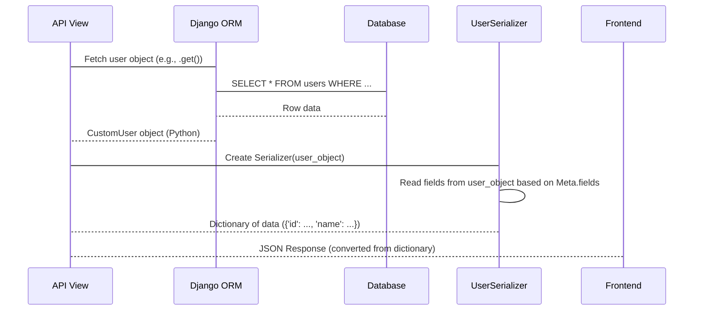
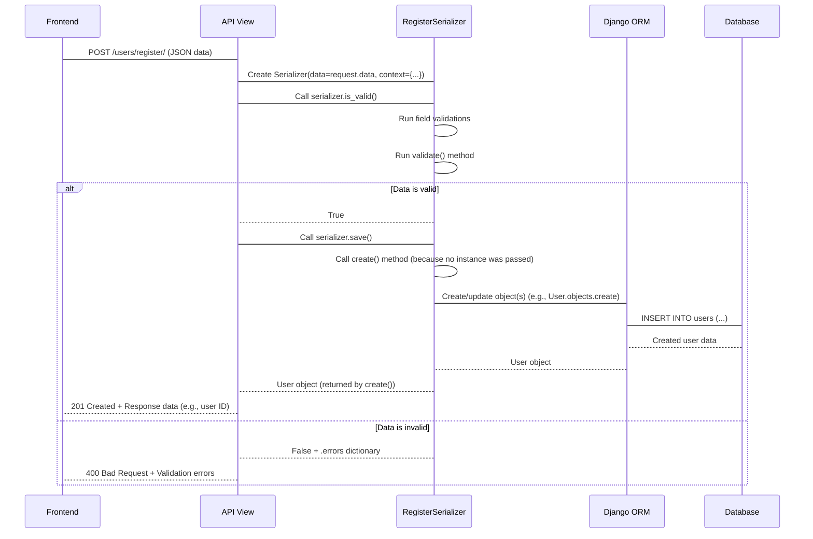

# Chapter 5: Data Serializers

Welcome back! In the previous chapters, we've covered the foundational elements of our project: [Django Models (ORM)](01_django_models__orm__.md) define the structure of our data in the database, [User Management & Authentication](02_user_management___authentication_.md) handles who can access the system, [Portfolio Company Management](03_portfolio_company_management_.md) and [Deal Lifecycle Management](04_deal_lifecycle_management_.md) show how we manage specific types of business data using these models.

So far, we've talked a lot about how the backend stores and processes data using Python objects and the ORM. But how does this Python data *travel* to the frontend (like a web browser or mobile app) or how does data coming *from* the frontend get understood by our Python backend?

This is where **Data Serializers** come in.

## What is a Data Serializer?

Imagine your backend speaks "Python Object" language, and your frontend speaks "JSON" language. They need a translator! That's exactly what a serializer does.

Serializers are like **translators or data formatters** for your API. They take complex data, like a Django model instance (a Python object representing a row in your database), and convert it into a standard, easy-to-understand format for sending over the web, primarily **JSON (JavaScript Object Notation)**.

They also work in reverse: when your API receives data (like from a form submission to create a new user or company), the serializer takes the incoming JSON data, validates it (checks if it's in the correct format and contains the expected information), and converts it into Python dictionaries or objects that your backend can work with.

**In simple terms:**

*   **Serialization (Python -> JSON):** Taking your carefully structured Python object (`CustomUser(name='Jane', role='investor', ...)`) and turning it into a JSON string that looks like:
    ```json
    {
        "name": "Jane",
        "role": "investor",
        ...
    }
    ```
*   **Deserialization (JSON -> Python):** Taking an incoming JSON string from a request body (`{"username": "test@example.com", "password": "..."}`) and turning it into a Python dictionary (`{'username': 'test@example.com', 'password': '...'}`) after checking that the data is valid (e.g., the username is an email format, password is not empty).

## Why Do We Need Serializers?

You might wonder, "Why can't I just send my Python object directly?"

1.  **Complexity:** Python objects can be complex, containing methods, database connections, etc. JSON is a simple, universal data format.
2.  **Database Stuff:** Django model instances are tied to the database. You don't want to expose internal database structure directly to the outside world.
3.  **Standardization:** JSON is the standard for web APIs. Frontends built with any technology (JavaScript, mobile apps) can easily understand JSON.
4.  **Validation:** Incoming data from the outside world is untrusted. Serializers provide a crucial layer to validate that the data conforms to expected rules (e.g., required fields are present, data types are correct, specific formats like email addresses are followed).
5.  **Filtering Data:** Often, you don't want to send *all* fields from a model instance. Serializers let you specify exactly which fields to include.

Our project uses **Django REST Framework (DRF)**, which provides powerful and convenient serializer classes to handle this translation and validation work efficiently.

## Introducing Django REST Framework Serializers

DRF provides several types of serializers, but the most common ones you'll see in our project are:

1.  **`serializers.Serializer`**: A basic serializer that works like a form. You define fields manually, and it handles validation and conversion to/from Python dictionaries. Useful for data that doesn't directly map to a single model (like a login request, which takes username/password and returns tokens).
2.  **`serializers.ModelSerializer`**: This is a shortcut! It automatically generates serializer fields based on a Django model. It also includes default implementations for creating (`.create()`) and updating (`.update()`) model instances. This is what you'll use most often when your API endpoints deal directly with models.

Let's focus on the `ModelSerializer` as it's fundamental to representing our models as API data.

## `ModelSerializer`: The Model's API Twin

A `ModelSerializer` is the simplest way to create a serializer that maps directly to a Django model. You tell it which model to use and which fields from that model should be included in the serialization/deserialization process.

It has a special inner `Meta` class, similar to the `Meta` class in Django models ([Chapter 1: Django Models (ORM)](01_django_models__orm__.md)), to configure its behavior.

### Example: Displaying a User

Let's look at how we might prepare `CustomUser` data for display (serialization). We need a serializer that can take a `CustomUser` object and turn it into JSON.

Recall the simplified `CustomUser` model from [Chapter 1](01_django_models__orm__.md) and [Chapter 2](02_user_management___authentication_.md):

```python
# Simplified model snippet (from pig_project/pig/models.py)
from django.contrib.auth.models import AbstractUser
# ... other imports ...

class CustomUser(AbstractUser):
    # ... standard AbstractUser fields like username, password, email ...
    role = models.CharField(...)
    name = models.CharField(...)
    contact_number = models.CharField(...)
    is_active = models.BooleanField(...)
    # ... other fields ...
```

Now, let's create a serializer for it:

```python
# Inside pig_project/pig/user/serializers.py (Simplified)
from rest_framework import serializers
from django.contrib.auth import get_user_model # Helper to get the active User model

User = get_user_model()

class UserSerializer(serializers.ModelSerializer):
    class Meta:
        model = User # Tell the serializer which model to use
        fields = [ # List the fields you want to include in the output/input
            'id', 'username', 'name', 'role', 'is_active',
            'contact_number', 'created_at'
        ]
        # Or use fields = '__all__' to include all fields,
        # or exclude = ['password'] to include all except listed ones.

    # You can add custom validation or representation logic here if needed
    # def to_representation(self, instance):
    #     # Example: customize how data is shown
    #     representation = super().to_representation(instance)
    #     representation['created_at'] = instance.created_at.strftime('%m/%d/%Y %H:%M')
    #     return representation
```

**Explanation:**

*   `class UserSerializer(serializers.ModelSerializer):` tells DRF we're creating a serializer based on a model.
*   `class Meta:` is where we configure the `ModelSerializer`.
*   `model = User`: Specifies that this serializer is for the `CustomUser` model (aliased as `User`).
*   `fields = [...]`: This is crucial! It lists exactly which fields from the `User` model should be included when serializing data (turning Python object into JSON) and which fields are expected when deserializing data (turning JSON into Python). We include fields like `id`, `username`, `name`, etc., but *not* sensitive fields like `password`.

**How a View Uses it (Serialization - Reading Data):**

Imagine an API view that fetches a `CustomUser` object from the database and needs to send it as a response.

```python
# Simplified view snippet (Conceptual, actual view is more complex)
from rest_framework.response import Response
from pig.user.serializers import UserSerializer # Import our serializer
from pig.models import CustomUser # Import the model

# Assume 'user' is a CustomUser object fetched from the database
user = CustomUser.objects.get(username='jane_doe') # ORM query (Chapter 1)

# Create a serializer instance, passing the model object
serializer = UserSerializer(user)

# Access the .data property to get the dictionary representation
output_data = serializer.data # This is the dictionary

# Send the dictionary as a JSON response
# return Response(output_data)
```



The serializer takes the `CustomUser` Python object and, based on its `Meta.fields` definition, extracts the specified field values and puts them into a standard Python dictionary. DRF then automatically converts this dictionary into a JSON string for the API response.

### Example: Creating a User (Deserialization - Writing Data)

Now, let's look at the reverse process: receiving JSON data to create a new user, as seen in the `RegisterView` from [Chapter 2](02_user_management___authentication_.md).

```python
# Inside pig_project/pig/user/serializers.py (Simplified RegisterSerializer)
from rest_framework import serializers
from django.contrib.auth import get_user_model
from rest_framework.validators import UniqueValidator
# ... other imports and utilities ...

User = get_user_model()

class RegisterSerializer(serializers.ModelSerializer):
    # Define fields explicitly if you need custom validation or behavior
    username = serializers.EmailField(
        required=True, validators=[UniqueValidator(queryset=User.objects.all())] # Ensure unique email
    )
    # Fields that are only for input, not output in response
    social_security_number = serializers.CharField(write_only=True, required=False)

    class Meta:
        model = User
        fields = [ # Fields expected in input AND possibly output
            'id', 'username', 'role', 'name', 'contact_number',
            # ... other fields ...
            'social_security_number', # Included here as it's input
        ]
        # Read-only fields are excluded from validation/saving
        read_only_fields = ['id', 'is_active'] # These are set by backend, not input

    # Custom validation for the entire data payload
    def validate(self, attrs):
        # Example validation: ensure role is allowed based on the creating user
        request = self.context.get('request') # Access request from context
        if request and hasattr(request, 'user') and request.user.role == 'operations':
             if attrs.get('role') not in ['investor']:
                  raise serializers.ValidationError({"role": "Operations users can only create investor users."})
        # ... other validation logic ...
        return attrs

    # Custom create method - called by serializer.save() when creating
    def create(self, validated_data):
        # Extract fields that require special handling (e.g., SSN encryption)
        ssn = validated_data.pop('social_security_number', None)

        # Use ORM to create the user object. **validated_data unpacks the dictionary.
        # The password is NOT set here; it's handled via reset link (Chapter 2)
        user = User.objects.create(
            **validated_data,
            created_by=self.context['request'].user # Set creator from request context
        )

        # Handle SSN encryption after user creation
        if ssn:
            user.set_ssn(ssn) # Call model method for encryption (Chapter 1)
            user.save()

        # ... logic to send welcome email with password reset link (Chapter 2) ...

        return user # Return the created user object
```

**Explanation:**

*   `username = serializers.EmailField(...)`: Explicitly defining fields allows adding custom validation like `UniqueValidator`.
*   `social_security_number = serializers.CharField(write_only=True, required=False)`: `write_only=True` means this field is *only* used for deserialization (receiving input). It will *not* be included in the serializer's output (`.data`), which is important for sensitive data like SSN.
*   `read_only_fields = ['id', 'is_active']`: These fields are included in the output (`.data`) but ignored during deserialization (`.is_valid()` and `.save()`). The backend controls their values.
*   `validate(self, attrs)`: This method is called by `serializer.is_valid()` after individual field validations pass. You can put complex validation logic here that involves multiple fields or the request context.
*   `create(self, validated_data)`: This method is automatically called when you call `serializer.save()` on a serializer that doesn't have an existing instance associated with it. It receives `validated_data`, which is a dictionary of data that passed all validation rules. This is where you typically interact with the ORM to save the data.

**How a View Uses it (Deserialization - Writing Data):**

An API view receiving data (like a `POST` request) uses the serializer to handle validation and saving.

```python
# Simplified view snippet (from pig_project/pig/user/views.py - RegisterView)
from rest_framework import status
from rest_framework.response import Response
from rest_framework.views import APIView
from pig.user.serializers import RegisterSerializer # Import serializer

class RegisterView(APIView):
    # ... permission_classes ...

    def post(self, request):
        # 1. Create serializer instance with incoming data
        #    Pass 'request' in context if needed for validation or saving
        serializer = RegisterSerializer(data=request.data, context={'request': request})

        # 2. Validate the data
        if serializer.is_valid(): # This triggers field and object-level validation
            # 3. If valid, save the data using the serializer's create/update method
            #    This calls serializer.create(validated_data) in this case
            user = serializer.save()

            # 4. Return success response (often including some created data)
            return Response({
                "message": "User registered successfully",
                "id": user.id,
            }, status=status.HTTP_201_CREATED) # 201 for creation success

        # 5. If data is NOT valid, serializer.errors contains validation messages
        return Response(serializer.errors, status=status.HTTP_400_BAD_REQUEST)
```



This shows the typical flow for handling incoming data: instantiate the serializer with the request data, call `is_valid()` to trigger validation, and if valid, call `save()` to persist the data (which, for `ModelSerializer`, defaults to using the ORM to create or update the model instance).

## Nested Serializers: Handling Relationships

What about related objects? Like how a `PortfolioCompany` can have multiple `FundingRoundDetails` ([Chapter 3: Portfolio Company Management](03_portfolio_company_management_.md))? Serializers can handle this using **nested serializers**.

You include a serializer instance for the related model as a field in the main serializer.

```python
# Inside pig_project/pig/portfolio_company/serializers.py (Simplified)

from rest_framework import serializers
from pig.models import PortfolioCompany, FundingRoundDetails # Import both models

# 1. Serializer for the 'child' model (FundingRoundDetails)
class FundingRoundDetailsSerializer(serializers.ModelSerializer):
    class Meta:
        model = FundingRoundDetails
        fields = [
            'funding_round_stage', 'valuation_amount', 'valuation_date', 'pig_funds',
        ]
        # Note: We don't typically include the ForeignKey back to the parent here

# 2. Serializer for the 'parent' model (PortfolioCompany)
class PortfolioCompanySerializer(serializers.ModelSerializer):
    # Add the child serializer as a field
    # many=True indicates it's a list of FundingRoundDetails
    funding_rounds = FundingRoundDetailsSerializer(many=True)

    class Meta:
        model = PortfolioCompany
        fields = [
            'name', 'detail_url', 'business_type', 'status',
            'current_valuation', 'date_of_valuation',
            'funding_rounds', # Include the nested field name here
        ]
        # ... other Meta options ...

    # Override create to handle saving the nested data
    def create(self, validated_data):
        # Extract the list of funding round data from the main validated data
        funding_rounds_data = validated_data.pop('funding_rounds', [])

        # Create the parent object first (PortfolioCompany)
        portfolio_company = PortfolioCompany.objects.create(**validated_data, created_by=self.context['request'].user)

        # Iterate through the extracted list and create child objects
        funding_rounds_to_create = [
            FundingRoundDetails(
                portfolio_company=portfolio_company, # Link child to parent
                created_by=self.context['request'].user,
                **round_data # Unpack specific round details
            )
            for round_data in funding_rounds_data
        ]
        # Use bulk_create for efficiency
        FundingRoundDetails.objects.bulk_create(funding_rounds_to_create) # ORM bulk insert

        # ... logic to potentially set initial current_valuation ...

        return portfolio_company # Return the created parent object
```

**Explanation:**

*   We define `FundingRoundDetailsSerializer` first for the related model.
*   Inside `PortfolioCompanySerializer`, we define a field named `funding_rounds` (matching the `related_name` on the `ForeignKey` in the `PortfolioCompany` model).
*   We assign an instance of `FundingRoundDetailsSerializer` to this field.
*   `many=True` is essential because a `PortfolioCompany` has *many* `FundingRoundDetails`. If it was a single `ForeignKey`, we would omit `many=True`.
*   In the `create` method, we manually extract the list of dictionaries for `funding_rounds` from the `validated_data` dictionary *before* creating the `PortfolioCompany` object.
*   After the company is created (so we have its ID), we loop through the `funding_rounds_data` list, create `FundingRoundDetails` objects in memory, link each one back to the `portfolio_company` object, and then use `bulk_create` to save them all efficiently using the ORM.

This pattern is used throughout the project for handling nested data structures, like Deals and their Agreements ([Chapter 4: Deal Lifecycle Management](04_deal_lifecycle_management_.md)).

## Conclusion

Data Serializers are the unsung heroes of your API backend! They are the crucial layer that translates complex Python objects into standard data formats like JSON for sending out, and validates/converts incoming JSON data back into Python for processing. Django REST Framework's `ModelSerializer` makes this task much easier by automatically mapping to your Django models. We saw how they are used for both reading data (serialization) and writing data (deserialization, including validation and saving related objects using nested serializers).

Understanding serializers is vital because almost every API endpoint that sends or receives data will use them. In the next chapter, we'll see how these serializers are integrated into the building blocks that handle web requests and responses: [API Views and URL Routing](06_api_views_and_url_routing_.md).

[Next Chapter: API Views and URL Routing](06_api_views_and_url_routing_.md)

