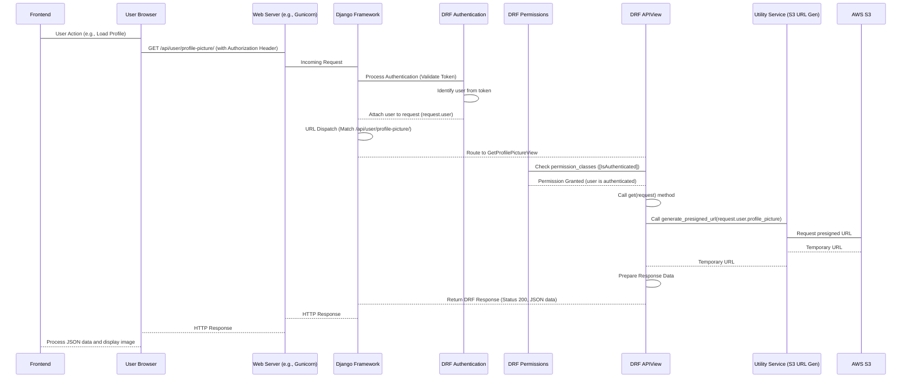

# Chapter 6: API Views and URL Routing

Welcome back! In our journey through the `sisforce-pig_backend` project, we've covered how our data is structured using [Django Models (ORM)](01_django_models__orm__.md), how users are managed and authenticated ([User Management & Authentication](02_user_management___authentication_.md)), and how we handle specific data like [Portfolio Company Management](03_portfolio_company_management_.md) and [Deal Lifecycle Management](04_deal_lifecycle_management_.md). Most recently, in [Chapter 5: Data Serializers](05_data_serializers_.md), we learned how our backend translates Python data (like model objects) into formats suitable for sending over the internet (JSON) and vice-versa.

Now, we need to understand how the outside world – a web browser, a mobile app, or another service – actually **talks** to our backend API. When someone types a URL or clicks a button in the frontend that needs data from the backend, how does that request get to the right piece of code to be processed?

This is the job of **API Views and URL Routing**.

## What are API Views and URL Routing?

Imagine our backend application is a building with many offices.

*   **URLs (`urls.py`):** These are like the **street addresses** and specific **room numbers** for different services within the building. For example, `/api/login/` might be the address for the login service, and `/api/users/123/` might be the address for retrieving details about user number 123.
*   **API Views (`views.py` files):** These are the **specific "offices" or "handlers"** that know how to perform a particular task. There's an office for handling login requests, another for getting user details, another for creating a new deal, and so on. When a request arrives at their "address", the view code takes over.
*   **URL Routing:** This is the **"receptionist" or "switchboard"** that listens for incoming requests (HTTP requests) arriving at the building's address (the server's domain name/IP). Based on the *specific URL* requested (like `/api/login/`), the router looks up which view is assigned to that URL and directs the request to that view's code.

In essence, URL routing is how the application matches an incoming web request (based on its URL) to the specific Python code (the View) that should handle it. The View then processes the request, interacts with other parts of the application (like models using the ORM, or serializers), and generates a response to send back.

## Core Concepts

### 1. URL Configuration (`urls.py`)

In Django, URL routing is primarily handled in `urls.py` files. Our project has a main `urls.py` in `pig_project/pig_project/` and includes another `urls.py` specifically for our application's endpoints in `pig_project/pig/urls.py`.

Let's look at a simplified version of `pig_project/pig/urls.py`:

```python
# Inside pig_project/pig/urls.py

from django.urls import path
from rest_framework_simplejwt.views import TokenRefreshView
from pig.auth.views import ( # Import views from auth app
    LoginView, LogoutView, # ... other auth views
)
from pig.user.views import ( # Import views from user app
    RegisterView, GetUserByIdView, GetProfilePictureView # ... other user views
)
# ... import views from other apps (portfolio_company, deals, dashboard) ...

urlpatterns = [
    # Maps the URL '/api/login/' to the LoginView class
    path('api/login/', LoginView.as_view(), name='login'),

    # Maps the URL '/api/token/refresh/' to DRF's built-in view
    path('api/token/refresh/', TokenRefreshView.as_view(), name='token_refresh'),

    # Maps the URL '/api/register/' to the RegisterView class
    path('api/register/', RegisterView.as_view(), name='register'),

    # Maps the URL '/api/user/profile/' to UserProfileView
    path('api/user/profile/', UserProfileView.as_view(), name='user_profile'),

    # Maps the URL '/api/user/profile-picture/' to GetProfilePictureView
    path('api/user/profile-picture/', GetProfilePictureView.as_view(), name='get_profile_picture'),

    # Example with a parameter: Maps '/api/users/a1b2c3d4-...' to GetUserByIdView
    # <uuid:user_id> captures a UUID from the URL and passes it to the view
    path('api/users/<uuid:user_id>/', GetUserByIdView.as_view(), name='get_user_by_id'),

    # ... many other path entries for other API endpoints ...
]
```

**Explanation:**

*   `urlpatterns` is a list where we define our URL patterns.
*   Each entry uses the `path()` function.
    *   The first argument is the **URL pattern** (e.g., `'api/login/'`). This is matched against the part of the URL *after* the domain name (like `example.com`).
    *   The second argument is the **View** that should handle requests matching this pattern. In Django REST Framework (DRF), we commonly use class-based views (like `LoginView`), so we call `.as_view()` on the class to get a function that Django can use.
    *   The third argument, `name='...'`, gives this URL pattern a name. This is useful for generating URLs dynamically elsewhere in the project, but less critical for simple API routing understanding.
*   Notice the entry for `GetUserByIdView`. The part `<uuid:user_id>` is a **URL parameter**. It tells Django to capture whatever comes after `/api/users/` *if* it looks like a UUID, and pass that captured value as a keyword argument named `user_id` to the view function/method.

When a request comes in (e.g., `GET /api/user/profile-picture/`), Django's URL dispatcher goes through `urlpatterns` and tries to find a match. Once it finds the line `path('api/user/profile-picture/', GetProfilePictureView.as_view(), ...)`, it knows to hand the request off to the `GetProfilePictureView`.

### 2. API Views (`views.py`)

Views are the heart of the backend logic for a specific endpoint. They are Python classes (or sometimes functions) that inherit from `rest_framework.views.APIView` or its subclasses (like `generics.ListAPIView`, `generics.RetrieveAPIView`, etc., which offer more built-in functionality but `APIView` is the basic building block).

An `APIView` class typically defines methods corresponding to HTTP request methods:

*   `get(self, request, ...)`: Handles `GET` requests (used for retrieving data).
*   `post(self, request, ...)`: Handles `POST` requests (used for creating data).
*   `put(self, request, ...)`: Handles `PUT` requests (used for updating data, often a whole resource).
*   `patch(self, request, ...)`: Handles `PATCH` requests (used for partially updating data).
*   `delete(self, request, ...)`: Handles `DELETE` requests (used for deleting data).

When the URL router directs a request to a view, DRF checks the HTTP method of the request (GET, POST, etc.) and calls the corresponding method on the view class instance.

Let's look at the `GetProfilePictureView` from `pig_project/pig/user/views.py`:

```python
# Inside pig_project/pig/user/views.py (Simplified GetProfilePictureView)

from rest_framework.views import APIView
from rest_framework.response import Response
from rest_framework.permissions import IsAuthenticated # From Chapter 2
# ... other imports ...
from pig.utils import generate_presigned_url # From Chapter 7

class GetProfilePictureView(APIView):
    # Permission classes checked BEFORE the get() method runs
    permission_classes = [IsAuthenticated] # Only authenticated users can access

    def get(self, request):
        # This method is called for GET requests to the URL mapped to this view
        try:
            user = request.user # Access the authenticated user object (from Chapter 2)

            if not user.profile_picture:
                # If user has no profile picture, return 404
                return Response(
                    {"error": "No profile picture found for this user."},
                    status=status.HTTP_404_NOT_FOUND
                )

            # Use a utility function (Chapter 7) to get a temporary S3 URL
            presigned_url = generate_presigned_url(user.profile_picture)

            if not presigned_url:
                # Handle error generating URL
                return Response(
                    {"error": "Failed to generate profile picture URL."},
                    status=status.HTTP_500_INTERNAL_SERVER_ERROR
                )

            # Prepare the response data
            response_data = {
                "profile_picture_url": presigned_url,
                "profile_picture_key": user.profile_picture # The S3 storage key
            }

            # Return a successful response
            return Response(response_data, status=status.HTTP_200_OK)

        except Exception as e:
            # Catch any unexpected errors
            # ... logging ...
            return Response(
                {"error": "An error occurred while retrieving the profile picture."},
                status=status.HTTP_500_INTERNAL_SERVER_ERROR
            )
```

**Explanation:**

*   It inherits from `APIView`.
*   `permission_classes = [IsAuthenticated]`: This list tells DRF to run these checks before executing the `get` method. `IsAuthenticated` (from DRF) ensures the user sending the request is logged in ([Chapter 2: User Management & Authentication](02_user_management___authentication_.md)). If not, DRF automatically sends an Unauthorized (401) response.
*   `def get(self, request):`: This method is executed for `GET` requests.
    *   `self`: The view instance.
    *   `request`: A DRF `Request` object. It contains all details about the incoming request (headers, body, user, query parameters, etc.). `request.user` is automatically populated with the authenticated user object by the authentication system ([Chapter 2](02_user_management___authentication_.md)).
    *   Inside the method, the view logic runs: it gets the user, checks if they have a `profile_picture` (which is an S3 key stored on the `CustomUser` model - [Chapter 1](01_django_models__orm__.md)), uses a utility function ([Chapter 7](07_utility_services___helpers_.md)) to generate a temporary download URL, and prepares the data to be sent back.
    *   `return Response(data, status=...)`: This creates a DRF `Response` object. DRF handles converting the Python `data` dictionary into a JSON response and setting the correct HTTP status code (e.g., `200 OK`, `404 Not Found`).

### 3. Views with URL Parameters

Let's look at the `GetUserByIdView` from `pig_project/pig/user/views.py` which handles a URL parameter:

```python
# Inside pig_project/pig/user/views.py (Simplified GetUserByIdView)

from rest_framework.views import APIView
from rest_framework.response import Response
from rest_framework import status
# ... other imports ...
from pig.permissions import RoleBasedPermission # Our custom permission (Chapter 2)
from pig.user.serializers import RegisterSerializer # The serializer (Chapter 5)
from django.contrib.auth import get_user_model

User = get_user_model()

class GetUserByIdView(APIView):
    # Permissions: Only Admin or Operations can get details for ANY user
    permission_classes = [IsAuthenticated, RoleBasedPermission]
    RoleBasedPermission.allowed_roles = ['admin', 'operations']

    # The 'user_id' captured from the URL pattern is passed as an argument
    def get(self, request, user_id):
        try:
            # Use ORM (Chapter 1) to fetch the user by the id from the URL
            user = User.objects.get(id=user_id)

            # Use the serializer (Chapter 5) to format the user data
            serializer = RegisterSerializer(user)
            user_data = serializer.data

            # Special case: only Super Admins can see SSN
            if request.user.role == 'super_admin':
                user_data['social_security_number'] = user.get_ssn() # Model method (Chapter 1)

            # Return the serialized user data
            return Response(user_data, status=status.HTTP_200_OK)

        except User.DoesNotExist:
            # If ORM .get() doesn't find the user, return 404
            return Response({'error': 'User not found'},
                            status=status.HTTP_404_NOT_FOUND)
```

**Explanation:**

*   This view also inherits from `APIView` and has permission checks (`RoleBasedPermission` from [Chapter 2](02_user_management___authentication_.md) restricts it to 'admin' or 'operations').
*   The `get` method now accepts a second argument: `user_id`. This argument automatically receives the value captured from the URL pattern (`<uuid:user_id>` in `urls.py`).
*   Inside the method, `User.objects.get(id=user_id)` uses the ORM ([Chapter 1](01_django_models__orm__.md)) to fetch the specific user object from the database using the ID provided in the URL.
*   It then uses the `RegisterSerializer` ([Chapter 5](05_data_serializers_.md)) to format the fetched user object into a dictionary for the response.
*   It includes a special check based on the *requesting* user's role (`request.user.role`) to decide whether to include sensitive data like SSN, demonstrating how views combine permissions and data handling.

## Use Case Walkthrough: Getting Your Own Profile Picture

Let's trace what happens when an authenticated user requests their profile picture via the API.

**Scenario:** An investor user is logged into the frontend application. The application needs to display their profile picture and makes a request to the backend.

1.  **Frontend Action:** The frontend application sends a `GET` request to `/api/user/profile-picture/`. It includes the user's **Access Token** in the `Authorization` header (as learned in [Chapter 2](02_user_management___authentication_.md)).
2.  **Request Arrives at Backend:** The Django development server (or production server like Gunicorn/Nginx) receives the HTTP request.
3.  **Middleware Processing:** Django and DRF middleware process the request. This includes authentication middleware, which validates the Access Token and sets `request.user` to the authenticated `CustomUser` object ([Chapter 2](02_user_management___authentication_.md)).
4.  **URL Routing:** Django's URL dispatcher looks at the requested path `/api/user/profile-picture/`. It consults `pig_project/pig/urls.py` and finds the matching `path('api/user/profile-picture/', GetProfilePictureView.as_view(), ...)`.
5.  **View Selection:** The request is routed to the `GetProfilePictureView` class.
6.  **Permission Check:** Before executing the view's method, DRF checks the `permission_classes`. `IsAuthenticated` is checked. Since the user is authenticated (token was valid), this check passes. `RoleBasedPermission` is *not* on this view's `permission_classes`, so no role check happens here (any authenticated user can view *their own* profile picture).
7.  **HTTP Method Dispatch:** The request method is `GET`. DRF calls the `get(self, request)` method on an instance of `GetProfilePictureView`.
8.  **View Logic Execution:**
    *   The code inside `get()` starts running.
    *   `request.user` holds the `CustomUser` object for the logged-in investor.
    *   The code checks `user.profile_picture`. If it exists (it's an S3 key like `profile_pictures/uuid.jpg`), it calls `generate_presigned_url(user.profile_picture)`.
    *   This utility function communicates with AWS S3 to generate a temporary, secure URL.
    *   Assuming success, the `response_data` dictionary is built.
9.  **Response Generation:** The `return Response(response_data, status=...)` line is executed. DRF takes the `response_data` dictionary, serializes it into a JSON string (`{"profile_picture_url": "...", "profile_picture_key": "..."}`), sets the HTTP status code to 200, and creates the HTTP response.
10. **Response Sent Back:** The response travels back through middleware and is sent back to the frontend application.
11. **Frontend Processing:** The frontend receives the JSON response, extracts the `profile_picture_url`, and uses it to display the image.

## Under the Hood: The Request Flow

Here's a simple sequence diagram showing the flow for the profile picture example:



This diagram shows how the request travels through different layers: the web server, the Django framework, DRF's authentication and permission layers, the view logic, and finally interacting with other services (like our utility functions talking to S3) before returning the response.

## More API View Examples

Looking back at `pig_project/pig/urls.py`, you can see many other examples mapping different URLs to different views:

*   `/api/login/` maps to `LoginView` (`POST` method handles login).
*   `/api/register/` maps to `RegisterView` (`POST` method handles user creation, uses a [Serializer](05_data_serializers_.md) and sends email via [Utilities](07_utility_services___helpers_.md)).
*   `/api/portfolio-company/create/` maps to `CreatePortfolioCompanyView` (`POST` method handles company creation, uses a [Serializer](05_data_serializers_.md) to save [Models](01_django_models__orm__.md)).
*   `/api/deals/<uuid:deal_id>/update/` maps to `UpdateDealView` (`PUT` method handles updating a specific deal identified by its ID from the URL, uses a [Serializer](05_data_serializers_.md), interacts with [Models](01_django_models__orm__.md), and checks permissions).
*   `/docusign-webhook/` maps to a function-based view `docusign_webhook` (`POST` method handles incoming data from DocuSign, updates [Agreement Models](01_django_models__orm__.md), and interacts with [Utilities](07_utility_services___helpers_.md) for S3 upload). This is an example of a view that doesn't require authentication because it's called by an external service (DocuSign), not a user.

Each of these views, defined in their respective `views.py` files, contains the specific logic needed to process requests for their assigned URL, interacting with other parts of the backend as needed.

## Conclusion

In this chapter, we've uncovered how incoming web requests are handled in our project. We learned that **URL routing** (defined in `urls.py`) is the system that directs requests based on their URL to the appropriate **API View** (defined in `views.py`). Views are the core Python code handlers that receive the request, perform actions (like interacting with [Models](01_django_models__orm__.md) via the ORM, using [Serializers](05_data_serializers_.md) to process data, or leveraging [Utility Services](07_utility_services___helpers_.md)), and return structured responses, typically in JSON format.

Understanding how URLs are mapped to views and how views process requests is fundamental to seeing how the API works end-to-end. In the next chapter, we'll take a closer look at some of the reusable helper functions and services that various views and other parts of the application rely on: [Utility Services & Helpers](07_utility_services___helpers_.md).

[Next Chapter: Utility Services & Helpers](07_utility_services___helpers_.md)

