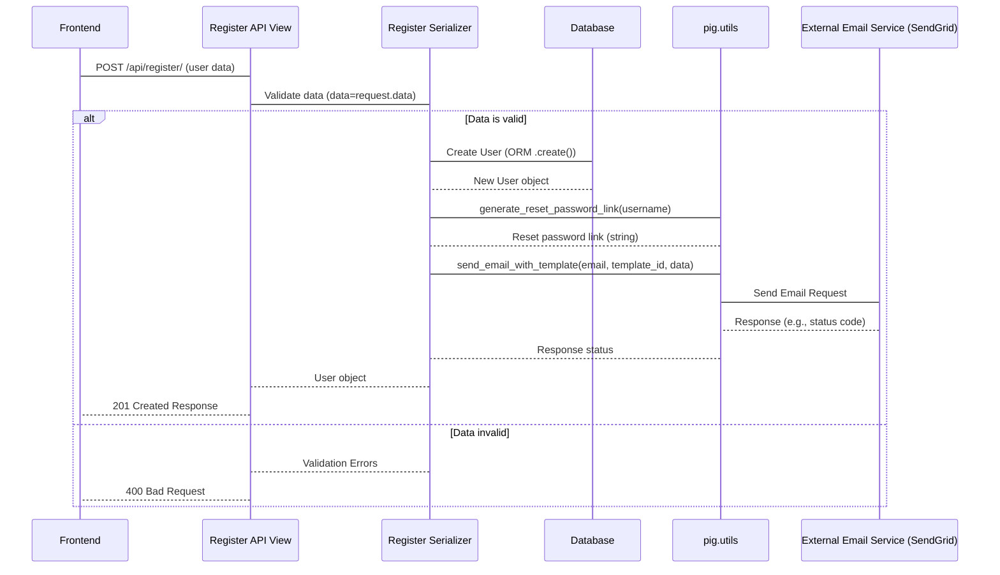

# Chapter 7: Utility Services & Helpers

Welcome back! In our journey through the `sisforce-pig_backend` project, we've explored the core building blocks: [Django Models (ORM)](01_django_models__orm__.md) for data structure, [User Management & Authentication](02_user_management___authentication_.md) for handling users, how we manage specific data like [Portfolio Company Management](03_portfolio_company_management_.md) and [Deal Lifecycle Management](04_deal_lifecycle_management_.md), and how [Data Serializers](05_data_serializers_.md) and [API Views and URL Routing](06_api_views_and_url_routing_.md) handle communication with the outside world.

As we've seen, views and serializers are responsible for specific tasks (like handling a login request or creating a deal). But often, these tasks involve performing common, repeatable operations that aren't tied to one specific view or model. For example, sending an email, uploading a file to cloud storage, or doing a specific calculation might be needed by multiple parts of the application.

Doing these common tasks directly inside every view or serializer that needs them would lead to **duplicate code**. If you need to send an email from three different places, you'd have the email sending logic copied three times! This makes the code harder to read, harder to maintain, and prone to errors. If you need to change how emails are sent, you have to change it in multiple places.

## What are Utility Services & Helpers?

This is where **Utility Services & Helpers** come in. Think of them as your project's **central toolbox**. It's a collection of specialized, reusable functions and sometimes classes that perform common tasks required by various parts of the application.

Instead of reinventing the wheel every time you need to send an email or format a date, you just grab the right tool from the toolbox. These tools live in dedicated files, keeping the main business logic in your views and serializers clean and focused on *what* needs to be done, rather than *how* to do every little common step.

In our `sisforce-pig_backend` project, many of these helpers are found in the `pig_project/pig/utils.py` file.

Common tasks handled by utilities in this project include:

*   **Logging:** Recording important events or errors.
*   **Email Sending:** Sending notifications, welcome emails, password reset links.
*   **File Storage (S3):** Uploading and downloading files (like profile pictures, agreements) to Amazon S3.
*   **PDF Generation:** Creating dynamic PDF documents (like agreements).
*   **Encryption:** Securely storing sensitive data (like SSN).
*   **Financial Calculations:** Performing specific calculations for reporting or display (like gain/loss on investments).
*   **Data Formatting:** Standardizing how dates or other data types are presented.

Let's look at a few examples from `pig_project/pig/utils.py` and see how they are used.

## Use Case: Sending a Welcome Email After Registration

We touched upon this in [Chapter 2: User Management & Authentication](02_user_management___authentication_.md). When a new user is registered by an admin, they don't get a password set directly. Instead, the system sends them an email with a link to create their password.

This process involves two key utility functions from `pig_project/pig/utils.py`:

1.  `generate_reset_password_link`: Creates the secure, time-limited link.
2.  `send_email_with_template`: Sends the actual email using a service like SendGrid.

Let's see how the `RegisterSerializer` ([Chapter 5: Data Serializers](05_data_serializers_.md)) and `RegisterView` ([Chapter 6: API Views and URL Routing](06_api_views_and_url_routing_.md)) use these utilities.

Recall the simplified `create` method in `RegisterSerializer`:

```python
# Inside pig_project/pig/user/serializers.py (Simplified create method)

from rest_framework import serializers
from django.core.signing import TimestampSigner
from django.conf import settings
from pig.utils import send_email_with_template, generate_reset_password_link # Import the utilities
# ... other imports ...

# ... RegisterSerializer class definition ...

    def create(self, validated_data):
        # ... (code to create the user object using ORM) ...
        user = User.objects.create(...) # User object is created and saved to DB

        # Use the utility functions here!
        reset_password_link = generate_reset_password_link(user.username)
        template_id = settings.SENDGRID_WELCOME_TEMPLATE_ID # Get template ID from settings
        dynamic_data = {"name": user.name, "link": reset_password_link}

        # Call the email sending utility
        send_email_with_template(user.email, template_id, dynamic_data)

        return user # Return the created user object
```

**Explanation:**

*   The serializer's job (`create` method) is to get the user object saved.
*   *After* the user is saved, it needs to trigger the email process.
*   It doesn't know *how* to generate a password reset token or *how* to connect to SendGrid. It just calls the helper functions: `generate_reset_password_link()` and `send_email_with_template()`.
*   It passes the necessary *data* to these functions (username for the link, recipient email, template ID, and dynamic data for the email content).
*   The complexity of signing tokens or interacting with an external email API is hidden inside the utility functions.

## How the Utilities Work (Under the Hood)

Let's peek inside `pig_project/pig/utils.py` to see simplified versions of these utility functions.

### `generate_reset_password_link`

```python
# Inside pig_project/pig/utils.py (Simplified)

from django.core.signing import TimestampSigner # Tool for creating signed tokens
from django.conf import settings
# ... other imports and utility functions ...

def generate_reset_password_link(username):
    """
    Generates a signed reset password link for the given username.
    """
    try:
        signer = TimestampSigner() # Create a signer instance
        token = signer.sign(username) # Sign the username with a timestamp
        log(f"Generated signed token for {username}", "info") # Use the logging utility!
        # Build the full URL using the token and the frontend URL from settings
        link = f"{settings.REACT_ORIGIN_URL}/reset-password?token={token}"
        return link
    except Exception as e:
        log(
            f"Failed to generate reset password link for {username}. Error: {str(e)}",
            "error") # Use the logging utility for errors
        return None
```

**Explanation:**

*   This function uses Django's built-in `TimestampSigner` to create a secure token that includes the username and a timestamp. This token can be verified later to ensure it hasn't been tampered with and hasn't expired.
*   It then constructs the full URL pointing to the frontend's password reset page, including the generated token as a query parameter.
*   It also uses the `log` utility function (explained next) to record its activity.

### `log`

This is a very simple but essential utility. Any part of the application can call `log()` instead of directly using `logging.getLogger()`.

```python
# Inside pig_project/pig/utils.py (Simplified)

import logging

logger = logging.getLogger('django_project_api')
# ... other utility functions ...

def log(message, level='info'):
    """
    Logs a message at the specified log level.
    """
    level = level.lower()
    if level == 'debug':
        logger.debug(message)
    elif level == 'info':
        logger.info(message)
    # ... checks for warning, error, critical ...
    else:
        logger.info(
            f"Invalid log level '{level}' provided. Logging as INFO: {message}"
        )

```

**Explanation:**

*   It provides a single, consistent way to log messages from anywhere in the project.
*   It ensures all messages go through the same logger instance (`django_project_api`), making log management easier.

### `send_email_with_template`

This function interacts with an external email service (SendGrid, based on the imports and settings usage).

```python
# Inside pig_project/pig/utils.py (Simplified)

from sendgrid import SendGridAPIClient # The SendGrid library
from sendgrid.helpers.mail import Mail # Helper for constructing email objects
from django.conf import settings # Access project settings (like API key)
# ... other imports and utility functions ...

def send_email_with_template(to_email, template_id, dynamic_data):
    """
    Sends an email using a predefined SendGrid template.
    """
    try:
        message = Mail( # Create an email object
            from_email=settings.DEFAULT_FROM_EMAIL, # Sender from settings
            to_emails=to_email # Recipient
        )
        message.template_id = template_id # Specify the template ID
        message.dynamic_template_data = dynamic_data # Provide data for the template
        sg = SendGridAPIClient(settings.SENDGRID_API_KEY) # Initialize SendGrid client with API key
        response = sg.send(message) # Send the email!
        log(
            f"Email sent to {to_email}. Status: {response.status_code}",
            "info"
        )
        return response.status_code
    except Exception as e: # Catch potential errors during sending
        log(f"Failed to send email to {to_email}. Error: {str(e)}", "error")
        return None
```

**Explanation:**

*   This function encapsulates all the details of using the SendGrid API.
*   It constructs the email message, sets the template and dynamic data, initializes the SendGrid client using the API key from settings, and sends the email via the API.
*   Any code that needs to send a templated email simply calls `send_email_with_template()`, providing the recipient, template ID, and data. It doesn't need to know anything about `Mail`, `SendGridAPIClient`, or API keys.

## Flow of Sending Welcome Email

Let's visualize the simplified flow:



This diagram clearly shows how the serializer delegates the specific tasks of link generation and email sending to the utility functions, keeping the serializer's `create` method focused on the core task of creating the user model instance.

## Other Examples of Utilities

*   **S3 Interaction:** Functions like `upload_to_s3`, `generate_presigned_url`, `fetch_from_s3`, and `remove_local_file` handle the specifics of interacting with Amazon S3. Views or services needing to store or retrieve files just call these functions with the file path/content and the desired S3 key (path). This hides the complexity of `boto3` (the AWS SDK) and AWS credentials from the rest of the application.
    *   Example usage in [Chapter 6: API Views and URL Routing](06_api_views_and_url_routing_.md) in `GetProfilePictureView` calling `generate_presigned_url`.
    *   Example usage in [Chapter 4: Deal Lifecycle Management](04_deal_lifecycle_management_.md) in the digital agreement flow calling `generate_deal_agreement_pdf` (another utility!), `upload_to_s3`, and `remove_local_file`.
*   **PDF Generation:** `generate_deal_agreement_pdf` encapsulates the logic for using a library (like ReportLab, implied by `canvas.Canvas`) to dynamically create a PDF file based on deal data.
*   **Encryption:** `get_encryption_cipher` and methods on the `CustomUser` model like `set_ssn`/`get_ssn` (which internally use the cipher) provide a standardized way to handle encryption, ensuring sensitive data is protected before being saved.
*   **Financial Calculations:** Functions like `calculate_gain_loss`, `calculate_deal_value`, `calculate_capitalization_table`, and `calculate_portfolio_metrics` contain the business logic for calculating investment performance metrics. Dashboard views can call these functions to get prepared data without needing to implement the calculation logic themselves. This keeps the complex math out of the presentation layer.
*   **Data Formatting:** `format_date`, `format_holding_period`, etc., provide consistent ways to format dates, times, or other data types for display, ensuring uniformity across API responses.

## Benefits of Using Utility Services

*   **Code Reusability:** The same function can be called from multiple places.
*   **Maintainability:** If you need to change how a common task is done (e.g., switch email providers, change S3 bucket structure), you only need to update the code in one place (`utils.py`).
*   **Readability:** Views and serializers become shorter and easier to understand because repetitive or complex helper logic is moved elsewhere. They focus on the core business process flow.
*   **Testability:** Utility functions often perform isolated tasks, making them easier to test independently.

## Conclusion

In this chapter, we've explored the concept of Utility Services & Helpers, recognizing them as a vital toolbox for reusable code in our project. We saw how functions within `pig_project/pig/utils.py` encapsulate common tasks like logging, sending emails, and interacting with external services like S3. By using these utilities, our views and serializers remain focused and clean, promoting code reuse and making the application easier to maintain and understand. This pattern is fundamental to writing efficient and well-structured backend code.

---

Generated by AI Codebase Knowledge Builder