# Tutorial: sisforce-pig_backend-a449e3c497d4

This project is a *backend API* for an **investment management platform**.
It allows users like *investors* and *admins* to manage their accounts, track **portfolio companies**
and their funding rounds, and oversee the entire **investment deal lifecycle**, including digital
agreement signing. The system also provides dashboards with key financial metrics and utilizes
services like DocuSign for agreements and S3 for file storage.


**Source Repository:** [None](None)

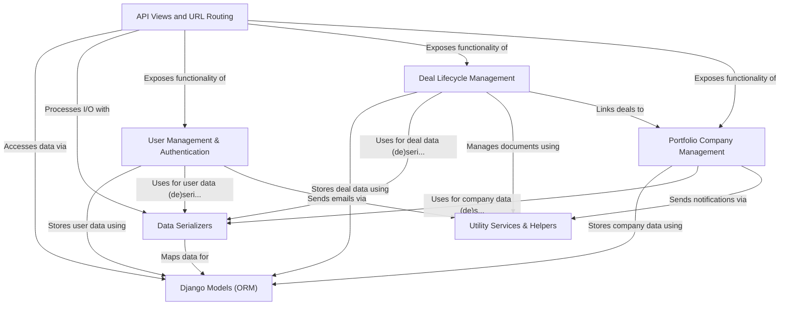

## Chapters

1. [Django Models (ORM)
](01_django_models__orm__.md)
2. [User Management & Authentication
](02_user_management___authentication_.md)
3. [Portfolio Company Management
](03_portfolio_company_management_.md)
4. [Deal Lifecycle Management
](04_deal_lifecycle_management_.md)
5. [Data Serializers
](05_data_serializers_.md)
6. [API Views and URL Routing
](06_api_views_and_url_routing_.md)
7. [Utility Services & Helpers
](07_utility_services___helpers_.md)


---

# Chapter 1: Django Models (ORM)

Welcome to the first chapter of our tutorial on the `sisforce-pig_backend` project! We're starting with the very foundation of how our application handles data: **Django Models** and its **Object-Relational Mapper (ORM)**.

Imagine you're building a system to manage information about investment deals, the companies involved, and the investors. You need a structured way to store things like:

*   Who is the investor? What's their name, contact, type?
*   What portfolio company is the deal for? What's its business type, current valuation?
*   What are the details of the deal itself? The amount invested, the date, the status?

This is where databases come in. Traditionally, you'd use a database like PostgreSQL and write SQL queries (like `CREATE TABLE users (id UUID PRIMARY KEY, name VARCHAR(100), ...);`, `INSERT INTO users (...) VALUES (...);`, `SELECT * FROM deals WHERE investor_id = '...';`) to define your data structure and interact with it. While powerful, SQL can become complex, especially for beginners, and it requires switching between your Python code and database-specific commands.

Django Models and the ORM solve this!

## What are Django Models (ORM)?

Think of Django Models as **blueprints or templates** for the different types of information you need to store in your application. Each model is essentially a Python class that defines the structure of data for a specific entity, like a `User`, a `PortfolioCompany`, or a `Deal`.

The **ORM (Object-Relational Mapper)** is the clever tool that acts as a translator. It lets you interact with your database using familiar Python code (working with these model objects) instead of writing complex SQL queries directly. You can create, read, update, and delete data using Python methods, and the ORM handles the translation to the necessary database commands behind the scenes.

*   **Object:** Your Python class instance (e.g., a specific `CustomUser` object).
*   **Relational:** Your database (which stores data in related tables).
*   **Mapper:** The ORM maps the Python objects to database rows and columns.

Using models makes managing and querying data much more intuitive and "Pythonic". It defines not just the structure but also the relationships between different pieces of data.

Let's look at the `pig_project/pig/models.py` file to see how this is defined in our project.

## Key Concepts in Django Models

Let's break down the essential parts you'll see in our `models.py` file.

### 1. Model Classes

Each distinct type of data gets its own Python class, which *inherits* from `django.db.models.Model`.

```python
# Inside pig_project/pig/models.py

from django.db import models
import uuid

class CustomUser(models.Model): # This is a model class
    # ... fields defined below ...
    pass

class PortfolioCompany(models.Model): # Another model class
    # ... fields defined below ...
    pass

class Deal(models.Model): # And another!
    # ... fields defined below ...
    pass

# ... other models ...
```

Each of these classes (`CustomUser`, `PortfolioCompany`, `Deal`, etc.) corresponds to a table in our database.

### 2. Fields

Inside each model class, you define **fields**. These are class attributes that specify the type of data each column in the database table will hold, and how it should behave.

```python
# Inside CustomUser model (simplified)

class CustomUser(models.Model):
    id = models.UUIDField(primary_key=True, default=uuid.uuid4, editable=False) # A unique identifier field
    name = models.CharField(max_length=100) # Text field for names
    contact_number = models.CharField(max_length=10, unique=True) # Text field for numbers, must be unique
    is_active = models.BooleanField(default=True) # True/False value, defaults to True
    created_at = models.DateTimeField(auto_now_add=True) # Date and time, automatically set when created

    # ... other fields ...
```

Here are some common field types used in our project:

*   `models.CharField`: For small amounts of text (like names, codes). Requires `max_length`.
*   `models.TextField`: For larger amounts of text (like descriptions).
*   `models.IntegerField`: For whole numbers.
*   `models.DecimalField`: For numbers with decimal points (like currency amounts). Requires `max_digits` and `decimal_places`.
*   `models.BooleanField`: For true/false values.
*   `models.DateField`: For dates.
*   `models.DateTimeField`: For dates and times.
*   `models.UUIDField`: For storing universally unique identifiers (UUIDs). Often used for `primary_key`.
*   `models.URLField`: For storing web addresses.
*   `models.EmailField`: For storing email addresses.

Fields often have attributes like:

*   `primary_key=True`: Makes this field the unique identifier for each row.
*   `default=...`: Provides a default value if none is specified when creating a new object.
*   `null=True`: Allows the database column to store `NULL` (empty) values.
*   `blank=True`: Allows forms (like in the Django Admin) to have this field empty. `null` is for the database, `blank` is for validation.
*   `unique=True`: Ensures that each value in this column must be unique across all rows.
*   `choices=...`: Provides a list of predefined options for this field.
*   `validators=...`: Allows adding custom validation rules (like the `RegexValidator` for `contact_number`).

### 3. Relationships

Real-world data is connected. Models reflect this using special field types:

*   **`ForeignKey`**: Represents a "many-to-one" relationship. Many objects of one model are related to a single object of another model.
    *   Example: Many `Deal` objects can be linked to *one* `PortfolioCompany`. A `Deal` object has a `portfolio_company` field that links to a `PortfolioCompany` object.
    *   Code Example:
        ```python
        # Inside Deal model
        portfolio_company = models.ForeignKey(
            'PortfolioCompany', # Links to the PortfolioCompany model
            on_delete=models.CASCADE, # What happens if the linked company is deleted? CASCADE means delete the deal too.
            related_name='deals' # Allows accessing related deals from a PortfolioCompany object (company.deals.all())
        )
        ```
    *   Another Example: Many `CustomUser` objects might be *created by* a single other `CustomUser`.
        ```python
        # Inside CustomUser model
        created_by = models.ForeignKey(
            'self', # Links to the same model (CustomUser)
            on_delete=models.SET_NULL, # What happens if the creator is deleted? Set this field to NULL.
            null=True, blank=True, # Allow this field to be optional
            related_name='created_users' # Access users created by this user (user.created_users.all())
        )
        ```

*   **`ManyToManyField`**: Represents a "many-to-many" relationship. Many objects of one model can be related to many objects of another model.
    *   Example: A `Deal` might involve multiple `BankTransferDetails` (for different payment stages), and a single `BankTransferDetail` might be used for multiple `Deal`s.
    *   Code Example:
        ```python
        # Inside Deal model
        bank_transfer_details = models.ManyToManyField(
            'BankTransferDetails', # Links to the BankTransferDetails model
            related_name='deals', # Allows accessing related deals from a BankTransferDetails object (bank_detail.deals.all())
            blank=True # Allow a deal to have no bank details linked initially
        )
        ```

Django's ORM automatically handles the database structure (often creating intermediate tables for `ManyToManyField`) to manage these relationships.

### 4. Metadata (`class Meta`)

You can add a special inner class named `Meta` inside your model to define database-specific options or other settings.

```python
# Inside CustomUser model
class CustomUser(AbstractUser):
    class Meta: # This is the Meta class
        db_table = "users" # Tells Django to use "users" as the table name instead of the default "pig_customuser"

    # ... fields ...
```

The `db_table` option is used here to give the database table a specific name ("users") which might be different from the default name Django would generate (which would typically be `appname_modelname`, like `pig_customuser`).

### 5. Model Methods

Model classes can also have methods, just like any other Python class. These methods can add custom behavior related to the data represented by the model.

```python
# Inside CustomUser model

# ... fields ...

def __str__(self):
    """String representation of the object."""
    return str(self.username) # When you print a user object, it shows their username

def set_ssn(self, ssn):
    """Encrypts and stores the SSN"""
    if ssn:
        encrypted_data = cipher.encrypt(ssn.encode())
        self.encrypted_ssn = encrypted_data
    else:
        self.encrypted_ssn = None

def get_ssn(self):
    """Decrypts and returns the SSN"""
    # ... decryption logic ...
    pass

def save(self, *args, **kwargs):
    """Ensure SSN is encrypted before saving"""
    if self.encrypted_ssn and isinstance(self.encrypted_ssn, str):
        self.set_ssn(self.encrypted_ssn) # Call set_ssn before saving if SSN is a string (e.g., coming from user input)
    super().save(*args, **kwargs) # Call the original save method to store in the database
```

*   The `__str__` method is very common. It defines what should be displayed when you print or represent an object of this model (very useful in the Django Admin or for debugging).
*   Methods like `set_ssn` and `get_ssn` encapsulate specific logic related to the model's data, in this case, handling encryption/decryption of sensitive information.
*   Overriding the `save` method allows you to perform actions *before* or *after* an object is saved to the database. In the `Deal` model, the `save` method is used to automatically generate a unique `deal_code` before saving a new deal object.

```python
# Inside Deal model

# ... fields ...

def save(self, *args, **kwargs):
    """Generate deal code before saving"""
    if not self.deal_code: # Check if deal_code is not already set
        # Logic to generate a unique code based on month/year and sequence number
        # ... (Code omitted for brevity, but it calculates a string like "PIG/DC/MMYYYY/######")
        self.deal_code = generated_code_here # Set the generated code
    super().save(*args, **kwargs) # Call the original save method to store in the database

# ... other methods ...
```

This shows how methods can add business logic directly to your data models.

## Using Models: A Simple Example (Creating a User)

Let's see how we would use the `CustomUser` model to create a new user in the database using Python and the ORM. You would typically do this in a Django shell, a script, or a view function ([Chapter 6: API Views and URL Routing](06_api_views_and_url_routing_.md)).

First, you need to import the model:

```python
# In your Python code (e.g., manage.py shell)

from pig.models import CustomUser
```

Now, create an *instance* of the model class. This is like creating a row in the "users" table, but it only exists in Python memory so far:

```python
# Create a new user object in memory
new_user = CustomUser(
    username='jane_doe',
    name='Jane Doe',
    contact_number='9876543210',
    role='investor', # Using one of the ROLE_CHOICES
    # You'd typically set a password separately and securely!
)

print(f"New user object created in memory: {new_user}")
```

This creates a Python object. It hasn't touched the database yet.

To save this user to the database, you call the `.save()` method on the object:

```python
# Save the user object to the database
new_user.save()

print(f"User '{new_user.username}' saved to database with ID: {new_user.id}")
```

**What happens when you call `.save()`?** This is where the ORM magic happens!

## Behind the Scenes: The ORM at Work

When you call `new_user.save()`, the Django ORM takes over. It knows:

1.  You're trying to save an object of the `CustomUser` model.
2.  The `CustomUser` model maps to the "users" table in the database.
3.  The fields (`username`, `name`, `contact_number`, etc.) correspond to columns in that table.
4.  The `new_user` object has specific values for these fields.

The ORM then constructs the appropriate SQL command, typically an `INSERT` statement if it's a new object, or an `UPDATE` statement if it's an existing object being modified.

Here's a simplified look at the process using a sequence diagram:

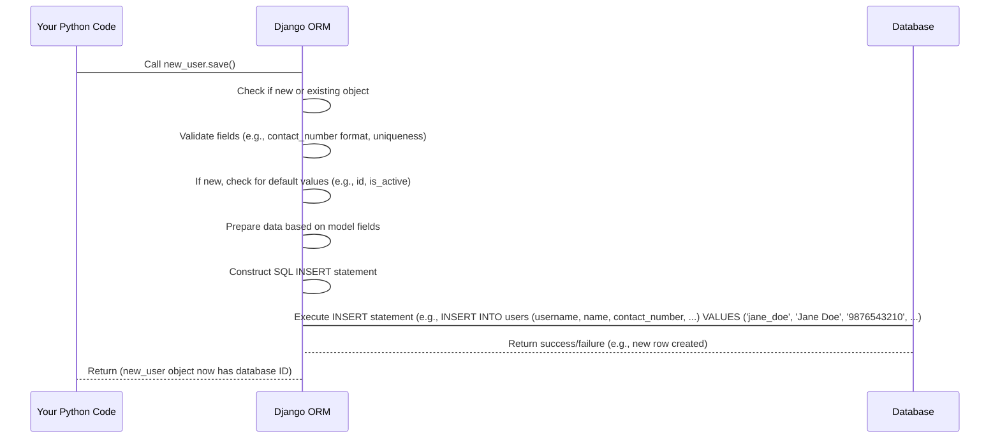

The ORM handles all the communication with the database using your project's database settings (defined in `pig_project/settings.py`, though we won't cover settings in detail here).

## Retrieving Data

The ORM also makes it easy to fetch data from the database using Python. Each model class automatically gets a special attribute called `objects`. This is the gateway to performing database queries.

To get the user we just created:

```python
# Get the user by username
try:
    fetched_user = CustomUser.objects.get(username='jane_doe')
    print(f"Fetched user: {fetched_user.name}, Contact: {fetched_user.contact_number}")
except CustomUser.DoesNotExist:
    print("User not found!")
```

This `CustomUser.objects.get(username='jane_doe')` call is translated by the ORM into an SQL query like `SELECT id, username, name, ... FROM users WHERE username = 'jane_doe';`. The ORM then takes the resulting row from the database and turns it back into a `CustomUser` Python object for you to use.

You can also fetch multiple objects (which returns a `QuerySet`, similar to a list) and filter them:

```python
# Get all users with the role 'investor'
investors = CustomUser.objects.filter(role='investor')

print(f"Found {investors.count()} investor(s):")
for investor in investors:
    print(f"- {investor.name}")

# Get all active portfolio companies
active_companies = PortfolioCompany.objects.filter(status='publish')
# (Here 'publish' would come from the STATUS_CHOICES defined in pig.utils)

print(f"Found {active_companies.count()} active companies.")

```

These simple Python method calls (`.get()`, `.filter()`, `.count()`) are powerful ORM features that abstract away complex SQL.

## Examples from `models.py`

Let's look at a few more snippets from the provided `pig_project/pig/models.py` file to see these concepts in action in our project.

### `PortfolioCompany` Model

```python
# Inside pig_project/pig/models.py
class PortfolioCompany(models.Model):
    id = models.UUIDField(primary_key=True, default=uuid.uuid4, editable=False)
    name = models.CharField(max_length=100)
    detail_url = models.URLField(max_length=500)
    business_type = models.CharField(max_length=50, choices=BUSINESS_TYPE_CHOICES)
    status = models.CharField(max_length=10, choices=STATUS_CHOICES, default='unpublish')
    created_by = models.ForeignKey(
        'CustomUser', # Links to the CustomUser model
        on_delete=models.SET_NULL,
        null=True, blank=True,
        related_name='portfolio_companies' # Access companies created by a user
    )
    created_at = models.DateTimeField(auto_now_add=True)

    class Meta:
        db_table = "portfolio_company" # Custom table name

    def __str__(self):
        return f"{self.name}"
```

This model defines the structure for storing information about a company. It has fields for its name, a URL, type, status, who created it (`ForeignKey` to `CustomUser`), and timestamps. The `Meta` class specifies the table name.

### `Deal` Model

```python
# Inside pig_project/pig/models.py
class Deal(models.Model):
    id = models.UUIDField(primary_key=True, default=uuid.uuid4, editable=False)
    investor = models.ForeignKey('CustomUser', on_delete=models.CASCADE, related_name='deals') # Link to the investor (a CustomUser)
    portfolio_company = models.ForeignKey('PortfolioCompany', on_delete=models.CASCADE, related_name='deals') # Link to the company
    funding_round = models.ForeignKey('FundingRoundDetails', on_delete=models.CASCADE, related_name='deals') # Link to a specific funding round detail
    invested_amount = models.DecimalField(max_digits=15, decimal_places=2, validators=[MinValueValidator(0)])
    bank_transfer_details = models.ManyToManyField('BankTransferDetails', related_name='deals', blank=True) # Link to potentially multiple bank details
    deal_execution_date = models.DateField()
    status = models.CharField(max_length=10, choices=DEAL_STATUS_CHOICES, default='active')
    deal_code = models.CharField(max_length=20, unique=True, editable=False) # Unique auto-generated code
    created_by = models.ForeignKey('CustomUser', on_delete=models.SET_NULL, null=True, related_name='created_deals')

    class Meta:
        db_table = "deals" # Custom table name

    def save(self, *args, **kwargs):
        """Generate deal code before saving"""
        # ... (logic to generate deal_code) ...
        super().save(*args, **kwargs)

    def __str__(self):
        return f"Deal {self.deal_code} - {self.investor.name}"
```

The `Deal` model brings together information from other models (`CustomUser`, `PortfolioCompany`, `FundingRoundDetails`, `BankTransferDetails`) using `ForeignKey` and `ManyToManyField` relationships. It also has its own specific fields like `invested_amount`, dates, status, and a unique `deal_code` which is automatically generated in the overridden `save` method.

### Relationships Visualized

Here's a simple diagram showing some of the key relationships between models using `ForeignKey` and `ManyToManyField`:

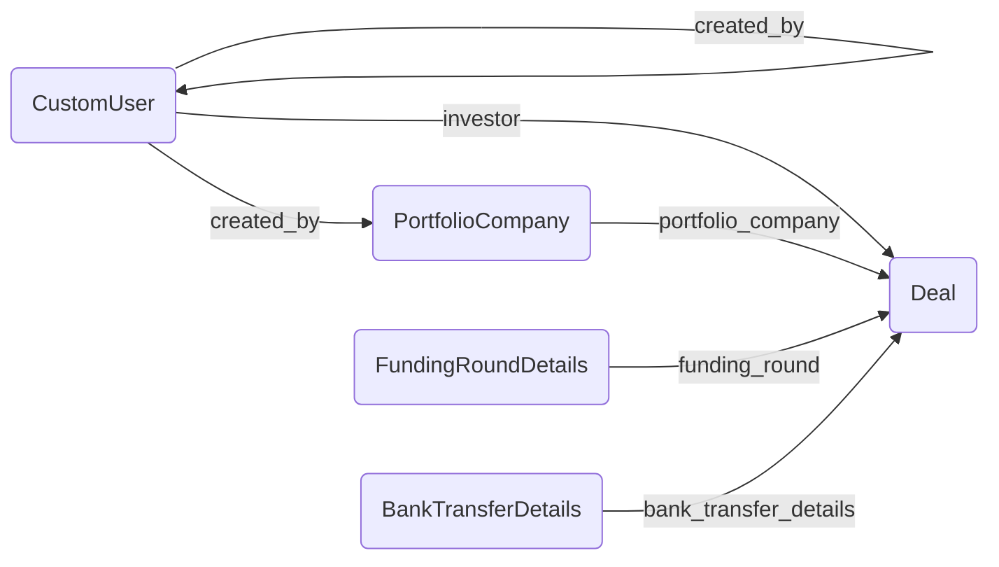
*Note: The arrows show the direction from the model where the `ForeignKey` or `ManyToManyField` is defined.*

## Why Use Models and ORM?

*   **Abstraction:** You don't need to write or even know SQL to perform most database operations.
*   **Maintainability:** Your data structure is defined in one place (your models.py file) using Python, which is easier to read and manage.
*   **Portability:** Django's ORM works with different database systems (PostgreSQL, MySQL, SQLite, Oracle) with minimal changes to your model code. The ORM translates your Python calls to the specific database's SQL dialect.
*   **Productivity:** Common tasks like creating, querying, and relating data are handled efficiently with simple method calls.
*   **Security:** The ORM helps prevent common security issues like SQL injection because it handles parameterization of queries.

Models are the backbone of any Django application that needs to store data. They define the "what" and the "how" of your data structure.

## Conclusion

In this first chapter, we learned that Django Models are Python classes that define the structure of our application's data, mapping directly to database tables. The Django ORM is the powerful layer that lets us interact with the database using standard Python code instead of writing SQL. We looked at how fields define columns, how `ForeignKey` and `ManyToManyField` define relationships between models, and how model methods add behavior.

Understanding models is crucial because they are the foundation upon which we will build the rest of our application's data management features.

In the next chapter, we will dive deeper into the `CustomUser` model and explore how it's used for [User Management & Authentication](02_user_management___authentication_.md), which is built directly on top of this foundational model structure.

[Next Chapter: User Management & Authentication](02_user_management___authentication_.md)


---

# Chapter 2: User Management & Authentication

Welcome back! In [Chapter 1: Django Models (ORM)](01_django_models__orm__.md), we learned how Django Models provide a structured way to represent and store our application's data, acting as blueprints for database tables. We saw how our `CustomUser` model defines the structure for user information.

Now, let's build on that foundation and explore how our application handles everything related to users: allowing them to prove who they are (Authentication) and determining what they are allowed to do (Authorization), based on their roles.

## Why is User Management & Authentication Important?

Imagine our investment platform. We have different types of users:

*   **Admins/Operations:** Who manage the platform, create other users, see all data, etc.
*   **Investors:** Who log in to view their deals, profile, documents, etc.

These different users need different levels of access. An investor shouldn't be able to create new admin accounts or see sensitive data about other investors' deals. An admin needs full access to manage the system.

This is where User Management & Authentication come in. It's the system's **security guard** and **HR department**:

1.  **Authentication:** Verifying a user's identity (Are you who you say you are?). This usually involves a username and password.
2.  **Authorization:** Determining what an *authenticated* user is allowed to access or do (Okay, you're Jane Doe; are you allowed to view this specific deal?). This is often based on roles or permissions.

Our project handles this using Django's built-in authentication system, extended with custom logic and modern API practices like token-based authentication.

## Core Concepts in Our Project

Let's break down the key pieces that make up our User Management & Authentication system:

### 1. The `CustomUser` Model (Our Foundation)

As we saw in [Chapter 1](01_django_models__orm__.md), the `CustomUser` model in `pig_project/pig/models.py` is the central place where user information is stored.

```python
# Inside pig_project/pig/models.py (Simplified)
from django.contrib.auth.models import AbstractUser
# ... other imports ...

class CustomUser(AbstractUser): # Inherits from Django's base user model
    class Meta:
        db_table = "users" # Uses 'users' as table name

    ROLE_CHOICES = (
        ('super_admin', 'Super Admin'),
        ('admin', 'Admin'),
        ('operations', 'Operations'),
        ('investor', 'Investor'),
    )
    role = models.CharField( # The key field for Authorization
        max_length=15,
        choices=ROLE_CHOICES
    )
    id = models.UUIDField(primary_key=True, default=uuid.uuid4, editable=False)
    name = models.CharField(max_length=100)
    contact_number = models.CharField(max_length=10, unique=True)
    is_active = models.BooleanField(default=True)
    failed_login_attempts = models.IntegerField(default=0) # Track failed logins
    lock_until = models.DateTimeField(null=True, blank=True) # Lockout timestamp

    # ... other fields for investor details, timestamps, etc. ...

    def __str__(self):
        return str(self.username) # Display username

    def is_locked(self):
        """Check if the user is currently locked."""
        # Check if lock_until is set AND is in the future
        return self.lock_until and self.lock_until > timezone.now()

    def reset_failed_attempts(self):
        """Reset failed login attempts and lock status."""
        self.failed_login_attempts = 0
        self.lock_until = None
        self.save()

    def increment_failed_attempts(self):
        """Increment failed login attempts and lock if needed."""
        self.failed_login_attempts += 1
        if self.failed_login_attempts >= 3: # Lock after 3 attempts
            self.lock_until = timezone.now() + timedelta(minutes=30) # Lock for 30 mins
        self.save()

    # ... set_ssn, get_ssn, and overridden save method ...
```

*   We inherit from `AbstractUser` to get all standard Django user features (like `username`, `password`, `email`, `is_staff`, `is_superuser`, `last_login`).
*   The `role` field is crucial for our authorization logic.
*   We add custom fields like `failed_login_attempts` and `lock_until` to implement a simple lockout mechanism for security.
*   Methods like `is_locked()`, `reset_failed_attempts()`, and `increment_failed_attempts()` are defined directly on the model to handle the logic related to login attempts.

This model is the central source of truth for user identity and basic properties.

### 2. Authentication: Logging In (Using Tokens)

Instead of traditional session-based logins (where the server keeps track of who is logged in), our API uses **Token-Based Authentication**, specifically **JSON Web Tokens (JWT)**.

Think of it like a club membership card:

1.  **Login:** You show your ID (username/password) at the door (the login endpoint).
2.  **Verification:** The bouncer (the backend) checks your ID.
3.  **Issue Token:** If your ID is valid, the bouncer gives you a special membership card (a JWT). This card proves you've been authenticated without needing to show your full ID every time.
4.  **Accessing Services:** For the rest of the night, whenever you want to access a service inside the club (like getting a drink at the bar - an API endpoint), you just show your membership card (the JWT). The bartender (the API endpoint) quickly checks if the card is valid.

This is great for APIs because the server doesn't need to remember anything about you after giving you the token (it's *stateless*), and the token itself contains enough information (like your user ID) for the server to identify you on subsequent requests.

Our project uses the `djangorestframework-simplejwt` library for this.

### 3. Authorization: Role-Based Permissions

Once a user is authenticated (they have a valid token), we need to decide what they can *do*. This is **Authorization**.

Our project uses a **Role-Based Permission** system. Each user has a `role` ('admin', 'investor', etc.). Specific API endpoints (views) are protected by a custom permission class that checks if the logged-in user's role is in the list of roles allowed to access that endpoint.

Think of this as different rooms in the club requiring different colored membership cards based on your membership type (role).

```python
# Inside pig_project/pig/permissions.py
from rest_framework.permissions import BasePermission
from pig.utils import log

class RoleBasedPermission(BasePermission):
    """
    Custom permission to check if the user has the required role.
    Super admin users always have permission.
    """

    allowed_roles = [] # This list is set on the view class

    def has_permission(self, request, view):
        # 1. Check if the user is authenticated (logged in).
        # This is usually handled by other authentication classes first,
        # but good practice to consider. request.user will be
        # an AnonymousUser if not authenticated.
        if not request.user or not request.user.is_authenticated:
             return False # Not authenticated? No permission.

        # 2. Super admin bypasses all role checks
        if request.user.role == 'super_admin':
            log(f'Super Admin {request.user.username} granted access', 'info')
            return True

        # 3. Check if the user's role is in the allowed list for THIS view
        if request.user.role not in self.allowed_roles:
            log(
                (
                    f"Unauthorized attempt by user {request.user.username} "
                    f"with role {request.user.role} on {view.__class__.__name__}"
                ),
                "warning",
            )
            return False # Role not allowed? No permission.

        # 4. If authenticated, not super_admin, and role IS allowed
        log(f'User {request.user.username} with role {request.user.role} granted access', 'info')
        return True # Permission granted!

```

This `RoleBasedPermission` class is attached to API views ([Chapter 6: API Views and URL Routing](06_api_views_and_url_routing_.md)). When a request comes in, Django REST Framework (DRF) checks this permission class *before* running the view logic.

### 4. Password Reset & Account Security

Handling forgotten passwords and securing against brute-force attacks are also part of user management.

*   **Forgot Password:** The system provides a way for users to request a password reset email with a special, time-sensitive link.
*   **Create Password:** This link allows the user to set a new password without knowing the old one.
*   **Account Lockout:** As seen in the `CustomUser` model, the system tracks failed login attempts and temporarily locks an account after too many incorrect password tries.

## Use Case Walkthrough: Logging In and Accessing Data

Let's follow a user trying to log in and then fetch a list of other users (an action only admins/operations should perform).

**Scenario 1: Successful Login**

1.  **User Action:** An 'admin' user enters their username (email) and password into the login form and clicks submit. The frontend sends this data to the backend's login endpoint (`/auth/login/`).
2.  **Backend Receives Request:** The `LoginView` ([Chapter 6: API Views and URL Routing](06_api_views_and_url_routing_.md)) receives the POST request.
3.  **Data Validation:** A `LoginSerializer` ([Chapter 5: Data Serializers](05_data_serializers_.md)) checks if the data format is correct (e.g., username looks like an email, password is present).
    ```python
    # Inside pig_project/pig/auth/serializers.py (Simplified)
    from rest_framework import serializers

    class LoginSerializer(serializers.Serializer):
        username = serializers.EmailField()
        password = serializers.CharField(write_only=True)

    # The serializer.is_valid() call in the view triggers this
    ```
4.  **User Lookup:** The view uses the `username` to find the `CustomUser` object in the database using the ORM (`User.objects.get(...)`).
    ```python
    # Inside pig_project/pig/auth/views.py (Simplified)
    from django.contrib.auth import get_user_model
    from rest_framework.views import APIView
    from rest_framework.response import Response
    from rest_framework import status
    # ... other imports ...

    User = get_user_model()

    class LoginView(APIView):
        def post(self, request):
            serializer = LoginSerializer(data=request.data)
            if serializer.is_valid():
                username = serializer.validated_data['username']
                password = serializer.validated_data['password']
                try:
                    # Find the user by email (username)
                    user = User.objects.get(email=username)
                except User.DoesNotExist:
                    # Handle user not found
                    return Response({'error': 'Invalid credentials'}, status=status.HTTP_401_UNAUTHORIZED)

                # Check if user is active or locked
                if not user.is_active: # Check CustomUser field
                     return Response({'error': 'You do not have permission to log in.'}, status=status.HTTP_403_FORBIDDEN)
                if user.is_locked(): # Call CustomUser method
                    return Response({'error': 'Account locked...'}, status=status.HTTP_403_FORBIDDEN)

                # Check the password
                if user.check_password(password): # Method provided by AbstractUser
                    # Password is correct!
                    user.reset_failed_attempts() # Reset attempts using CustomUser method
                    # ... issue tokens ...
                    log(f'User {user.username} logged in successfully', 'info')
                    return Response({'message': 'Login successful', 'access': '...', 'refresh': '...'}, status=status.HTTP_200_OK)

                else: # Password incorrect
                    user.increment_failed_attempts() # Increment attempts using CustomUser method
                    # Handle incorrect password
                    return Response({'error': 'Invalid credentials'}, status=status.HTTP_401_UNAUTHORIZED)
            # Handle invalid serializer data
            return Response(serializer.errors, status=status.HTTP_400_BAD_REQUEST)
    ```
5.  **Password Verification:** Django's built-in `check_password` method (from `AbstractUser`) securely compares the provided password with the hashed password stored in the database.
6.  **Account Status Check:** The view checks if the user is active and if their account is locked using the methods on the `CustomUser` model.
7.  **Token Issuance:** If everything is correct, `djangorestframework-simplejwt` is used to generate an **Access Token** and a **Refresh Token**.
    ```python
    # Inside LoginView's post method (Simplified)
    from rest_framework_simplejwt.tokens import RefreshToken
    # ... inside the 'if user.check_password(password):' block ...

    refresh = RefreshToken.for_user(user) # Generate tokens for this user
    # return tokens in the response...
    ```
8.  **Response:** The backend sends a successful response back to the frontend, including the Access and Refresh tokens.

**Scenario 2: Accessing a Protected View (e.g., Get List of Users)**

1.  **User Action:** The 'admin' user's frontend application wants to display a list of all users. It sends a GET request to the `/users/` endpoint, including the **Access Token** in the `Authorization` header (usually as `Bearer <token>`).
2.  **Backend Receives Request:** The request arrives at the `GetUsersView` ([Chapter 6: API Views and URL Routing](06_api_views_and_url_routing_.md)).
3.  **Authentication Middleware:** Django REST Framework's authentication system extracts the token from the request header, validates it using `djangorestframework-simplejwt`. If the token is valid, it identifies the user associated with the token and attaches the `CustomUser` object to the `request.user` property. If the token is invalid or missing, `request.user` might be an `AnonymousUser`.
4.  **Permission Check:** Before the view's `get` method is executed, DRF checks the `permission_classes` defined on the view. Our `GetUsersView` has `RoleBasedPermission`.
    ```python
    # Inside pig_project/pig/user/views.py (Simplified)
    from rest_framework.views import APIView
    from rest_framework.permissions import IsAuthenticated # Also usually included
    from pig.permissions import RoleBasedPermission
    # ... other imports ...

    class GetUsersView(APIView):
        # Permission check happens BEFORE the get() method runs
        permission_classes = [IsAuthenticated, RoleBasedPermission]
        RoleBasedPermission.allowed_roles = ['admin', 'operations'] # Only these roles allowed

        def get(self, request):
            # If we reach here, the user is authenticated and has an allowed role
            # ... logic to fetch and return list of users ...
            # Example: Fetch all users with role 'admin' or 'operations'
            users = User.objects.filter(role__in=['admin', 'operations']).order_by('-created_at')
            # ... serialize and return users ...
            return Response({'items': [...], 'pagination': {...}}, status=status.HTTP_200_OK)

    ```
5.  **`RoleBasedPermission.has_permission` Execution:**
    *   `request.user` is checked (`is_authenticated`). Since the JWT was valid, this is True.
    *   The user's role (`request.user.role`) is checked against `self.allowed_roles` which is `['admin', 'operations']`.
    *   If the user's role is 'admin' (or 'operations'), `has_permission` returns `True`.
    *   If the user's role was 'investor', `has_permission` would return `False`.
6.  **View Execution (if permitted):** Since the role was 'admin', the permission check passes, and the `get` method of `GetUsersView` is executed. This method fetches the relevant user data from the database using the ORM ([Chapter 1: Django Models (ORM)](01_django_models__orm__.md)).
7.  **Response:** The view returns the list of users.

**Scenario 3: Access Denied**

*   If an 'investor' user (authenticated) tried to access `/users/`, the `RoleBasedPermission` would return `False`, and Django REST Framework would automatically return an "Permission Denied" error response (usually HTTP 403 Forbidden) without even running the `get` method in `GetUsersView`.
*   If an *unauthenticated* user (no valid token) tried to access `/users/`, the `IsAuthenticated` permission (or the first check in `RoleBasedPermission`) would return `False`, resulting in an "Authentication credentials were not provided" error (HTTP 401 Unauthorized).

## Under the Hood: The Flow

Let's visualize the login flow with a simple sequence diagram:

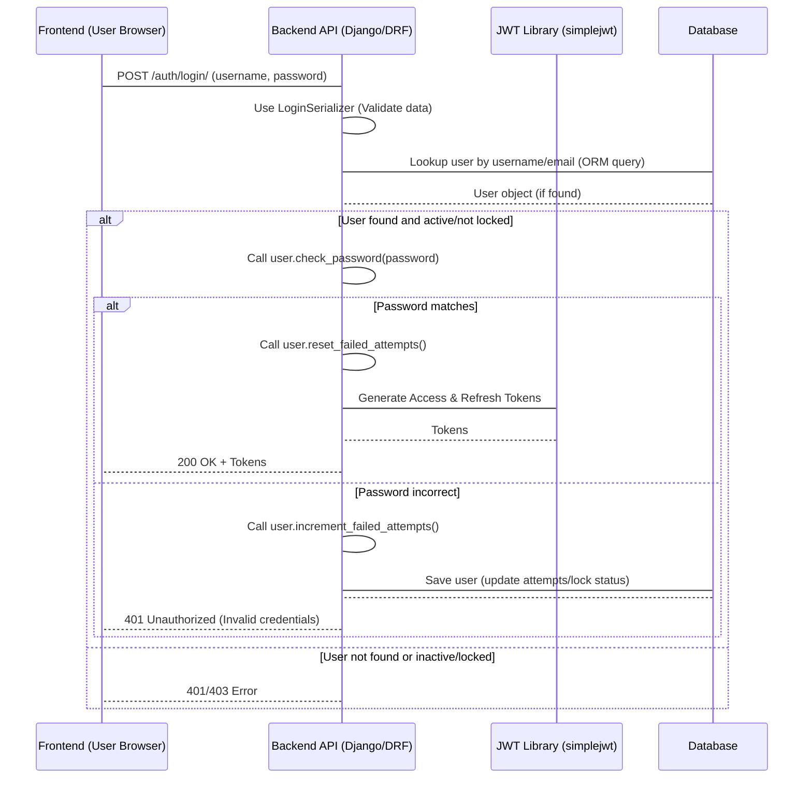

And the flow for accessing a protected endpoint after login:

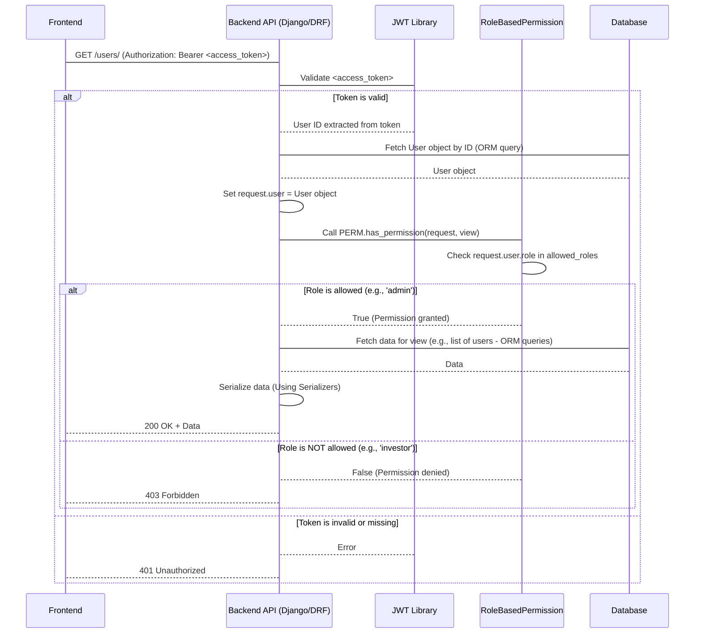

These diagrams illustrate how different parts of the system (Frontend, API views, JWT library, Custom Permission class, and Database) work together to handle secure access.

## Creating and Managing Users

Users are typically created by existing 'admin' or 'operations' users. The `RegisterView` in `pig_project/pig/user/views.py` handles this:

```python
# Inside pig_project/pig/user/views.py (Simplified)
from rest_framework.views import APIView
from rest_framework.permissions import IsAuthenticated
from pig.permissions import RoleBasedPermission
from pig.user.serializers import RegisterSerializer # Handles data for creating/updating users
# ... other imports ...

class RegisterView(APIView):
    # Only authenticated users with 'admin' or 'operations' roles can access this
    permission_classes = [IsAuthenticated, RoleBasedPermission]
    RoleBasedPermission.allowed_roles = ['admin', 'operations']

    def post(self, request):
        # Use RegisterSerializer to validate input data for a new user
        serializer = RegisterSerializer(
            data=request.data,
            context={'request': request} # Pass request to serializer for validation checks
        )
        if serializer.is_valid():
            # The serializer's create method (see user/serializers.py)
            # handles creating the user object and sending the welcome email
            user = serializer.save()
            log('User registered successfully', 'info')
            return Response(
                {'message': 'User registered successfully', 'user_id': user.id},
                status=status.HTTP_201_CREATED # 201 Created status
            )
        log(f'Registration failed: {serializer.errors}', 'error')
        return Response(serializer.errors, status=status.HTTP_400_BAD_REQUEST)

```

When a user is registered, their password is *not* set directly. Instead, the `RegisterSerializer` ([Chapter 5: Data Serializers](05_data_serializers_.md)) automatically generates a unique, time-limited token using `TimestampSigner` and sends a welcome email containing a link to a "Create Password" page.

```python
# Inside pig_project/pig/user/serializers.py (Simplified)
from rest_framework import serializers
from django.core.signing import TimestampSigner # Used for creating timed tokens
from django.conf import settings
from pig.utils import send_email_with_template, generate_reset_password_link # Utility functions

signer = TimestampSigner() # Initialize the signer

class RegisterSerializer(serializers.ModelSerializer):
    # ... field definitions ...
    social_security_number = serializers.CharField(write_only=True, required=False) # Write-only for encryption

    class Meta:
        model = User
        # ... fields list ...

    def create(self, validated_data):
        request = self.context.get('request')
        ssn = validated_data.pop('social_security_number', None) # Extract SSN before creating user
        profile_picture = validated_data.pop('profile_picture', None)

        # Create the user object (password is NOT set here)
        user = User.objects.create(
            username=validated_data['username'],
            email=validated_data['username'],
            role=validated_data['role'],
            name=validated_data['name'],
            contact_number=validated_data['contact_number'],
            is_active=True,
            created_by_id=request.user.id, # Link to the user who created this user
            # ... other field assignments ...
        )

        if profile_picture:
             user.profile_picture = profile_picture
             user.save()

        if ssn:
            user.set_ssn(ssn) # Call the model method to encrypt and store SSN
            user.save()

        # Generate password reset link and send email
        reset_password_link = generate_reset_password_link(user.username)
        template_id = settings.SENDGRID_WELCOME_TEMPLATE_ID
        dynamic_data = {"name": user.name, "link": reset_password_link}
        send_email_with_template(user.email, template_id, dynamic_data)

        return user
```

The `generate_reset_password_link` function (found in `pig_project/pig/utils.py`) uses the `TimestampSigner` to create a signed token containing the user's username. This token is then included in the link.

When the user clicks the link, they are taken to a page where they can set their password using the `CreatePasswordView` and `CreatePasswordSerializer` in `pig_project/pig/auth/views.py` and `pig_project/pig/auth/serializers.py`. This serializer first validates the token using the same `TimestampSigner` (checking the signature and expiration) via the `TokenValidationSerializer`, and then uses `user.set_password()` to securely hash and store the new password.

This flow ensures that initial passwords are not handled insecurely and forgotten passwords can be reset safely.

Other views in `pig_project/pig/user/views.py` (like `UpdateUserView`, `GetUserByIdView`, `GetUsersView`, `GetInvestorsView`) provide functionality to manage user data, always protected by the `RoleBasedPermission` to ensure only authorized roles can access them. For instance, `GetUsersView` and `GetInvestorsView` use ORM queries ([Chapter 1: Django Models (ORM)](01_django_models__orm__.md)) to fetch lists of users filtered by role and include related data like the creator (`select_related('created_by')`) or total investment amount (`annotate(total_investment=Sum('deals__invested_amount'))`).

## Conclusion

In this chapter, we explored the User Management & Authentication system. We saw how the `CustomUser` model is the core data structure, extended from Django's built-in users to include roles and security features. We learned about token-based authentication (JWT) as the method for users to prove their identity to the API after logging in. Crucially, we understood how the `RoleBasedPermission` class enforces authorization, ensuring only users with specific roles ('admin', 'operations', 'investor') can access relevant parts of the application. Finally, we touched upon account security features like login attempt tracking and the password reset flow.

Understanding how users are managed, authenticated, and authorized is fundamental to building a secure application. In the next chapter, we'll look at how the system handles data related to the companies that the platform invests in: [Portfolio Company Management](03_portfolio_company_management_.md).

[Next Chapter: Portfolio Company Management](03_portfolio_company_management_.md)


---

# Chapter 3: Portfolio Company Management

Welcome back! In [Chapter 1: Django Models (ORM)](01_django_models__orm__.md), we learned how models structure our data, and in [Chapter 2: User Management & Authentication](02_user_management___authentication_.md), we explored how users log in and what permissions they have based on their roles. Now that we know who our users are and how they are authenticated, let's dive into managing one of the core types of data in our investment platform: the **Portfolio Companies**.

## What is Portfolio Company Management?

Imagine you're running an investment fund. You invest money in various startup or growth-stage companies. You need a system to keep track of:

*   Which companies you've invested in?
*   Basic details about each company (name, type, website).
*   How much the company is currently valued at.
*   Details about the specific investment rounds you've participated in for that company (when was it, how much was the company worth then, how much did your fund invest in that specific round).

**Portfolio Company Management** is the part of our application that handles all this information. It's like maintaining a detailed, digital directory for every company you have a stake in. It allows users (specifically admins and operations staff) to add new companies, record funding rounds, update valuations, and view all this crucial data.

This abstraction focuses on two main data types, represented by Django Models we briefly touched upon in [Chapter 1](01_django_models__orm__.md):

1.  **`PortfolioCompany`**: This model stores the main details about a company in your portfolio.
2.  **`FundingRoundDetails`**: This model tracks specific investment rounds within a `PortfolioCompany`.

Let's look at these models in a bit more detail.

## Core Models for Portfolio Companies

These models are defined in the `pig_project/pig/models.py` file.

### The `PortfolioCompany` Model

This is the main blueprint for a company record.

```python
# Inside pig_project/pig/models.py (Simplified)

class PortfolioCompany(models.Model):
    id = models.UUIDField(primary_key=True, default=uuid.uuid4, editable=False)
    name = models.CharField(max_length=100) # Company's name
    detail_url = models.URLField(max_length=500) # Website or detailed info URL
    business_type = models.CharField( # Type of business (e.g., Tech, Healthcare)
        max_length=50, choices=BUSINESS_TYPE_CHOICES
    )
    status = models.CharField( # Internal status (e.g., 'publish', 'unpublish')
        max_length=10, choices=STATUS_CHOICES, default='unpublish'
    )
    current_valuation = models.DecimalField( # Most recent company valuation
        max_digits=10, decimal_places=2, null=True, blank=True
    )
    date_of_valuation = models.DateField(null=True, blank=True) # Date of that valuation
    created_by = models.ForeignKey( # Who added this company? (Link to CustomUser)
        'CustomUser', on_delete=models.SET_NULL, null=True, blank=True, related_name='portfolio_companies'
    )
    created_at = models.DateTimeField(auto_now_add=True)

    class Meta:
        db_table = "portfolio_company" # Database table name

    def __str__(self):
        return f"{self.name}" # How the object looks when printed
```

As you can see, it uses various field types ([Chapter 1: Django Models (ORM)](01_django_models__orm__.md)) like `CharField`, `URLField`, `DecimalField`, `DateField`, and a `ForeignKey` to `CustomUser` to link the company record to the user who created it.

### The `FundingRoundDetails` Model

A company can have multiple investment rounds over time (Seed, Series A, Series B, etc.). This model tracks the details for *each* specific round.

```python
# Inside pig_project/pig/models.py (Simplified)

class FundingRoundDetails(models.Model):
    id = models.UUIDField(primary_key=True, default=uuid.uuid4, editable=False)
    portfolio_company = models.ForeignKey( # Which company does this round belong to?
        'PortfolioCompany', on_delete=models.CASCADE, related_name='funding_rounds'
    )
    funding_round_stage = models.CharField(max_length=20) # e.g., 'Series A', 'Seed'
    valuation_amount = models.DecimalField( # Company valuation AT THIS ROUND
        max_digits=10, decimal_places=2, null=True, blank=True)
    valuation_date = models.DateField() # Date of THIS round's valuation
    pig_funds = models.DecimalField(max_digits=10, decimal_places=2) # Amount PIG invested in THIS round
    created_by = models.ForeignKey( # Who added this round detail? (Link to CustomUser)
        'CustomUser', on_delete=models.SET_NULL, null=True, blank=True, related_name='funding_rounds'
    )
    created_at = models.DateTimeField(auto_now_add=True)

    class Meta:
        db_table = "funding_round_detail" # Database table name

    def __str__(self):
        return f"{self.portfolio_company.name} - {self.funding_round_stage}"
```

Notice the `ForeignKey` pointing back to `PortfolioCompany`. This creates the link: one `PortfolioCompany` can have many `FundingRoundDetails`. The `related_name='funding_rounds'` allows us to easily access all funding rounds for a company using `company_object.funding_rounds.all()`.

## Use Case: Adding a New Company and Its First Funding Round

Let's walk through a common task: adding a brand new company to the portfolio along with the details of the initial investment round the fund participated in.

To do this, an 'admin' or 'operations' user would typically use an interface (like a web form) which sends data to the backend API.

The relevant API endpoint for creating a portfolio company is `/portfolio-companies/create/` and it accepts `POST` requests.

The data sent would look something like this (using JSON format):

```json
{
    "name": "Innovative Gadgets Inc.",
    "detail_url": "https://www.innovativegadgets.com",
    "business_type": "technology",
    "status": "publish",
    // current_valuation and date_of_valuation can be omitted if sending funding rounds
    "funding_rounds": [
        {
            "funding_round_stage": "Seed",
            "valuation_amount": 5000000.00,
            "valuation_date": "2023-07-15",
            "pig_funds": 500000.00
        }
    ]
}
```

This single request includes data for both the `PortfolioCompany` (name, URL, type, status) and its first `FundingRoundDetails` (stage, valuation at that time, date, funds invested).

## How it Works: Creating a Portfolio Company

When the backend receives the `POST` request with the company and funding round data, here's a simplified look at the process:

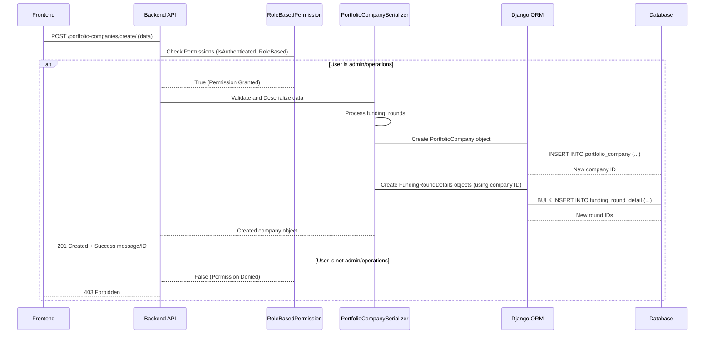

Let's break down the key components involved:

### 1. The API View (`CreatePortfolioCompanyView`)

This view (`pig_project/pig/portfolio_company/views.py`) is the entry point for the API request.

```python
# Inside pig_project/pig/portfolio_company/views.py (Simplified)

from rest_framework import status
from rest_framework.response import Response
from rest_framework.views import APIView
from rest_framework.permissions import IsAuthenticated
from pig.portfolio_company.serializers import PortfolioCompanySerializer # We'll use this next
from pig.permissions import RoleBasedPermission # Used in Chapter 2

class CreatePortfolioCompanyView(APIView):
    # Permissions: Must be authenticated AND have 'admin' or 'operations' role
    permission_classes = [IsAuthenticated, RoleBasedPermission]
    RoleBasedPermission.allowed_roles = ['admin', 'operations']

    def post(self, request):
        # Pass the received data to the serializer for validation and creation
        serializer = PortfolioCompanySerializer(
            data=request.data, # The data from the frontend
            context={'request': request} # Pass the request context (needed for created_by)
        )
        # Check if the data is valid according to the serializer rules
        if serializer.is_valid():
            # If valid, save the data (this calls the serializer's create method)
            portfolio_company = serializer.save()
            # Return a success response
            return Response({
                "message": "Portfolio company created successfully",
                "id": portfolio_company.id,
            }, status=status.HTTP_201_CREATED) # Use 201 for creation success
        # If data is NOT valid, return error details
        return Response(serializer.errors, status=status.HTTP_400_BAD_REQUEST)
```

*   The `permission_classes` ensure that only authorized users can even attempt to create a company ([Chapter 2: User Management & Authentication](02_user_management___authentication_.md)).
*   The `post` method receives the request data.
*   It hands the data over to the `PortfolioCompanySerializer` ([Chapter 5: Data Serializers](05_data_serializers_.md)) for validation and processing.
*   If the serializer says the data is good (`is_valid()`), it calls `serializer.save()`, which triggers the actual database creation.
*   Finally, it returns a success or error response.

### 2. The Serializer (`PortfolioCompanySerializer`)

This serializer (`pig_project/pig/portfolio_company/serializers.py`) is responsible for converting the incoming JSON data into Python objects that match our models, validating the data, and then telling the ORM to save it.

```python
# Inside pig_project/pig/portfolio_company/serializers.py (Simplified)

from rest_framework import serializers
from pig.models import PortfolioCompany, FundingRoundDetails

# Serializer for the nested Funding Round data
class FundingRoundDetailsSerializer(serializers.ModelSerializer):
    class Meta:
        model = FundingRoundDetails
        fields = [ # Define which fields are expected in the input/output
            'funding_round_stage', 'valuation_amount', 'valuation_date', 'pig_funds',
        ]

# Main serializer for the Portfolio Company, includes nested funding rounds
class PortfolioCompanySerializer(serializers.ModelSerializer):
    # Define 'funding_rounds' field using the nested serializer
    # many=True indicates it's a list of funding rounds
    funding_rounds = FundingRoundDetailsSerializer(many=True)

    class Meta:
        model = PortfolioCompany
        fields = [ # Define which fields are expected for the company itself
            'name', 'detail_url', 'business_type', 'status',
            'current_valuation', 'date_of_valuation',
            'funding_rounds', # Include the nested field
        ]

    # This method is automatically called by serializer.save() when creating
    def create(self, validated_data):
        # 1. Separate funding round data from company data
        #    .pop() removes funding_rounds from validated_data but gives us the list
        funding_rounds_data = validated_data.pop('funding_rounds', [])
        request_user = self.context['request'].user # Get the logged-in user

        # 2. Create the PortfolioCompany object using ORM
        #    **validated_data unpacks the dictionary into arguments
        portfolio_company = PortfolioCompany.objects.create(
            **validated_data,
            created_by=request_user # Set the creator based on the logged-in user
        )

        # 3. Prepare FundingRoundDetails objects
        funding_rounds_to_create = [
            FundingRoundDetails(
                portfolio_company=portfolio_company, # Link to the company we just created
                created_by=request_user, # Set the creator
                **funding_round_data # Unpack funding round specific data
            )
            for funding_round_data in funding_rounds_data
        ]

        # 4. Create FundingRoundDetails objects in bulk using ORM
        #    bulk_create is efficient for adding multiple objects at once
        if funding_rounds_to_create:
             FundingRoundDetails.objects.bulk_create(funding_rounds_to_create)

        # 5. Handle setting initial current_valuation if not provided
        #    (Logic omitted for brevity, but it finds the latest round's valuation)
        # ... (logic to find latest valuation in funding_rounds_to_create) ...
        # if latest_valuation_found:
        #     portfolio_company.current_valuation = latest_valuation
        #     portfolio_company.date_of_valuation = latest_date
        #     portfolio_company.save() # Save the company again with the valuation

        return portfolio_company # Return the created company object
```

*   This serializer defines how the `PortfolioCompany` data, *including* the nested `funding_rounds` list, should look.
*   The `create` method is crucial. It's where the ORM calls happen.
*   It first creates the main `PortfolioCompany` object using `PortfolioCompany.objects.create()`.
*   Then, it iterates through the list of funding round dictionaries, creates `FundingRoundDetails` objects in memory, and uses `FundingRoundDetails.objects.bulk_create()` to efficiently save them all to the database, linked back to the newly created company.
*   It also includes logic to automatically set the company's `current_valuation` and `date_of_valuation` based on the funding rounds provided in the request if the user didn't explicitly set `current_valuation` in the main company data.

This flow demonstrates how Serializers and ORM work together to handle complex data structures like a company with multiple related funding rounds.

## Viewing Portfolio Companies

Admins and operations staff also need to view the list of portfolio companies and their details.

*   **Get List:** The `/portfolio-companies/` endpoint (GET request to `GetPortfolioCompaniesView` in `pig_project/pig/portfolio_company/views.py`) is used to fetch a paginated list of companies.

    ```python
    # Inside pig_project/pig/portfolio_company/views.py (Simplified)

    from rest_framework.views import APIView
    from rest_framework.response import Response
    from django.db.models import Sum # Used for calculations
    from pig.permissions import RoleBasedPermission
    from pig.models import PortfolioCompany

    class GetPortfolioCompaniesView(APIView):
        permission_classes = [RoleBasedPermission] # Only roles listed in allowed_roles
        RoleBasedPermission.allowed_roles = ['admin', 'operations'] # Allowed roles

        def get(self, request):
            # Get pagination parameters from request query (e.g., ?limit=10&offset=0)
            limit = int(request.query_params.get('limit', 10))
            offset = int(request.query_params.get('offset', 0))

            # Use ORM to query companies:
            # .annotate(invested_value=Sum('funding_rounds__pig_funds')) calculates total PIG investment per company
            # .select_related('created_by') efficiently fetches creator details
            # .order_by('-created_at') sorts by creation date
            # [offset:offset + limit] applies pagination (slicing)
            portfolio_companies = (
                PortfolioCompany.objects
                .annotate(invested_value=Sum('funding_rounds__pig_funds', default=0))
                .select_related('created_by')
                .order_by('-created_at')[offset:offset + limit]
            )

            # Prepare data for the response (converting ORM objects to dictionary list)
            items = [
                {
                    "id": company.id,
                    "portfolio_company": company.name,
                    "invested_value": company.invested_value or 0,
                    "created_date": company.created_at.strftime('%m/%d/%Y'),
                    "created_by": (company.created_by.name if company.created_by else None),
                    "status": company.status,
                }
                for company in portfolio_companies
            ]

            # Get total count for pagination info
            total_count = PortfolioCompany.objects.count()

            response_data = {
                "items": items,
                "pagination": {
                    "total_count": total_count,
                    "offset": offset,
                    "limit": limit,
                    "has_more": offset + limit < total_count
                }
            }
            return Response(response_data, status=status.HTTP_200_OK)
    ```

    This view uses powerful ORM features like `annotate` (to perform calculations like summing investment across related funding rounds and deals) and `select_related` (to fetch related user data efficiently) ([Chapter 1: Django Models (ORM)](01_django_models__orm__.md)).

*   **Get Single:** The `/portfolio-companies/{company_id}/` endpoint (GET request to `GetPortfolioCompanyByIdView`) fetches details for a specific company, including all its associated funding rounds.

    ```python
    # Inside pig_project/pig/portfolio_company/views.py (Simplified)

    from rest_framework.views import APIView
    from rest_framework.response import Response
    from rest_framework import status
    from pig.permissions import RoleBasedPermission
    from pig.models import PortfolioCompany, FundingRoundDetails # Need both models

    class GetPortfolioCompanyByIdView(APIView):
        permission_classes = [RoleBasedPermission]
        RoleBasedPermission.allowed_roles = ['admin', 'operations']

        def get(self, request, company_id): # company_id comes from the URL
            try:
                # Fetch the company using ORM, also select related creator
                portfolio_company = PortfolioCompany.objects.select_related(
                    'created_by'
                ).get(id=company_id) # .get() raises DoesNotExist if not found

                # Fetch all funding rounds related to this company
                funding_rounds = list(
                    FundingRoundDetails.objects.filter(
                        portfolio_company=portfolio_company
                    ).values(
                        "id", "funding_round_stage", "valuation_amount",
                        "valuation_date", "pig_funds",
                    )
                )
                # Format date fields for the response
                for round_data in funding_rounds:
                    if round_data["valuation_date"]:
                        round_data["valuation_date"] = round_data["valuation_date"].strftime('%m/%d/%Y')

                # Build the response dictionary
                response_data = {
                    "id": portfolio_company.id,
                    "name": portfolio_company.name,
                    "detail_url": portfolio_company.detail_url,
                    "business_type": portfolio_company.business_type,
                    "status": portfolio_company.status,
                    "current_valuation": portfolio_company.current_valuation,
                    "date_of_valuation": (
                        portfolio_company.date_of_valuation.strftime('%m/%d/%Y')
                        if portfolio_company.date_of_valuation else None
                    ),
                    "funding_rounds": funding_rounds, # Include the list of rounds
                }
                return Response(response_data, status=status.HTTP_200_OK)

            except PortfolioCompany.DoesNotExist:
                # If .get() didn't find the company, return 404
                return Response({"error": "Portfolio company not found"},
                                status=status.HTTP_404_NOT_FOUND)
    ```

    This view demonstrates fetching related objects (`FundingRoundDetails`) for a single main object (`PortfolioCompany`). It uses `.get()` to find the specific company and `.filter()` to get its related funding rounds ([Chapter 1: Django Models (ORM)](01_django_models__orm__.md)).

## Updating Portfolio Companies and Notifications

Keeping company information up-to-date is important. The `/portfolio-companies/{company_id}/` endpoint also handles `PUT` requests via the `UpdatePortfolioCompanyView`. This view allows updating basic company fields and also adding/updating individual funding rounds.

One important feature here is the **valuation change notification**. If the `current_valuation` field of a `PortfolioCompany` is updated, the system automatically sends an email notification to all investors who have a `Deal` associated with that company.

How does this work?

1.  The `UpdatePortfolioCompanyView` (`pig_project/pig/portfolio_company/views.py`) handles the `PUT` request.
2.  Before saving the updated data, it retrieves the existing `PortfolioCompany` object from the database using its `id`.
3.  It then applies the updates from the request data to the fetched object's fields.
4.  It saves the updated `PortfolioCompany` object.
5.  Crucially, *after* saving, it compares the `current_valuation` value *before* the update with the `current_valuation` value *after* the update.
6.  If the values are different, it calls a separate function, `send_valuation_change_email`, passing the company object, the old valuation, and the new valuation.

Here's a simplified look at the update logic and notification trigger:

```python
# Inside pig_project/pig/portfolio_company/views.py (Simplified PUT method)

class UpdatePortfolioCompanyView(APIView):
    permission_classes = [RoleBasedPermission]
    RoleBasedPermission.allowed_roles = ['admin', 'operations']

    def put(self, request, company_id):
        try:
            # 1. Get the existing company object
            portfolio_company = PortfolioCompany.objects.get(id=company_id)
            # Store the old valuation before updating
            old_valuation = portfolio_company.current_valuation

            # 2. Update company fields (excluding nested funding rounds)
            #    (Logic omitted for brevity, but it loops through request.data and sets attributes)
            # Example: portfolio_company.name = request.data.get('name', portfolio_company.name)
            # portfolio_company.save()

            # 3. Handle nested funding rounds (add new, potentially update existing)
            #    (This involves complex logic using FundingRoundDetailsSerializer)
            #    (Logic omitted, but it processes request.data['funding_rounds'])

            # 4. After all updates and saves, get the NEW valuation
            portfolio_company.refresh_from_db() # Get the latest values from the DB
            new_valuation = portfolio_company.current_valuation

            # 5. Compare old and new valuation and trigger email if changed
            if old_valuation != new_valuation:
                # Call the notification function
                send_valuation_change_email(
                    portfolio_company, old_valuation, new_valuation
                )

            # 6. Return success response
            return Response(
                {"message": "Portfolio company updated successfully"},
                status=status.HTTP_200_OK
            )

        except PortfolioCompany.DoesNotExist:
            return Response({"error": "Portfolio company not found"}, status=status.HTTP_404_NOT_FOUND)
        except Exception as e:
             # Handle other potential errors during update
             return Response({"error": str(e)}, status=status.HTTP_500_INTERNAL_SERVER_ERROR)
```

### The Notification Function (`send_valuation_change_email`)

This function (`pig_project/pig/portfolio_company/portfolio_updates.py`) is responsible for finding the relevant investors and sending the email.

```python
# Inside pig_project/pig/portfolio_company/portfolio_updates.py (Simplified)

from django.conf import settings
from pig.utils import log, send_email_with_template # Utility functions from Chapter 7
from pig.models import Deal # Need the Deal model to find investors

def send_valuation_change_email(
        portfolio_company, old_valuation, new_valuation):
    """
    Sends an email notification to all investors when the current valuation changes.
    """
    try:
        # 1. Find all Deals related to this portfolio_company
        #    .select_related('investor') efficiently fetches investor details for each deal
        deals = Deal.objects.filter(
            portfolio_company=portfolio_company).select_related('investor')

        # 2. Collect unique investors and their total invested amount in this company
        investor_data = {}
        for deal in deals:
            investor_email = deal.investor.email
            if investor_email not in investor_data:
                investor_data[investor_email] = {
                    "name": deal.investor.name,
                    "invested_value": 0
                }
            # Sum up the invested amount from all deals for this investor in this company
            investor_data[investor_email]["invested_value"] += deal.invested_amount

        # 3. Send an email to each unique investor
        template_id = settings.SENDGRID_PORTFOLIO_UPDATE_TEMPLATE_ID # Email template ID
        for investor_email, data in investor_data.items():
            # Prepare dynamic data for the email template
            dynamic_data = {
                "name": data["name"],
                "invested_value": f"${data['invested_value']:,.2f}", # Format currency
                "current_value": f"${new_valuation:,.2f}" if new_valuation is not None else "N/A",
                "updated_companies": [portfolio_company.name],
                "link": f"{settings.REACT_ORIGIN_URL}/dashboard" # Link to their dashboard
            }
            # Use the utility function to send the email
            send_email_with_template(investor_email, template_id, dynamic_data)
            log(f"Valuation change email sent to {data['name']} for '{portfolio_company.name}'")

    except Exception as e:
        # Log any errors that occur during the process
        log(f"Error sending valuation change email for '{portfolio_company.name}': {str(e)}", "error")

```

This function uses the `Deal` model and ORM queries to find which `CustomUser` objects (investors) are linked to the updated `PortfolioCompany` through deals. It then aggregates the data and uses utility functions ([Chapter 7: Utility Services & Helpers](07_utility_services___helpers_.md)) to send personalized emails based on a template.

## Conclusion

In this chapter, we focused on the Portfolio Company Management abstraction. We learned about the key models, `PortfolioCompany` and `FundingRoundDetails`, and how they are related using a `ForeignKey`. We explored how API views and serializers work together to allow authorized users to create, retrieve, and update company information, including managing nested funding rounds. Finally, we saw how updates to a company's valuation can trigger automatic email notifications to relevant investors, leveraging ORM relationships to find the right recipients and utility functions to handle the email sending.

Understanding how companies and their funding history are managed provides a crucial piece of the platform's data structure. In the next chapter, we will look at how the system tracks individual investments made by investors in these companies: [Deal Lifecycle Management](04_deal_lifecycle_management_.md).

[Next Chapter: Deal Lifecycle Management](04_deal_lifecycle_management_.md)


---

# Chapter 4: Deal Lifecycle Management

Welcome back! In the previous chapters, we've built up fundamental parts of our investment platform. In [Chapter 1: Django Models (ORM)](01_django_models__orm__.md), we learned how models like `CustomUser` and `PortfolioCompany` define our data structure. In [Chapter 2: User Management & Authentication](02_user_management___authentication_.md), we saw how users log in and are granted permissions. And in [Chapter 3: Portfolio Company Management](03_portfolio_company_management_.md), we covered how to manage the companies we might invest in.

Now, it's time to bring investors and companies together and track the most important thing: the **investment deals** themselves!

## What is Deal Lifecycle Management?

Imagine the journey of a single investment:

1.  An investor decides to invest a specific amount in a particular portfolio company during a certain funding round.
2.  There needs to be a legal agreement (like a contract) outlining the terms of this investment.
3.  This agreement needs to be signed by both parties (the investor and the fund).
4.  The investment is recorded, tracked, and potentially updated over time until the investment is exited or completed.

**Deal Lifecycle Management** is the system that handles this entire process in our application. It's like managing a pipeline of contracts, taking each potential investment from its initial idea, through the legal paperwork, to its final status.

It involves:

*   Recording the details of the investment (who, what company, how much, when).
*   Handling the legal agreement associated with the deal.
*   Tracking the status of the agreement (generated, sent for signing, signed).
*   Managing the overall status of the deal itself (active, closed).

This process relies heavily on two core models we introduced in [Chapter 1](01_django_models__orm__.md): `Deal` and `Agreement`.

## Core Models for Deals and Agreements

These models are the blueprints for storing all the necessary information about each investment deal and its related legal documents. They are defined in `pig_project/pig/models.py`.

### The `Deal` Model

This model represents a single investment transaction by a specific investor in a specific portfolio company during a particular funding round.

```python
# Inside pig_project/pig/models.py (Simplified Deal model)

class Deal(models.Model):
    id = models.UUIDField(primary_key=True, default=uuid.uuid4, editable=False)
    investor = models.ForeignKey(
        'CustomUser', on_delete=models.CASCADE, related_name='deals') # Link to the investing user
    portfolio_company = models.ForeignKey(
        'PortfolioCompany', on_delete=models.CASCADE, related_name='deals') # Link to the company
    funding_round = models.ForeignKey(
        'FundingRoundDetails', on_delete=models.CASCADE, related_name='deals') # Link to the specific round
    invested_amount = models.DecimalField(
        max_digits=15, decimal_places=2, validators=[MinValueValidator(0)]) # Amount invested
    management_fee = models.DecimalField(max_digits=15, decimal_places=2) # Associated fee
    # Links to bank details (Many-to-Many, can be multiple)
    bank_transfer_details = models.ManyToManyField(
        'BankTransferDetails', related_name='deals', blank=True)
    # Text fields for bank details if not using linked BankTransferDetails objects
    bank_transfer_details_funds = models.CharField(max_length=255, blank=True, null=True)
    bank_transfer_details_fees = models.CharField(max_length=255, blank=True, null=True)
    exit_valuation = models.DecimalField( # Valuation at deal closure (optional)
        max_digits=15, decimal_places=2, null=True, blank=True)
    deal_execution_date = models.DateField() # Date deal was agreed
    effective_date = models.DateField() # Date investment becomes effective
    status = models.CharField( # Current status (e.g., 'active', 'closed')
        max_length=10, choices=DEAL_STATUS_CHOICES, default='active')
    deal_code = models.CharField(max_length=20, unique=True, editable=False) # Auto-generated code
    created_by = models.ForeignKey( # Who created this deal record?
        'CustomUser', on_delete=models.SET_NULL, null=True, related_name='created_deals')
    created_at = models.DateTimeField(auto_now_add=True)
    updated_at = models.DateTimeField(auto_now=True)

    class Meta:
        db_table = "deals" # Database table name

    def save(self, *args, **kwargs):
        """Generate deal code before saving"""
        # This method automatically generates a unique 'deal_code'
        # like "PIG/DC/MMYYYY/######" when a new deal is created.
        # Code omitted for brevity, but it ensures uniqueness.
        if not self.deal_code:
            # ... generate unique code ...
            self.deal_code = "GENERATED_CODE" # Placeholder
        super().save(*args, **kwargs) # Call the original save method

    def __str__(self):
        return f"Deal {self.deal_code}" # How the object looks when printed
```

Key points about the `Deal` model:
*   It connects to `CustomUser` (the investor), `PortfolioCompany`, and `FundingRoundDetails` using `ForeignKey` relationships.
*   It stores financial details (`invested_amount`, `management_fee`).
*   It can link to `BankTransferDetails` using a `ManyToManyField` if pre-defined bank accounts are used, or store details directly in text fields.
*   It tracks important dates and its current `status`.
*   The `save` method automatically creates a unique `deal_code` for easy identification.

### The `Agreement` Model

Each `Deal` requires one or more legal agreements. This model tracks the details of these documents.

```python
# Inside pig_project/pig/models.py (Simplified Agreement model)

class Agreement(models.Model):
    id = models.UUIDField(primary_key=True, default=uuid.uuid4, editable=False)
    deal = models.ForeignKey(
        'Deal', on_delete=models.CASCADE, related_name='agreements') # Link back to the Deal
    agreement_type = models.CharField( # 'digital' (DocuSign) or 'offline'
        max_length=20, choices=AGREEMENT_TYPE_CHOICES)
    agreement_file = models.CharField( # S3 path to the generated/uploaded agreement file
        max_length=255, blank=True, null=True)
    signed_agreement_file = models.CharField( # S3 path to the final signed file
        max_length=255, blank=True, null=True)
    envelope_id = models.UUIDField( # DocuSign Envelope ID (for digital agreements)
        null=True, blank=True)
    is_signed = models.BooleanField(default=False) # Is the agreement signed?
    signed_by = models.ForeignKey( # Who signed it? (Link to CustomUser)
        'CustomUser', on_delete=models.SET_NULL, null=True, blank=True, related_name='signed_agreements')
    signed_at = models.DateTimeField(null=True, blank=True) # When was it signed?
    signed_ip = models.GenericIPAddressField(null=True, blank=True) # IP address used for signing
    docusign_status = models.CharField( # DocuSign specific status (e.g., 'sent', 'delivered', 'completed')
        max_length=20, choices=DOCUSIGN_STATUS_CHOICES, null=True, blank=True)
    created_at = models.DateTimeField(auto_now_add=True)
    updated_at = models.DateTimeField(auto_now=True)

    class Meta:
        db_table = "agreements" # Database table name

    def __str__(self):
        return f"Agreement ID: {self.id} for Deal: {self.deal.deal_code}"
```

Key points about the `Agreement` model:
*   It has a `ForeignKey` back to the `Deal` it belongs to. One `Deal` can have multiple `Agreement` objects (e.g., different document types, though often there's just one main agreement).
*   It tracks the `agreement_type` ('digital' or 'offline').
*   It stores links (`S3` paths) to the unsigned and signed files.
*   For digital agreements, it stores the `envelope_id` from DocuSign and tracks its status.
*   It records signing details (`is_signed`, `signed_by`, `signed_at`, `signed_ip`).

## Use Case Walkthrough: Creating a New Deal

The most common operation is creating a new deal when an investor commits to an investment. This is typically done by an 'admin' or 'operations' user.

This involves sending data to the backend API, specifically the `/deals/create/` endpoint using a `POST` request. The data includes details for the `Deal` and specifies the type of `Agreement` needed (digital or offline).

Here's a simplified example of the JSON data sent:

```json
{
    "investor": "a1b2c3d4-...", // UUID of the investor user
    "portfolio_company": "e5f6g7h8-...", // UUID of the portfolio company
    "funding_round": "i9j1k2l3-...", // UUID of the funding round details
    "invested_amount": 100000.00,
    "management_fee": 2000.00,
    "deal_execution_date": "2024-01-15",
    "effective_date": "2024-02-01",
    "status": "active",
    "agreement_type": "digital", // or "offline"
    // bank_transfer_details_funds/fees or bank_transfer_details IDs can also be included
}
```

## How it Works: Creating a Deal

When the backend receives this `POST` request, here's a simplified step-by-step flow:

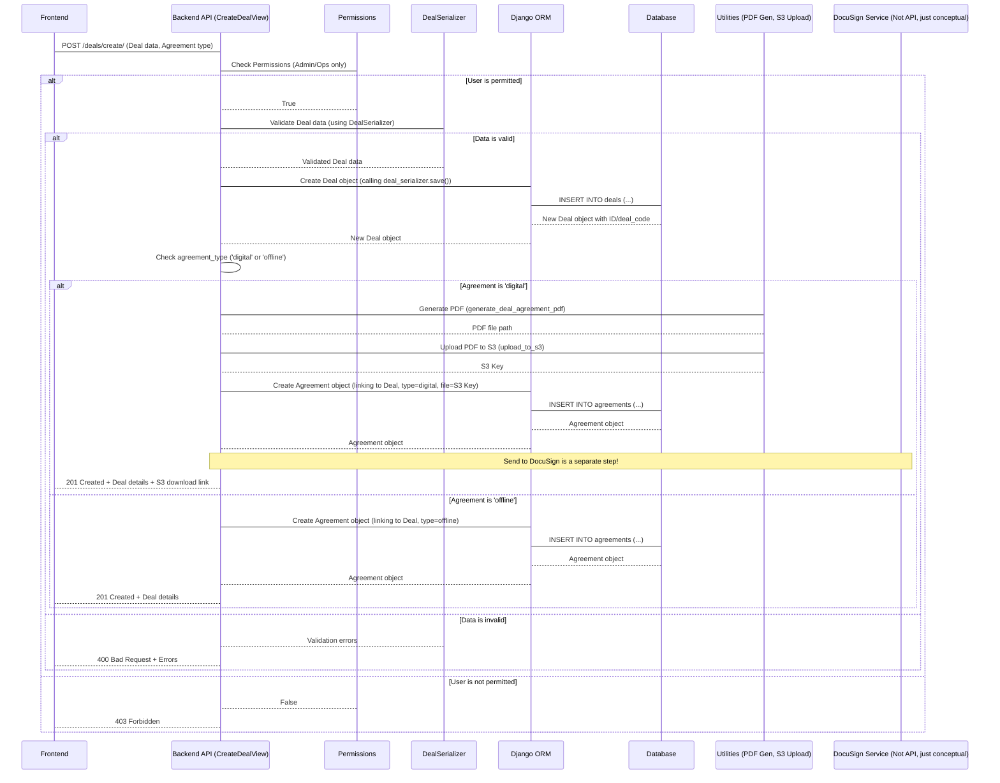

Let's look at the key code pieces involved in the `CreateDealView` (`pig_project/pig/deals/views.py`).

### 1. The API View (`CreateDealView`)

This view handles the incoming request, validates the data, and orchestrates the creation of the `Deal` and `Agreement` objects.

```python
# Inside pig_project/pig/deals/views.py (Simplified CreateDealView)

from rest_framework import status
from rest_framework.response import Response
from rest_framework.views import APIView
from rest_framework.permissions import IsAuthenticated
from pig.permissions import RoleBasedPermission # From Chapter 2
from pig.deals.serializers import DealSerializer, AgreementSerializer # From Chapter 5
from pig.models import Deal, Agreement
from pig.utils import (
    log, # From Chapter 7
    generate_deal_agreement_pdf, # From Chapter 7
    upload_to_s3, # From Chapter 7
    generate_presigned_url, # From Chapter 7
    remove_local_file # From Chapter 7
)
# DocuSign service (covered later)
from pig.deals.docusign import send_agreement_for_signing

class CreateDealView(APIView):
    # Only authenticated users with 'admin' or 'operations' roles can create deals
    permission_classes = [IsAuthenticated, RoleBasedPermission]
    RoleBasedPermission.allowed_roles = ['admin', 'operations']

    def post(self, request):
        # Extract agreement type from request data
        agreement_type = request.data.get("agreement_type", "digital").lower()
        if agreement_type not in ["digital", "offline"]:
             return Response(
                 {"error": "Invalid agreement type."},
                 status=status.HTTP_400_BAD_REQUEST,
             )

        # Extract data for the Deal model
        deal_data = {
            "investor": request.data.get("investor"),
            "portfolio_company": request.data.get("portfolio_company"),
            "funding_round": request.data.get("funding_round"),
            "invested_amount": request.data.get("invested_amount"),
            "management_fee": request.data.get("management_fee"),
            "deal_execution_date": request.data.get("deal_execution_date"),
            "effective_date": request.data.get("effective_date"),
            "status": "active", # Deals start as 'active'
            # ... include bank transfer details fields if present ...
        }

        # Validate Deal data using the serializer
        deal_serializer = DealSerializer(data=deal_data)
        if deal_serializer.is_valid():
            # If valid, create the Deal object
            # created_by is set based on the logged-in user
            deal = deal_serializer.save(created_by=request.user)

            # Handle agreement creation based on type
            if agreement_type == "digital":
                # Call helper method for digital
                return self.handle_digital_agreement(deal, request)
            if agreement_type == "offline":
                # Call helper method for offline
                return self.handle_offline_agreement(deal)

        # If Deal data is invalid, return errors
        log(f"Deal creation failed: {deal_serializer.errors}", "error") # From Chapter 7
        return Response(
            {"errors": deal_serializer.errors, "status": "error"},
            status=status.HTTP_400_BAD_REQUEST,
        )

    # Helper methods for handling different agreement types (shown below)
    def handle_digital_agreement(self, deal, request):
        # ... logic for digital agreement ...
        pass # Simplified

    def handle_offline_agreement(self, deal):
        # ... logic for offline agreement ...
        pass # Simplified
```

*   The view first checks permissions ([Chapter 2](02_user_management___authentication_.md)).
*   It extracts the core `deal_data` and the requested `agreement_type`.
*   It uses the `DealSerializer` ([Chapter 5](05_data_serializers_.md)) to validate the `deal_data`.
*   If valid, `deal_serializer.save(created_by=request.user)` is called. This triggers the `create` method in `DealSerializer` which creates the `Deal` object in the database using the ORM ([Chapter 1](01_django_models__orm__.md)).
*   Based on the `agreement_type`, it calls one of two helper methods.

### 2. Serializer `create` Method (`DealSerializer`)

When `deal_serializer.save()` is called in the view, the `create` method in the `DealSerializer` (`pig_project/pig/deals/serializers.py`) is executed.

```python
# Inside pig_project/pig/deals/serializers.py (Simplified create method)

from rest_framework import serializers
from pig.models import Deal # Need the Deal model

class DealSerializer(serializers.ModelSerializer):
    # ... field definitions ...

    class Meta:
        model = Deal
        fields = [ # List of fields the serializer handles
            'investor', 'portfolio_company', 'funding_round',
            'invested_amount', 'management_fee',
            # ... other deal fields ...
        ]

    # This method is called by serializer.save() when creating a new object
    def create(self, validated_data):
        # Extract ManyToMany fields or other special data first
        bank_transfer_details = validated_data.pop(
            'bank_transfer_details', None) # Remove from validated_data

        # Create the Deal object using ORM
        # **validated_data unpacks the remaining dictionary into arguments
        deal = Deal.objects.create(**validated_data) # ORM call to save to DB

        # Handle ManyToMany relationship if data was provided
        if bank_transfer_details:
            # .set() is an ORM method to link M2M objects
            deal.bank_transfer_details.set(bank_transfer_details)

        return deal # Return the created Deal object
```

This simplified `create` method shows how the serializer uses `Deal.objects.create(**validated_data)` (an ORM method) to save the validated data as a new row in the `deals` database table. If `bank_transfer_details` were included in the request, it links those existing `BankTransferDetails` objects to the new `Deal` object using the `deal.bank_transfer_details.set()` ORM method.

### 3. Handling Digital Agreements (`handle_digital_agreement` helper)

Back in `CreateDealView`, if `agreement_type` is 'digital', this method is called:

```python
# Inside pig_project/pig/deals/views.py (Simplified handle_digital_agreement)

    def handle_digital_agreement(self, deal, _): # '_' indicates unused request parameter
        """
        Handles the creation of a digital agreement.
        Generates PDF, uploads to S3, creates Agreement model entry.
        """
        # 1. Generate the PDF file for the agreement using deal data
        pdf_path = generate_deal_agreement_pdf(deal) # Utility function (Chapter 7)

        if pdf_path:
            try:
                # 2. Upload the generated PDF to AWS S3
                s3_key = f"digital_agreements/{deal.id}.pdf"
                upload_success = upload_to_s3(pdf_path, s3_key) # Utility function (Chapter 7)

                if upload_success:
                    # 3. Create an Agreement object in the database
                    agreement_data = {
                        "deal": deal.id, # Link to the newly created deal
                        "agreement_type": "digital",
                        "agreement_file": s3_key, # Store the S3 path
                        "is_signed": False, # Not signed yet
                        # docusign_status and envelope_id are added later when sent/signed
                    }
                    agreement_serializer = AgreementSerializer( # Use AgreementSerializer
                        data=agreement_data)

                    if agreement_serializer.is_valid():
                        # Save the Agreement object using ORM via serializer
                        agreement_serializer.save() # ORM INSERT into agreements table

                        # 4. Generate a temporary download link for the unsignd PDF
                        presigned_url = generate_presigned_url(s3_key) # Utility function (Chapter 7)

                        log(f"Digital agreement created for deal '{deal.deal_code}'.") # Chapter 7
                        return Response(
                            {
                                "message": "Deal created successfully with digital agreement.",
                                "id": deal.id,
                                "deal_code": deal.deal_code,
                                "download_url": presigned_url, # Link to download unsigned PDF
                            },
                            status=status.HTTP_201_CREATED,
                        )
                    # Handle Agreement serializer validation errors
                    log(f"Agreement creation failed: {agreement_serializer.errors}", "error") # Chapter 7
                    # ... return 400 error ...
            finally:
                # Always remove the local PDF file after processing
                remove_local_file(pdf_path) # Utility function (Chapter 7)

        # Handle failure in PDF generation or S3 upload
        return Response(
            {"error": "Failed to create digital agreement."},
            status=status.HTTP_500_INTERNAL_SERVER_ERROR,
        )
```

This method uses utility functions ([Chapter 7](07_utility_services___helpers_.md)) to:
1.  Generate a PDF file based on the deal data.
2.  Upload that PDF to AWS S3 for storage.
3.  Create an `Agreement` object in the database using the `AgreementSerializer` ([Chapter 5](05_data_serializers_.md)), linking it to the deal and storing the S3 file path.
4.  Generate a temporary, secure download link (a presigned URL) for the user to view the unsigned agreement.

Note that sending the agreement for *signing* via DocuSign is handled as a separate step later in the lifecycle.

### 4. Handling Offline Agreements (`handle_offline_agreement` helper)

If `agreement_type` is 'offline', this much simpler method is called:

```python
# Inside pig_project/pig/deals/views.py (Simplified handle_offline_agreement)

    def handle_offline_agreement(self, deal):
        """
        Handles the creation of an offline agreement entry in the database.
        No file is generated or uploaded initially.
        """
        # Simply create an Agreement object linked to the deal
        # No agreement_file is set initially, it will be uploaded later manually
        Agreement.objects.create( # Direct ORM call
            deal=deal,
            agreement_type="offline",
            is_signed=False, # Not signed yet
        )
        log(f"Deal '{deal.deal_code}' created successfully with offline agreement.") # Chapter 7
        return Response(
            {
                "message": "Deal created successfully with offline agreement.",
                "id": deal.id,
                "deal_code": deal.deal_code,
            },
            status=status.HTTP_201_CREATED,
        )
```

For offline agreements, the system just creates a placeholder `Agreement` object linked to the deal. The actual signed file will be uploaded manually by an admin/operations user later.

This completes the creation step of the deal lifecycle, handling both digital and offline agreement paths from the start.

## Advancing Through the Lifecycle

Once a deal is created, it goes through different stages. The backend provides API endpoints to manage these stages:

1.  **Viewing Deals:** `GET /deals/` (listing all deals) and `GET /deals/{deal_id}/` (getting details for a specific deal).
    *   These views (`GetDealsView`, `GetDealByIdView` in `pig_project/pig/deals/views.py`) use ORM methods like `filter`, `select_related` (to fetch related `investor`, `portfolio_company`, `funding_round` data efficiently), and `prefetch_related` (to fetch all associated `agreements` for each deal) ([Chapter 1](01_django_models__orm__.md)). They are protected by `RoleBasedPermission` for 'admin'/'operations' users ([Chapter 2](02_user_management___authentication_.md)).

2.  **Updating Deal Details:** `PUT /deals/{deal_id}/` (`UpdateDealView`).
    *   Allows admins/operations to modify deal fields (amount, dates, etc.) or agreement status.
    *   Important constraint: The `UpdateDealView` prevents updating a deal if *any* of its associated `Agreement` objects have `is_signed=True`. This prevents changes to deals after the legal document is finalized.

3.  **Managing the Agreement Signing:** This is where the digital and offline paths diverge.

    *   **Digital Signing (DocuSign):**
        *   `POST /deals/{deal_id}/send-agreement/` (`SendAgreementForSigningView`). An admin/operations user triggers this endpoint.
            *   It retrieves the `Agreement` object linked to the deal.
            *   It fetches the *unsigned* PDF from S3 using a utility function ([Chapter 7](07_utility_services___helpers_.md)).
            *   It uses a dedicated DocuSign service function (`send_agreement_for_signing` in `pig_project/pig/deals/docusign.py`) to send the PDF via the DocuSign API to the investor (recipient).
            *   The DocuSign service sets up a **webhook**.
            *   If successful, it updates the `Agreement` object with the `envelope_id` returned by DocuSign.
        *   **Webhook Notification (`POST /docusign/webhook/`)**: This is a special endpoint (`docusign_webhook` function in `pig_project/pig/deals/views.py`) that the DocuSign service calls automatically when the envelope status changes (e.g., delivered, signed, declined).
            *   It receives the payload from DocuSign.
            *   It finds the relevant `Agreement` object using the `envelope_id`.
            *   It updates the `agreement.docusign_status` field.
            *   If the status is 'completed' (meaning signed), it sets `agreement.is_signed = True`, records `signed_at` and `signed_by` (linking to the investor user), and retrieves the *signed* document PDF bytes from the webhook payload.
            *   It uploads the signed PDF to S3 (`signed_agreements/{deal_id}.pdf`).
            *   It updates `agreement.signed_agreement_file` with the S3 path.
            *   It saves the `Agreement` object.

    *   **Offline Signing:**
        *   `POST /deals/{deal_id}/upload-offline-agreement/` (`UploadOfflineAgreementView`). An admin/operations user triggers this endpoint, uploading the manually signed PDF file.
            *   It retrieves the `Agreement` object (the placeholder created earlier).
            *   It receives the PDF file from the request.
            *   It uploads the file to S3 (`offline_agreements/{deal_id}.pdf`).
            *   It updates the `agreement.agreement_file` field (or potentially `signed_agreement_file`, depending on implementation detail) with the S3 path.
            *   It sets `agreement.is_signed = True` and saves the `Agreement` object. Signing details like `signed_by`, `signed_at`, `signed_ip` might be manually entered or left blank for offline agreements, or captured differently.

4.  **Downloading Agreements:**
    *   `GET /deals/{deal_id}/download-agreement/` (`DownloadAgreementView`). Allows downloading the *unsigned* agreement (if available).
    *   `GET /deals/{deal_id}/download-signed-agreement/` (`DownloadSignedAgreementView`). Allows downloading the *signed* agreement file (if available).
    *   These views use utility functions ([Chapter 7](07_utility_services___helpers_.md)) to generate temporary S3 presigned URLs, providing secure access to the files without making them publicly accessible. Note that `DownloadSignedAgreementView` might be accessible to investors (requiring a slightly different permission setup than just admin/ops).

5.  **Closing the Deal:** Updating the `deal.status` to 'closed' via the `PUT /deals/{deal_id}/` endpoint. The `UpdateDealView` includes specific logic to capture the `PortfolioCompany`'s `current_valuation` and store it in the `deal.exit_valuation` field when the status is changed to 'closed'.

This entire flow, from creation to finalization, represents the Deal Lifecycle Management process.

## DocuSign Integration Flow (Simplified)

Here's a basic visualization of the digital signing process:

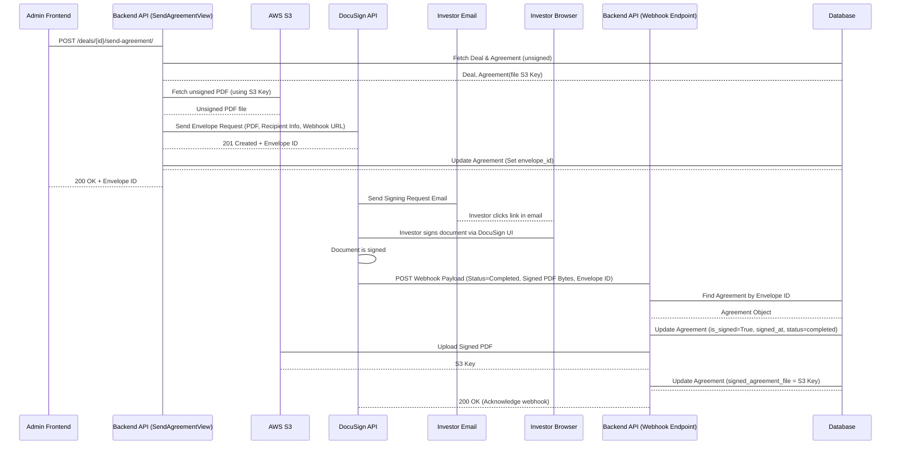

This diagram shows how the backend initiates the DocuSign process and how DocuSign communicates back to the backend using a webhook to finalize the agreement status and store the signed document. The `docusign_webhook` function in `pig_project/pig/deals/views.py` is the crucial endpoint that listens for these updates from DocuSign.

## Conclusion

In this chapter, we learned about Deal Lifecycle Management, the core process of tracking investments from creation to completion. We explored the central roles of the `Deal` and `Agreement` models in structuring this information. We walked through the creation process, understanding how API views, serializers, ORM, and utility services work together to handle both digital and offline agreement paths. We also touched upon how the lifecycle progresses through views for viewing, updating, sending for signature (including the DocuSign integration via webhooks), uploading offline agreements, and managing deal status.

Understanding how deals and their agreements are managed is critical to the platform's functionality. In the next chapter, we will take a closer look at a tool that is fundamental to almost everything we've discussed so far – connecting our Python code and models to the data formats expected by APIs: [Data Serializers](05_data_serializers_.md).

[Next Chapter: Data Serializers](05_data_serializers_.md)


---

# Chapter 5: Data Serializers

Welcome back! In the previous chapters, we've covered the foundational elements of our project: [Django Models (ORM)](01_django_models__orm__.md) define the structure of our data in the database, [User Management & Authentication](02_user_management___authentication_.md) handles who can access the system, [Portfolio Company Management](03_portfolio_company_management_.md) and [Deal Lifecycle Management](04_deal_lifecycle_management_.md) show how we manage specific types of business data using these models.

So far, we've talked a lot about how the backend stores and processes data using Python objects and the ORM. But how does this Python data *travel* to the frontend (like a web browser or mobile app) or how does data coming *from* the frontend get understood by our Python backend?

This is where **Data Serializers** come in.

## What is a Data Serializer?

Imagine your backend speaks "Python Object" language, and your frontend speaks "JSON" language. They need a translator! That's exactly what a serializer does.

Serializers are like **translators or data formatters** for your API. They take complex data, like a Django model instance (a Python object representing a row in your database), and convert it into a standard, easy-to-understand format for sending over the web, primarily **JSON (JavaScript Object Notation)**.

They also work in reverse: when your API receives data (like from a form submission to create a new user or company), the serializer takes the incoming JSON data, validates it (checks if it's in the correct format and contains the expected information), and converts it into Python dictionaries or objects that your backend can work with.

**In simple terms:**

*   **Serialization (Python -> JSON):** Taking your carefully structured Python object (`CustomUser(name='Jane', role='investor', ...)`) and turning it into a JSON string that looks like:
    ```json
    {
        "name": "Jane",
        "role": "investor",
        ...
    }
    ```
*   **Deserialization (JSON -> Python):** Taking an incoming JSON string from a request body (`{"username": "test@example.com", "password": "..."}`) and turning it into a Python dictionary (`{'username': 'test@example.com', 'password': '...'}`) after checking that the data is valid (e.g., the username is an email format, password is not empty).

## Why Do We Need Serializers?

You might wonder, "Why can't I just send my Python object directly?"

1.  **Complexity:** Python objects can be complex, containing methods, database connections, etc. JSON is a simple, universal data format.
2.  **Database Stuff:** Django model instances are tied to the database. You don't want to expose internal database structure directly to the outside world.
3.  **Standardization:** JSON is the standard for web APIs. Frontends built with any technology (JavaScript, mobile apps) can easily understand JSON.
4.  **Validation:** Incoming data from the outside world is untrusted. Serializers provide a crucial layer to validate that the data conforms to expected rules (e.g., required fields are present, data types are correct, specific formats like email addresses are followed).
5.  **Filtering Data:** Often, you don't want to send *all* fields from a model instance. Serializers let you specify exactly which fields to include.

Our project uses **Django REST Framework (DRF)**, which provides powerful and convenient serializer classes to handle this translation and validation work efficiently.

## Introducing Django REST Framework Serializers

DRF provides several types of serializers, but the most common ones you'll see in our project are:

1.  **`serializers.Serializer`**: A basic serializer that works like a form. You define fields manually, and it handles validation and conversion to/from Python dictionaries. Useful for data that doesn't directly map to a single model (like a login request, which takes username/password and returns tokens).
2.  **`serializers.ModelSerializer`**: This is a shortcut! It automatically generates serializer fields based on a Django model. It also includes default implementations for creating (`.create()`) and updating (`.update()`) model instances. This is what you'll use most often when your API endpoints deal directly with models.

Let's focus on the `ModelSerializer` as it's fundamental to representing our models as API data.

## `ModelSerializer`: The Model's API Twin

A `ModelSerializer` is the simplest way to create a serializer that maps directly to a Django model. You tell it which model to use and which fields from that model should be included in the serialization/deserialization process.

It has a special inner `Meta` class, similar to the `Meta` class in Django models ([Chapter 1: Django Models (ORM)](01_django_models__orm__.md)), to configure its behavior.

### Example: Displaying a User

Let's look at how we might prepare `CustomUser` data for display (serialization). We need a serializer that can take a `CustomUser` object and turn it into JSON.

Recall the simplified `CustomUser` model from [Chapter 1](01_django_models__orm__.md) and [Chapter 2](02_user_management___authentication_.md):

```python
# Simplified model snippet (from pig_project/pig/models.py)
from django.contrib.auth.models import AbstractUser
# ... other imports ...

class CustomUser(AbstractUser):
    # ... standard AbstractUser fields like username, password, email ...
    role = models.CharField(...)
    name = models.CharField(...)
    contact_number = models.CharField(...)
    is_active = models.BooleanField(...)
    # ... other fields ...
```

Now, let's create a serializer for it:

```python
# Inside pig_project/pig/user/serializers.py (Simplified)
from rest_framework import serializers
from django.contrib.auth import get_user_model # Helper to get the active User model

User = get_user_model()

class UserSerializer(serializers.ModelSerializer):
    class Meta:
        model = User # Tell the serializer which model to use
        fields = [ # List the fields you want to include in the output/input
            'id', 'username', 'name', 'role', 'is_active',
            'contact_number', 'created_at'
        ]
        # Or use fields = '__all__' to include all fields,
        # or exclude = ['password'] to include all except listed ones.

    # You can add custom validation or representation logic here if needed
    # def to_representation(self, instance):
    #     # Example: customize how data is shown
    #     representation = super().to_representation(instance)
    #     representation['created_at'] = instance.created_at.strftime('%m/%d/%Y %H:%M')
    #     return representation
```

**Explanation:**

*   `class UserSerializer(serializers.ModelSerializer):` tells DRF we're creating a serializer based on a model.
*   `class Meta:` is where we configure the `ModelSerializer`.
*   `model = User`: Specifies that this serializer is for the `CustomUser` model (aliased as `User`).
*   `fields = [...]`: This is crucial! It lists exactly which fields from the `User` model should be included when serializing data (turning Python object into JSON) and which fields are expected when deserializing data (turning JSON into Python). We include fields like `id`, `username`, `name`, etc., but *not* sensitive fields like `password`.

**How a View Uses it (Serialization - Reading Data):**

Imagine an API view that fetches a `CustomUser` object from the database and needs to send it as a response.

```python
# Simplified view snippet (Conceptual, actual view is more complex)
from rest_framework.response import Response
from pig.user.serializers import UserSerializer # Import our serializer
from pig.models import CustomUser # Import the model

# Assume 'user' is a CustomUser object fetched from the database
user = CustomUser.objects.get(username='jane_doe') # ORM query (Chapter 1)

# Create a serializer instance, passing the model object
serializer = UserSerializer(user)

# Access the .data property to get the dictionary representation
output_data = serializer.data # This is the dictionary

# Send the dictionary as a JSON response
# return Response(output_data)
```

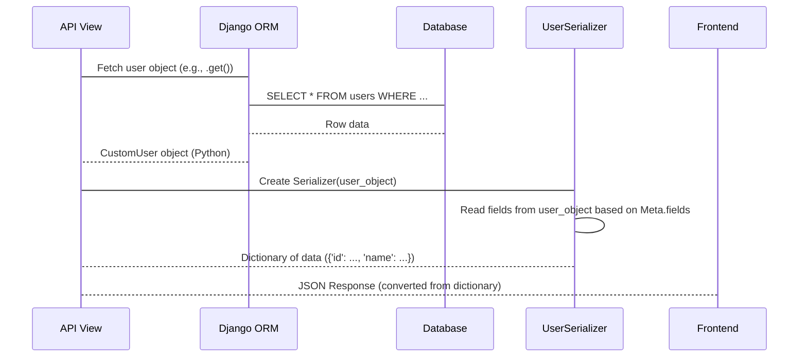

The serializer takes the `CustomUser` Python object and, based on its `Meta.fields` definition, extracts the specified field values and puts them into a standard Python dictionary. DRF then automatically converts this dictionary into a JSON string for the API response.

### Example: Creating a User (Deserialization - Writing Data)

Now, let's look at the reverse process: receiving JSON data to create a new user, as seen in the `RegisterView` from [Chapter 2](02_user_management___authentication_.md).

```python
# Inside pig_project/pig/user/serializers.py (Simplified RegisterSerializer)
from rest_framework import serializers
from django.contrib.auth import get_user_model
from rest_framework.validators import UniqueValidator
# ... other imports and utilities ...

User = get_user_model()

class RegisterSerializer(serializers.ModelSerializer):
    # Define fields explicitly if you need custom validation or behavior
    username = serializers.EmailField(
        required=True, validators=[UniqueValidator(queryset=User.objects.all())] # Ensure unique email
    )
    # Fields that are only for input, not output in response
    social_security_number = serializers.CharField(write_only=True, required=False)

    class Meta:
        model = User
        fields = [ # Fields expected in input AND possibly output
            'id', 'username', 'role', 'name', 'contact_number',
            # ... other fields ...
            'social_security_number', # Included here as it's input
        ]
        # Read-only fields are excluded from validation/saving
        read_only_fields = ['id', 'is_active'] # These are set by backend, not input

    # Custom validation for the entire data payload
    def validate(self, attrs):
        # Example validation: ensure role is allowed based on the creating user
        request = self.context.get('request') # Access request from context
        if request and hasattr(request, 'user') and request.user.role == 'operations':
             if attrs.get('role') not in ['investor']:
                  raise serializers.ValidationError({"role": "Operations users can only create investor users."})
        # ... other validation logic ...
        return attrs

    # Custom create method - called by serializer.save() when creating
    def create(self, validated_data):
        # Extract fields that require special handling (e.g., SSN encryption)
        ssn = validated_data.pop('social_security_number', None)

        # Use ORM to create the user object. **validated_data unpacks the dictionary.
        # The password is NOT set here; it's handled via reset link (Chapter 2)
        user = User.objects.create(
            **validated_data,
            created_by=self.context['request'].user # Set creator from request context
        )

        # Handle SSN encryption after user creation
        if ssn:
            user.set_ssn(ssn) # Call model method for encryption (Chapter 1)
            user.save()

        # ... logic to send welcome email with password reset link (Chapter 2) ...

        return user # Return the created user object
```

**Explanation:**

*   `username = serializers.EmailField(...)`: Explicitly defining fields allows adding custom validation like `UniqueValidator`.
*   `social_security_number = serializers.CharField(write_only=True, required=False)`: `write_only=True` means this field is *only* used for deserialization (receiving input). It will *not* be included in the serializer's output (`.data`), which is important for sensitive data like SSN.
*   `read_only_fields = ['id', 'is_active']`: These fields are included in the output (`.data`) but ignored during deserialization (`.is_valid()` and `.save()`). The backend controls their values.
*   `validate(self, attrs)`: This method is called by `serializer.is_valid()` after individual field validations pass. You can put complex validation logic here that involves multiple fields or the request context.
*   `create(self, validated_data)`: This method is automatically called when you call `serializer.save()` on a serializer that doesn't have an existing instance associated with it. It receives `validated_data`, which is a dictionary of data that passed all validation rules. This is where you typically interact with the ORM to save the data.

**How a View Uses it (Deserialization - Writing Data):**

An API view receiving data (like a `POST` request) uses the serializer to handle validation and saving.

```python
# Simplified view snippet (from pig_project/pig/user/views.py - RegisterView)
from rest_framework import status
from rest_framework.response import Response
from rest_framework.views import APIView
from pig.user.serializers import RegisterSerializer # Import serializer

class RegisterView(APIView):
    # ... permission_classes ...

    def post(self, request):
        # 1. Create serializer instance with incoming data
        #    Pass 'request' in context if needed for validation or saving
        serializer = RegisterSerializer(data=request.data, context={'request': request})

        # 2. Validate the data
        if serializer.is_valid(): # This triggers field and object-level validation
            # 3. If valid, save the data using the serializer's create/update method
            #    This calls serializer.create(validated_data) in this case
            user = serializer.save()

            # 4. Return success response (often including some created data)
            return Response({
                "message": "User registered successfully",
                "id": user.id,
            }, status=status.HTTP_201_CREATED) # 201 for creation success

        # 5. If data is NOT valid, serializer.errors contains validation messages
        return Response(serializer.errors, status=status.HTTP_400_BAD_REQUEST)
```

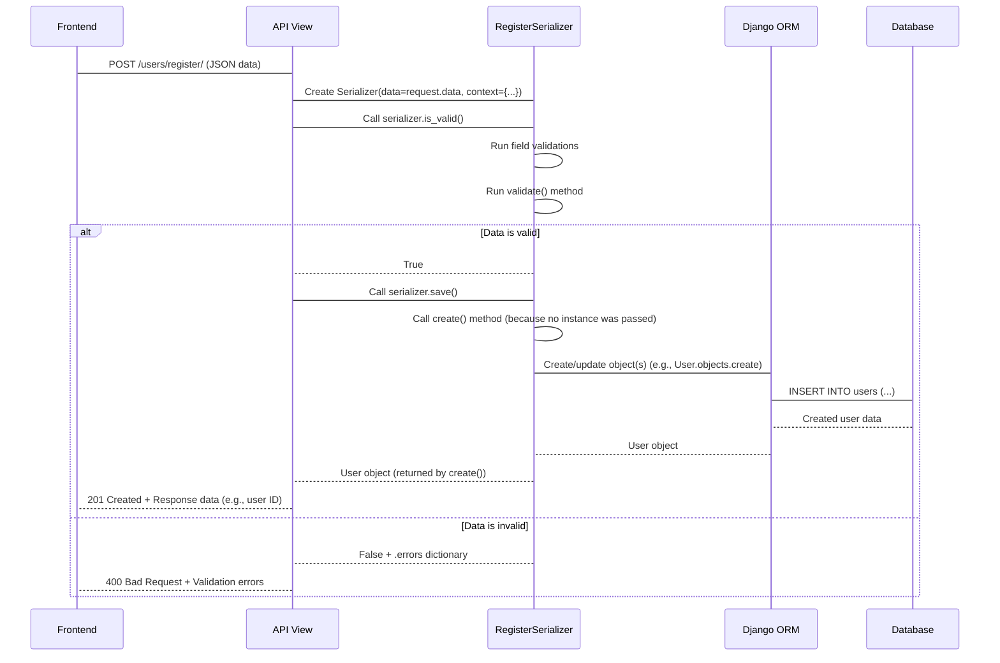

This shows the typical flow for handling incoming data: instantiate the serializer with the request data, call `is_valid()` to trigger validation, and if valid, call `save()` to persist the data (which, for `ModelSerializer`, defaults to using the ORM to create or update the model instance).

## Nested Serializers: Handling Relationships

What about related objects? Like how a `PortfolioCompany` can have multiple `FundingRoundDetails` ([Chapter 3: Portfolio Company Management](03_portfolio_company_management_.md))? Serializers can handle this using **nested serializers**.

You include a serializer instance for the related model as a field in the main serializer.

```python
# Inside pig_project/pig/portfolio_company/serializers.py (Simplified)

from rest_framework import serializers
from pig.models import PortfolioCompany, FundingRoundDetails # Import both models

# 1. Serializer for the 'child' model (FundingRoundDetails)
class FundingRoundDetailsSerializer(serializers.ModelSerializer):
    class Meta:
        model = FundingRoundDetails
        fields = [
            'funding_round_stage', 'valuation_amount', 'valuation_date', 'pig_funds',
        ]
        # Note: We don't typically include the ForeignKey back to the parent here

# 2. Serializer for the 'parent' model (PortfolioCompany)
class PortfolioCompanySerializer(serializers.ModelSerializer):
    # Add the child serializer as a field
    # many=True indicates it's a list of FundingRoundDetails
    funding_rounds = FundingRoundDetailsSerializer(many=True)

    class Meta:
        model = PortfolioCompany
        fields = [
            'name', 'detail_url', 'business_type', 'status',
            'current_valuation', 'date_of_valuation',
            'funding_rounds', # Include the nested field name here
        ]
        # ... other Meta options ...

    # Override create to handle saving the nested data
    def create(self, validated_data):
        # Extract the list of funding round data from the main validated data
        funding_rounds_data = validated_data.pop('funding_rounds', [])

        # Create the parent object first (PortfolioCompany)
        portfolio_company = PortfolioCompany.objects.create(**validated_data, created_by=self.context['request'].user)

        # Iterate through the extracted list and create child objects
        funding_rounds_to_create = [
            FundingRoundDetails(
                portfolio_company=portfolio_company, # Link child to parent
                created_by=self.context['request'].user,
                **round_data # Unpack specific round details
            )
            for round_data in funding_rounds_data
        ]
        # Use bulk_create for efficiency
        FundingRoundDetails.objects.bulk_create(funding_rounds_to_create) # ORM bulk insert

        # ... logic to potentially set initial current_valuation ...

        return portfolio_company # Return the created parent object
```

**Explanation:**

*   We define `FundingRoundDetailsSerializer` first for the related model.
*   Inside `PortfolioCompanySerializer`, we define a field named `funding_rounds` (matching the `related_name` on the `ForeignKey` in the `PortfolioCompany` model).
*   We assign an instance of `FundingRoundDetailsSerializer` to this field.
*   `many=True` is essential because a `PortfolioCompany` has *many* `FundingRoundDetails`. If it was a single `ForeignKey`, we would omit `many=True`.
*   In the `create` method, we manually extract the list of dictionaries for `funding_rounds` from the `validated_data` dictionary *before* creating the `PortfolioCompany` object.
*   After the company is created (so we have its ID), we loop through the `funding_rounds_data` list, create `FundingRoundDetails` objects in memory, link each one back to the `portfolio_company` object, and then use `bulk_create` to save them all efficiently using the ORM.

This pattern is used throughout the project for handling nested data structures, like Deals and their Agreements ([Chapter 4: Deal Lifecycle Management](04_deal_lifecycle_management_.md)).

## Conclusion

Data Serializers are the unsung heroes of your API backend! They are the crucial layer that translates complex Python objects into standard data formats like JSON for sending out, and validates/converts incoming JSON data back into Python for processing. Django REST Framework's `ModelSerializer` makes this task much easier by automatically mapping to your Django models. We saw how they are used for both reading data (serialization) and writing data (deserialization, including validation and saving related objects using nested serializers).

Understanding serializers is vital because almost every API endpoint that sends or receives data will use them. In the next chapter, we'll see how these serializers are integrated into the building blocks that handle web requests and responses: [API Views and URL Routing](06_api_views_and_url_routing_.md).

[Next Chapter: API Views and URL Routing](06_api_views_and_url_routing_.md)


---

# Chapter 6: API Views and URL Routing

Welcome back! In our journey through the `sisforce-pig_backend` project, we've covered how our data is structured using [Django Models (ORM)](01_django_models__orm__.md), how users are managed and authenticated ([User Management & Authentication](02_user_management___authentication_.md)), and how we handle specific data like [Portfolio Company Management](03_portfolio_company_management_.md) and [Deal Lifecycle Management](04_deal_lifecycle_management_.md). Most recently, in [Chapter 5: Data Serializers](05_data_serializers_.md), we learned how our backend translates Python data (like model objects) into formats suitable for sending over the internet (JSON) and vice-versa.

Now, we need to understand how the outside world – a web browser, a mobile app, or another service – actually **talks** to our backend API. When someone types a URL or clicks a button in the frontend that needs data from the backend, how does that request get to the right piece of code to be processed?

This is the job of **API Views and URL Routing**.

## What are API Views and URL Routing?

Imagine our backend application is a building with many offices.

*   **URLs (`urls.py`):** These are like the **street addresses** and specific **room numbers** for different services within the building. For example, `/api/login/` might be the address for the login service, and `/api/users/123/` might be the address for retrieving details about user number 123.
*   **API Views (`views.py` files):** These are the **specific "offices" or "handlers"** that know how to perform a particular task. There's an office for handling login requests, another for getting user details, another for creating a new deal, and so on. When a request arrives at their "address", the view code takes over.
*   **URL Routing:** This is the **"receptionist" or "switchboard"** that listens for incoming requests (HTTP requests) arriving at the building's address (the server's domain name/IP). Based on the *specific URL* requested (like `/api/login/`), the router looks up which view is assigned to that URL and directs the request to that view's code.

In essence, URL routing is how the application matches an incoming web request (based on its URL) to the specific Python code (the View) that should handle it. The View then processes the request, interacts with other parts of the application (like models using the ORM, or serializers), and generates a response to send back.

## Core Concepts

### 1. URL Configuration (`urls.py`)

In Django, URL routing is primarily handled in `urls.py` files. Our project has a main `urls.py` in `pig_project/pig_project/` and includes another `urls.py` specifically for our application's endpoints in `pig_project/pig/urls.py`.

Let's look at a simplified version of `pig_project/pig/urls.py`:

```python
# Inside pig_project/pig/urls.py

from django.urls import path
from rest_framework_simplejwt.views import TokenRefreshView
from pig.auth.views import ( # Import views from auth app
    LoginView, LogoutView, # ... other auth views
)
from pig.user.views import ( # Import views from user app
    RegisterView, GetUserByIdView, GetProfilePictureView # ... other user views
)
# ... import views from other apps (portfolio_company, deals, dashboard) ...

urlpatterns = [
    # Maps the URL '/api/login/' to the LoginView class
    path('api/login/', LoginView.as_view(), name='login'),

    # Maps the URL '/api/token/refresh/' to DRF's built-in view
    path('api/token/refresh/', TokenRefreshView.as_view(), name='token_refresh'),

    # Maps the URL '/api/register/' to the RegisterView class
    path('api/register/', RegisterView.as_view(), name='register'),

    # Maps the URL '/api/user/profile/' to UserProfileView
    path('api/user/profile/', UserProfileView.as_view(), name='user_profile'),

    # Maps the URL '/api/user/profile-picture/' to GetProfilePictureView
    path('api/user/profile-picture/', GetProfilePictureView.as_view(), name='get_profile_picture'),

    # Example with a parameter: Maps '/api/users/a1b2c3d4-...' to GetUserByIdView
    # <uuid:user_id> captures a UUID from the URL and passes it to the view
    path('api/users/<uuid:user_id>/', GetUserByIdView.as_view(), name='get_user_by_id'),

    # ... many other path entries for other API endpoints ...
]
```

**Explanation:**

*   `urlpatterns` is a list where we define our URL patterns.
*   Each entry uses the `path()` function.
    *   The first argument is the **URL pattern** (e.g., `'api/login/'`). This is matched against the part of the URL *after* the domain name (like `example.com`).
    *   The second argument is the **View** that should handle requests matching this pattern. In Django REST Framework (DRF), we commonly use class-based views (like `LoginView`), so we call `.as_view()` on the class to get a function that Django can use.
    *   The third argument, `name='...'`, gives this URL pattern a name. This is useful for generating URLs dynamically elsewhere in the project, but less critical for simple API routing understanding.
*   Notice the entry for `GetUserByIdView`. The part `<uuid:user_id>` is a **URL parameter**. It tells Django to capture whatever comes after `/api/users/` *if* it looks like a UUID, and pass that captured value as a keyword argument named `user_id` to the view function/method.

When a request comes in (e.g., `GET /api/user/profile-picture/`), Django's URL dispatcher goes through `urlpatterns` and tries to find a match. Once it finds the line `path('api/user/profile-picture/', GetProfilePictureView.as_view(), ...)`, it knows to hand the request off to the `GetProfilePictureView`.

### 2. API Views (`views.py`)

Views are the heart of the backend logic for a specific endpoint. They are Python classes (or sometimes functions) that inherit from `rest_framework.views.APIView` or its subclasses (like `generics.ListAPIView`, `generics.RetrieveAPIView`, etc., which offer more built-in functionality but `APIView` is the basic building block).

An `APIView` class typically defines methods corresponding to HTTP request methods:

*   `get(self, request, ...)`: Handles `GET` requests (used for retrieving data).
*   `post(self, request, ...)`: Handles `POST` requests (used for creating data).
*   `put(self, request, ...)`: Handles `PUT` requests (used for updating data, often a whole resource).
*   `patch(self, request, ...)`: Handles `PATCH` requests (used for partially updating data).
*   `delete(self, request, ...)`: Handles `DELETE` requests (used for deleting data).

When the URL router directs a request to a view, DRF checks the HTTP method of the request (GET, POST, etc.) and calls the corresponding method on the view class instance.

Let's look at the `GetProfilePictureView` from `pig_project/pig/user/views.py`:

```python
# Inside pig_project/pig/user/views.py (Simplified GetProfilePictureView)

from rest_framework.views import APIView
from rest_framework.response import Response
from rest_framework.permissions import IsAuthenticated # From Chapter 2
# ... other imports ...
from pig.utils import generate_presigned_url # From Chapter 7

class GetProfilePictureView(APIView):
    # Permission classes checked BEFORE the get() method runs
    permission_classes = [IsAuthenticated] # Only authenticated users can access

    def get(self, request):
        # This method is called for GET requests to the URL mapped to this view
        try:
            user = request.user # Access the authenticated user object (from Chapter 2)

            if not user.profile_picture:
                # If user has no profile picture, return 404
                return Response(
                    {"error": "No profile picture found for this user."},
                    status=status.HTTP_404_NOT_FOUND
                )

            # Use a utility function (Chapter 7) to get a temporary S3 URL
            presigned_url = generate_presigned_url(user.profile_picture)

            if not presigned_url:
                # Handle error generating URL
                return Response(
                    {"error": "Failed to generate profile picture URL."},
                    status=status.HTTP_500_INTERNAL_SERVER_ERROR
                )

            # Prepare the response data
            response_data = {
                "profile_picture_url": presigned_url,
                "profile_picture_key": user.profile_picture # The S3 storage key
            }

            # Return a successful response
            return Response(response_data, status=status.HTTP_200_OK)

        except Exception as e:
            # Catch any unexpected errors
            # ... logging ...
            return Response(
                {"error": "An error occurred while retrieving the profile picture."},
                status=status.HTTP_500_INTERNAL_SERVER_ERROR
            )
```

**Explanation:**

*   It inherits from `APIView`.
*   `permission_classes = [IsAuthenticated]`: This list tells DRF to run these checks before executing the `get` method. `IsAuthenticated` (from DRF) ensures the user sending the request is logged in ([Chapter 2: User Management & Authentication](02_user_management___authentication_.md)). If not, DRF automatically sends an Unauthorized (401) response.
*   `def get(self, request):`: This method is executed for `GET` requests.
    *   `self`: The view instance.
    *   `request`: A DRF `Request` object. It contains all details about the incoming request (headers, body, user, query parameters, etc.). `request.user` is automatically populated with the authenticated user object by the authentication system ([Chapter 2](02_user_management___authentication_.md)).
    *   Inside the method, the view logic runs: it gets the user, checks if they have a `profile_picture` (which is an S3 key stored on the `CustomUser` model - [Chapter 1](01_django_models__orm__.md)), uses a utility function ([Chapter 7](07_utility_services___helpers_.md)) to generate a temporary download URL, and prepares the data to be sent back.
    *   `return Response(data, status=...)`: This creates a DRF `Response` object. DRF handles converting the Python `data` dictionary into a JSON response and setting the correct HTTP status code (e.g., `200 OK`, `404 Not Found`).

### 3. Views with URL Parameters

Let's look at the `GetUserByIdView` from `pig_project/pig/user/views.py` which handles a URL parameter:

```python
# Inside pig_project/pig/user/views.py (Simplified GetUserByIdView)

from rest_framework.views import APIView
from rest_framework.response import Response
from rest_framework import status
# ... other imports ...
from pig.permissions import RoleBasedPermission # Our custom permission (Chapter 2)
from pig.user.serializers import RegisterSerializer # The serializer (Chapter 5)
from django.contrib.auth import get_user_model

User = get_user_model()

class GetUserByIdView(APIView):
    # Permissions: Only Admin or Operations can get details for ANY user
    permission_classes = [IsAuthenticated, RoleBasedPermission]
    RoleBasedPermission.allowed_roles = ['admin', 'operations']

    # The 'user_id' captured from the URL pattern is passed as an argument
    def get(self, request, user_id):
        try:
            # Use ORM (Chapter 1) to fetch the user by the id from the URL
            user = User.objects.get(id=user_id)

            # Use the serializer (Chapter 5) to format the user data
            serializer = RegisterSerializer(user)
            user_data = serializer.data

            # Special case: only Super Admins can see SSN
            if request.user.role == 'super_admin':
                user_data['social_security_number'] = user.get_ssn() # Model method (Chapter 1)

            # Return the serialized user data
            return Response(user_data, status=status.HTTP_200_OK)

        except User.DoesNotExist:
            # If ORM .get() doesn't find the user, return 404
            return Response({'error': 'User not found'},
                            status=status.HTTP_404_NOT_FOUND)
```

**Explanation:**

*   This view also inherits from `APIView` and has permission checks (`RoleBasedPermission` from [Chapter 2](02_user_management___authentication_.md) restricts it to 'admin' or 'operations').
*   The `get` method now accepts a second argument: `user_id`. This argument automatically receives the value captured from the URL pattern (`<uuid:user_id>` in `urls.py`).
*   Inside the method, `User.objects.get(id=user_id)` uses the ORM ([Chapter 1](01_django_models__orm__.md)) to fetch the specific user object from the database using the ID provided in the URL.
*   It then uses the `RegisterSerializer` ([Chapter 5](05_data_serializers_.md)) to format the fetched user object into a dictionary for the response.
*   It includes a special check based on the *requesting* user's role (`request.user.role`) to decide whether to include sensitive data like SSN, demonstrating how views combine permissions and data handling.

## Use Case Walkthrough: Getting Your Own Profile Picture

Let's trace what happens when an authenticated user requests their profile picture via the API.

**Scenario:** An investor user is logged into the frontend application. The application needs to display their profile picture and makes a request to the backend.

1.  **Frontend Action:** The frontend application sends a `GET` request to `/api/user/profile-picture/`. It includes the user's **Access Token** in the `Authorization` header (as learned in [Chapter 2](02_user_management___authentication_.md)).
2.  **Request Arrives at Backend:** The Django development server (or production server like Gunicorn/Nginx) receives the HTTP request.
3.  **Middleware Processing:** Django and DRF middleware process the request. This includes authentication middleware, which validates the Access Token and sets `request.user` to the authenticated `CustomUser` object ([Chapter 2](02_user_management___authentication_.md)).
4.  **URL Routing:** Django's URL dispatcher looks at the requested path `/api/user/profile-picture/`. It consults `pig_project/pig/urls.py` and finds the matching `path('api/user/profile-picture/', GetProfilePictureView.as_view(), ...)`.
5.  **View Selection:** The request is routed to the `GetProfilePictureView` class.
6.  **Permission Check:** Before executing the view's method, DRF checks the `permission_classes`. `IsAuthenticated` is checked. Since the user is authenticated (token was valid), this check passes. `RoleBasedPermission` is *not* on this view's `permission_classes`, so no role check happens here (any authenticated user can view *their own* profile picture).
7.  **HTTP Method Dispatch:** The request method is `GET`. DRF calls the `get(self, request)` method on an instance of `GetProfilePictureView`.
8.  **View Logic Execution:**
    *   The code inside `get()` starts running.
    *   `request.user` holds the `CustomUser` object for the logged-in investor.
    *   The code checks `user.profile_picture`. If it exists (it's an S3 key like `profile_pictures/uuid.jpg`), it calls `generate_presigned_url(user.profile_picture)`.
    *   This utility function communicates with AWS S3 to generate a temporary, secure URL.
    *   Assuming success, the `response_data` dictionary is built.
9.  **Response Generation:** The `return Response(response_data, status=...)` line is executed. DRF takes the `response_data` dictionary, serializes it into a JSON string (`{"profile_picture_url": "...", "profile_picture_key": "..."}`), sets the HTTP status code to 200, and creates the HTTP response.
10. **Response Sent Back:** The response travels back through middleware and is sent back to the frontend application.
11. **Frontend Processing:** The frontend receives the JSON response, extracts the `profile_picture_url`, and uses it to display the image.

## Under the Hood: The Request Flow

Here's a simple sequence diagram showing the flow for the profile picture example:

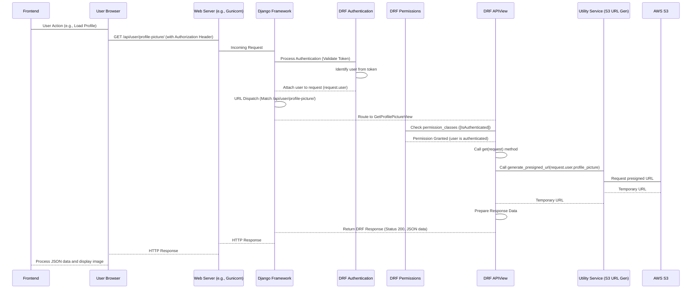

This diagram shows how the request travels through different layers: the web server, the Django framework, DRF's authentication and permission layers, the view logic, and finally interacting with other services (like our utility functions talking to S3) before returning the response.

## More API View Examples

Looking back at `pig_project/pig/urls.py`, you can see many other examples mapping different URLs to different views:

*   `/api/login/` maps to `LoginView` (`POST` method handles login).
*   `/api/register/` maps to `RegisterView` (`POST` method handles user creation, uses a [Serializer](05_data_serializers_.md) and sends email via [Utilities](07_utility_services___helpers_.md)).
*   `/api/portfolio-company/create/` maps to `CreatePortfolioCompanyView` (`POST` method handles company creation, uses a [Serializer](05_data_serializers_.md) to save [Models](01_django_models__orm__.md)).
*   `/api/deals/<uuid:deal_id>/update/` maps to `UpdateDealView` (`PUT` method handles updating a specific deal identified by its ID from the URL, uses a [Serializer](05_data_serializers_.md), interacts with [Models](01_django_models__orm__.md), and checks permissions).
*   `/docusign-webhook/` maps to a function-based view `docusign_webhook` (`POST` method handles incoming data from DocuSign, updates [Agreement Models](01_django_models__orm__.md), and interacts with [Utilities](07_utility_services___helpers_.md) for S3 upload). This is an example of a view that doesn't require authentication because it's called by an external service (DocuSign), not a user.

Each of these views, defined in their respective `views.py` files, contains the specific logic needed to process requests for their assigned URL, interacting with other parts of the backend as needed.

## Conclusion

In this chapter, we've uncovered how incoming web requests are handled in our project. We learned that **URL routing** (defined in `urls.py`) is the system that directs requests based on their URL to the appropriate **API View** (defined in `views.py`). Views are the core Python code handlers that receive the request, perform actions (like interacting with [Models](01_django_models__orm__.md) via the ORM, using [Serializers](05_data_serializers_.md) to process data, or leveraging [Utility Services](07_utility_services___helpers_.md)), and return structured responses, typically in JSON format.

Understanding how URLs are mapped to views and how views process requests is fundamental to seeing how the API works end-to-end. In the next chapter, we'll take a closer look at some of the reusable helper functions and services that various views and other parts of the application rely on: [Utility Services & Helpers](07_utility_services___helpers_.md).

[Next Chapter: Utility Services & Helpers](07_utility_services___helpers_.md)


---

# Chapter 7: Utility Services & Helpers

Welcome back! In our journey through the `sisforce-pig_backend` project, we've explored the core building blocks: [Django Models (ORM)](01_django_models__orm__.md) for data structure, [User Management & Authentication](02_user_management___authentication_.md) for handling users, how we manage specific data like [Portfolio Company Management](03_portfolio_company_management_.md) and [Deal Lifecycle Management](04_deal_lifecycle_management_.md), and how [Data Serializers](05_data_serializers_.md) and [API Views and URL Routing](06_api_views_and_url_routing_.md) handle communication with the outside world.

As we've seen, views and serializers are responsible for specific tasks (like handling a login request or creating a deal). But often, these tasks involve performing common, repeatable operations that aren't tied to one specific view or model. For example, sending an email, uploading a file to cloud storage, or doing a specific calculation might be needed by multiple parts of the application.

Doing these common tasks directly inside every view or serializer that needs them would lead to **duplicate code**. If you need to send an email from three different places, you'd have the email sending logic copied three times! This makes the code harder to read, harder to maintain, and prone to errors. If you need to change how emails are sent, you have to change it in multiple places.

## What are Utility Services & Helpers?

This is where **Utility Services & Helpers** come in. Think of them as your project's **central toolbox**. It's a collection of specialized, reusable functions and sometimes classes that perform common tasks required by various parts of the application.

Instead of reinventing the wheel every time you need to send an email or format a date, you just grab the right tool from the toolbox. These tools live in dedicated files, keeping the main business logic in your views and serializers clean and focused on *what* needs to be done, rather than *how* to do every little common step.

In our `sisforce-pig_backend` project, many of these helpers are found in the `pig_project/pig/utils.py` file.

Common tasks handled by utilities in this project include:

*   **Logging:** Recording important events or errors.
*   **Email Sending:** Sending notifications, welcome emails, password reset links.
*   **File Storage (S3):** Uploading and downloading files (like profile pictures, agreements) to Amazon S3.
*   **PDF Generation:** Creating dynamic PDF documents (like agreements).
*   **Encryption:** Securely storing sensitive data (like SSN).
*   **Financial Calculations:** Performing specific calculations for reporting or display (like gain/loss on investments).
*   **Data Formatting:** Standardizing how dates or other data types are presented.

Let's look at a few examples from `pig_project/pig/utils.py` and see how they are used.

## Use Case: Sending a Welcome Email After Registration

We touched upon this in [Chapter 2: User Management & Authentication](02_user_management___authentication_.md). When a new user is registered by an admin, they don't get a password set directly. Instead, the system sends them an email with a link to create their password.

This process involves two key utility functions from `pig_project/pig/utils.py`:

1.  `generate_reset_password_link`: Creates the secure, time-limited link.
2.  `send_email_with_template`: Sends the actual email using a service like SendGrid.

Let's see how the `RegisterSerializer` ([Chapter 5: Data Serializers](05_data_serializers_.md)) and `RegisterView` ([Chapter 6: API Views and URL Routing](06_api_views_and_url_routing_.md)) use these utilities.

Recall the simplified `create` method in `RegisterSerializer`:

```python
# Inside pig_project/pig/user/serializers.py (Simplified create method)

from rest_framework import serializers
from django.core.signing import TimestampSigner
from django.conf import settings
from pig.utils import send_email_with_template, generate_reset_password_link # Import the utilities
# ... other imports ...

# ... RegisterSerializer class definition ...

    def create(self, validated_data):
        # ... (code to create the user object using ORM) ...
        user = User.objects.create(...) # User object is created and saved to DB

        # Use the utility functions here!
        reset_password_link = generate_reset_password_link(user.username)
        template_id = settings.SENDGRID_WELCOME_TEMPLATE_ID # Get template ID from settings
        dynamic_data = {"name": user.name, "link": reset_password_link}

        # Call the email sending utility
        send_email_with_template(user.email, template_id, dynamic_data)

        return user # Return the created user object
```

**Explanation:**

*   The serializer's job (`create` method) is to get the user object saved.
*   *After* the user is saved, it needs to trigger the email process.
*   It doesn't know *how* to generate a password reset token or *how* to connect to SendGrid. It just calls the helper functions: `generate_reset_password_link()` and `send_email_with_template()`.
*   It passes the necessary *data* to these functions (username for the link, recipient email, template ID, and dynamic data for the email content).
*   The complexity of signing tokens or interacting with an external email API is hidden inside the utility functions.

## How the Utilities Work (Under the Hood)

Let's peek inside `pig_project/pig/utils.py` to see simplified versions of these utility functions.

### `generate_reset_password_link`

```python
# Inside pig_project/pig/utils.py (Simplified)

from django.core.signing import TimestampSigner # Tool for creating signed tokens
from django.conf import settings
# ... other imports and utility functions ...

def generate_reset_password_link(username):
    """
    Generates a signed reset password link for the given username.
    """
    try:
        signer = TimestampSigner() # Create a signer instance
        token = signer.sign(username) # Sign the username with a timestamp
        log(f"Generated signed token for {username}", "info") # Use the logging utility!
        # Build the full URL using the token and the frontend URL from settings
        link = f"{settings.REACT_ORIGIN_URL}/reset-password?token={token}"
        return link
    except Exception as e:
        log(
            f"Failed to generate reset password link for {username}. Error: {str(e)}",
            "error") # Use the logging utility for errors
        return None
```

**Explanation:**

*   This function uses Django's built-in `TimestampSigner` to create a secure token that includes the username and a timestamp. This token can be verified later to ensure it hasn't been tampered with and hasn't expired.
*   It then constructs the full URL pointing to the frontend's password reset page, including the generated token as a query parameter.
*   It also uses the `log` utility function (explained next) to record its activity.

### `log`

This is a very simple but essential utility. Any part of the application can call `log()` instead of directly using `logging.getLogger()`.

```python
# Inside pig_project/pig/utils.py (Simplified)

import logging

logger = logging.getLogger('django_project_api')
# ... other utility functions ...

def log(message, level='info'):
    """
    Logs a message at the specified log level.
    """
    level = level.lower()
    if level == 'debug':
        logger.debug(message)
    elif level == 'info':
        logger.info(message)
    # ... checks for warning, error, critical ...
    else:
        logger.info(
            f"Invalid log level '{level}' provided. Logging as INFO: {message}"
        )

```

**Explanation:**

*   It provides a single, consistent way to log messages from anywhere in the project.
*   It ensures all messages go through the same logger instance (`django_project_api`), making log management easier.

### `send_email_with_template`

This function interacts with an external email service (SendGrid, based on the imports and settings usage).

```python
# Inside pig_project/pig/utils.py (Simplified)

from sendgrid import SendGridAPIClient # The SendGrid library
from sendgrid.helpers.mail import Mail # Helper for constructing email objects
from django.conf import settings # Access project settings (like API key)
# ... other imports and utility functions ...

def send_email_with_template(to_email, template_id, dynamic_data):
    """
    Sends an email using a predefined SendGrid template.
    """
    try:
        message = Mail( # Create an email object
            from_email=settings.DEFAULT_FROM_EMAIL, # Sender from settings
            to_emails=to_email # Recipient
        )
        message.template_id = template_id # Specify the template ID
        message.dynamic_template_data = dynamic_data # Provide data for the template
        sg = SendGridAPIClient(settings.SENDGRID_API_KEY) # Initialize SendGrid client with API key
        response = sg.send(message) # Send the email!
        log(
            f"Email sent to {to_email}. Status: {response.status_code}",
            "info"
        )
        return response.status_code
    except Exception as e: # Catch potential errors during sending
        log(f"Failed to send email to {to_email}. Error: {str(e)}", "error")
        return None
```

**Explanation:**

*   This function encapsulates all the details of using the SendGrid API.
*   It constructs the email message, sets the template and dynamic data, initializes the SendGrid client using the API key from settings, and sends the email via the API.
*   Any code that needs to send a templated email simply calls `send_email_with_template()`, providing the recipient, template ID, and data. It doesn't need to know anything about `Mail`, `SendGridAPIClient`, or API keys.

## Flow of Sending Welcome Email

Let's visualize the simplified flow:

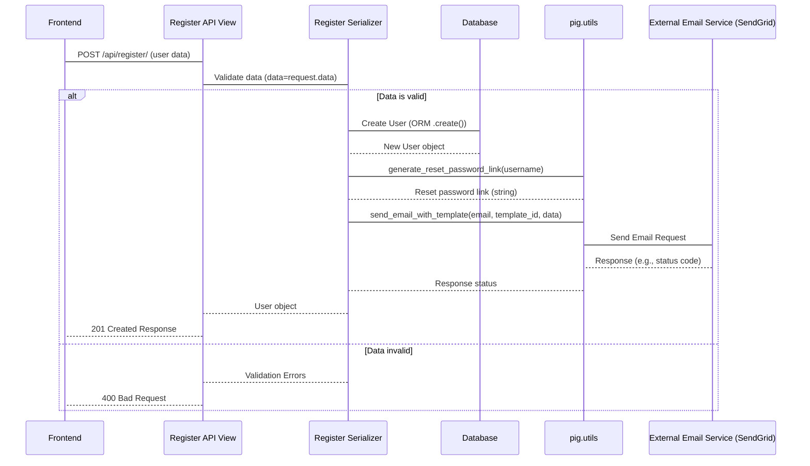

This diagram clearly shows how the serializer delegates the specific tasks of link generation and email sending to the utility functions, keeping the serializer's `create` method focused on the core task of creating the user model instance.

## Other Examples of Utilities

*   **S3 Interaction:** Functions like `upload_to_s3`, `generate_presigned_url`, `fetch_from_s3`, and `remove_local_file` handle the specifics of interacting with Amazon S3. Views or services needing to store or retrieve files just call these functions with the file path/content and the desired S3 key (path). This hides the complexity of `boto3` (the AWS SDK) and AWS credentials from the rest of the application.
    *   Example usage in [Chapter 6: API Views and URL Routing](06_api_views_and_url_routing_.md) in `GetProfilePictureView` calling `generate_presigned_url`.
    *   Example usage in [Chapter 4: Deal Lifecycle Management](04_deal_lifecycle_management_.md) in the digital agreement flow calling `generate_deal_agreement_pdf` (another utility!), `upload_to_s3`, and `remove_local_file`.
*   **PDF Generation:** `generate_deal_agreement_pdf` encapsulates the logic for using a library (like ReportLab, implied by `canvas.Canvas`) to dynamically create a PDF file based on deal data.
*   **Encryption:** `get_encryption_cipher` and methods on the `CustomUser` model like `set_ssn`/`get_ssn` (which internally use the cipher) provide a standardized way to handle encryption, ensuring sensitive data is protected before being saved.
*   **Financial Calculations:** Functions like `calculate_gain_loss`, `calculate_deal_value`, `calculate_capitalization_table`, and `calculate_portfolio_metrics` contain the business logic for calculating investment performance metrics. Dashboard views can call these functions to get prepared data without needing to implement the calculation logic themselves. This keeps the complex math out of the presentation layer.
*   **Data Formatting:** `format_date`, `format_holding_period`, etc., provide consistent ways to format dates, times, or other data types for display, ensuring uniformity across API responses.

## Benefits of Using Utility Services

*   **Code Reusability:** The same function can be called from multiple places.
*   **Maintainability:** If you need to change how a common task is done (e.g., switch email providers, change S3 bucket structure), you only need to update the code in one place (`utils.py`).
*   **Readability:** Views and serializers become shorter and easier to understand because repetitive or complex helper logic is moved elsewhere. They focus on the core business process flow.
*   **Testability:** Utility functions often perform isolated tasks, making them easier to test independently.

## Conclusion

In this chapter, we've explored the concept of Utility Services & Helpers, recognizing them as a vital toolbox for reusable code in our project. We saw how functions within `pig_project/pig/utils.py` encapsulate common tasks like logging, sending emails, and interacting with external services like S3. By using these utilities, our views and serializers remain focused and clean, promoting code reuse and making the application easier to maintain and understand. This pattern is fundamental to writing efficient and well-structured backend code.


---

