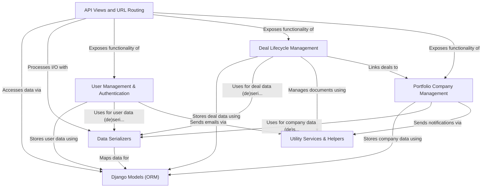

# Tutorial: sisforce-pig_backend-a449e3c497d4

This project is a *backend API* for an **investment management platform**.
It allows users like *investors* and *admins* to manage their accounts, track **portfolio companies**
and their funding rounds, and oversee the entire **investment deal lifecycle**, including digital
agreement signing. The system also provides dashboards with key financial metrics and utilizes
services like DocuSign for agreements and S3 for file storage.

**Source Repository:** [None](None)

## Chapters

1. [Django Models (ORM)
](01_django_models__orm__.md)
2. [User Management & Authentication
](02_user_management___authentication_.md)
3. [Portfolio Company Management
](03_portfolio_company_management_.md)
4. [Deal Lifecycle Management
](04_deal_lifecycle_management_.md)
5. [Data Serializers
](05_data_serializers_.md)
6. [API Views and URL Routing
](06_api_views_and_url_routing_.md)
7. [Utility Services & Helpers
](07_utility_services___helpers_.md)
